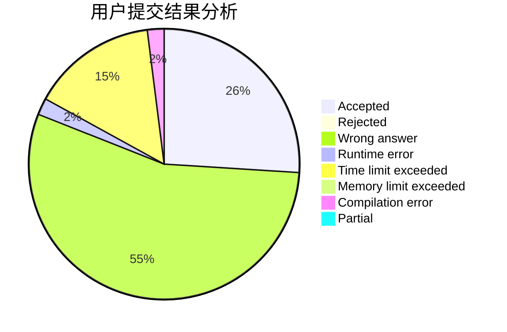
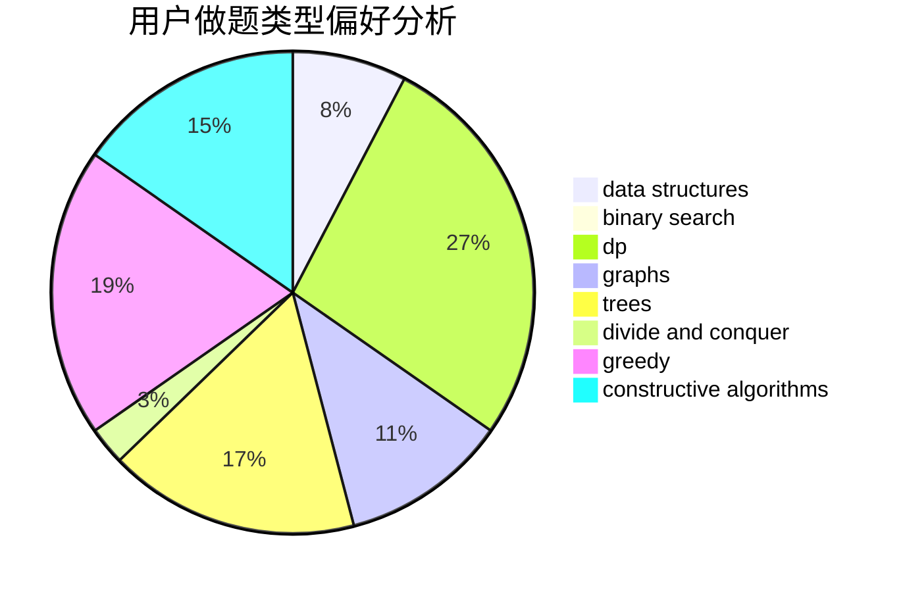
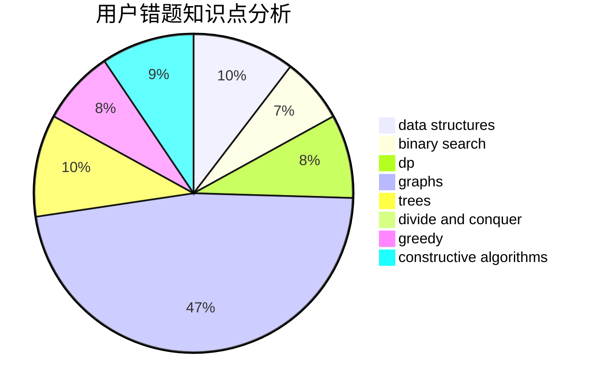

# Jr1Preg

<!-- tabs:start -->

#### **用户提交结果分析**

#### **用户做题类型偏好分析**

#### **用户错题知识点分析**

<!-- tabs:end -->
# 推荐题目
[198B](https://codeforces.com/contest/198/problem/B)		shortest paths		  
[286D](https://codeforces.com/contest/286/problem/D)		data structures,
                        sortings		  
[1147A](https://codeforces.com/contest/1147/problem/A)		graphs		  
[1140D](https://codeforces.com/contest/1140/problem/D)		dp,
                        greedy,
                        math		  
[448D](https://codeforces.com/contest/448/problem/D)		binary search,
                        brute force		  
[675D](https://codeforces.com/contest/675/problem/D)		data structures,
                        trees		  
[394C](https://codeforces.com/contest/394/problem/C)		constructive algorithms,
                        greedy		  
[246B](https://codeforces.com/contest/246/problem/B)		greedy,
                        math		  
[955B](https://codeforces.com/contest/955/problem/B)		implementation		  
[1033A](https://codeforces.com/contest/1033/problem/A)		dfs and similar,
                        graphs,
                        implementation		  
