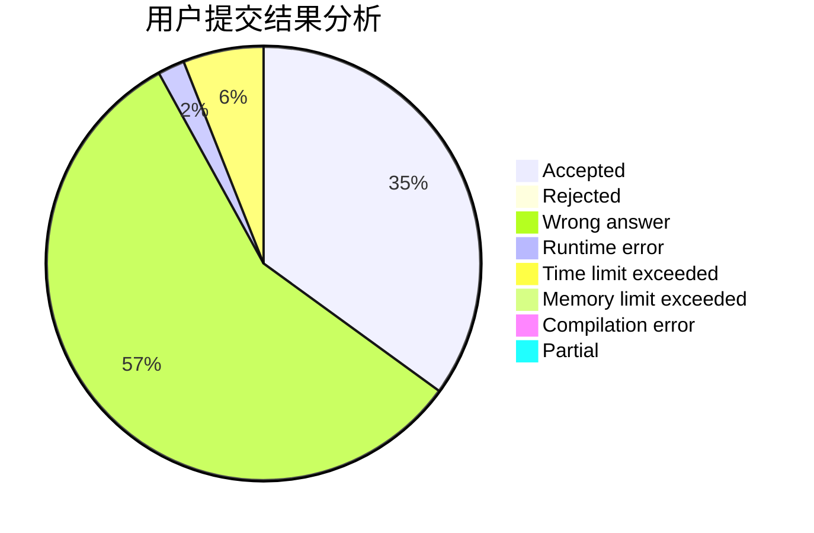
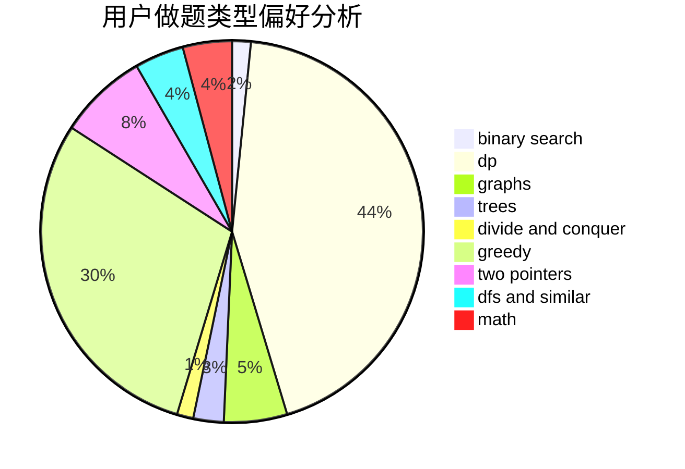

# Juanzhang

<!-- tabs:start -->

#### **用户提交结果分析**

#### **用户做题类型偏好分析**

<!-- tabs:end -->
# 推荐题目
[1424G](https://codeforces.com/contest/1424/problem/G)
[1020A](https://codeforces.com/contest/1020/problem/A)
[1101C](https://codeforces.com/contest/1101/problem/C)
[1311D](https://codeforces.com/contest/1311/problem/D)
[672C](https://codeforces.com/contest/672/problem/C)
[835D](https://codeforces.com/contest/835/problem/D)
[425E](https://codeforces.com/contest/425/problem/E)
[102B](https://codeforces.com/contest/102/problem/B)
[1041F](https://codeforces.com/contest/1041/problem/F)
[768E](https://codeforces.com/contest/768/problem/E)
