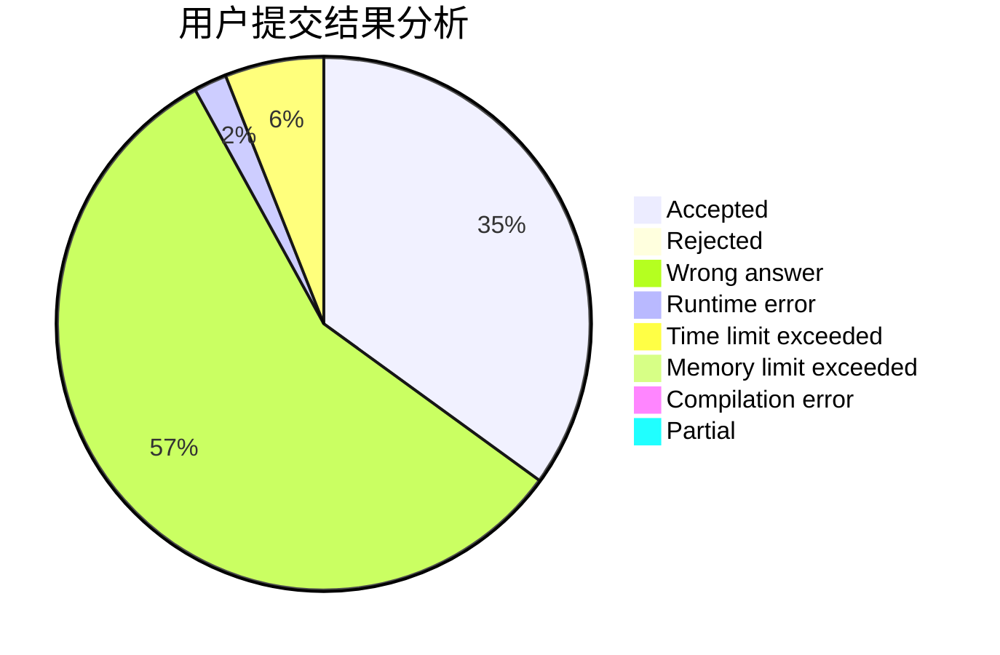
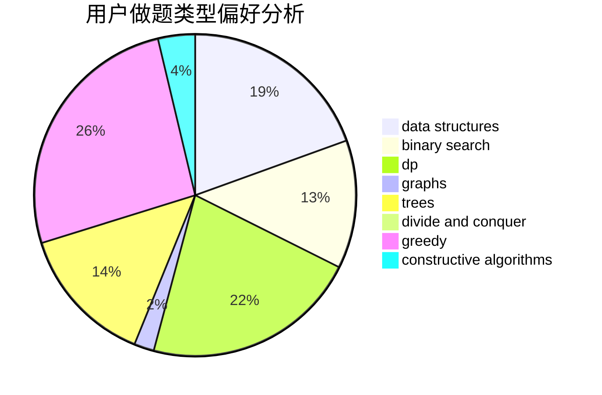

# Juanzhang
<!-- tabs:start -->
#### **用户提交结果分析**

#### **用户做题类型偏好分析**

#### **用户错题知识点分析**

<!-- tabs:end -->
# 推荐题目
[Inversions After Shuffle](http://codeforces.com/problemset/problem/749/E)		data structures,
                        probabilities		  
[Armistice Area Apportionment](http://codeforces.com/problemset/problem/645/G)		binary search,
                        geometry		  
[Showing Off](http://codeforces.com/problemset/problem/1416/F)		flows,
                        graph matchings,
                        greedy,
                        implementation		  
[Keep talking and nobody explodes -- easy](http://codeforces.com/problemset/problem/1302/F)		bitmasks,
                        brute force,
                        expression parsing		  
[Moon Craters](http://codeforces.com/problemset/problem/39/C)		dp,
                        sortings		  
[Interactive LowerBound](http://codeforces.com/problemset/problem/843/B)		brute force,
                        interactive,
                        probabilities		  
[Randomizer](http://codeforces.com/problemset/problem/559/D)		combinatorics,
                        geometry,
                        probabilities		  
[Rat Kwesh and Cheese](http://codeforces.com/problemset/problem/621/D)		brute force,
                        constructive algorithms,
                        math		  
[Petr and Book](http://codeforces.com/problemset/problem/139/A)		implementation		  
[Karen and Game](https://codeforces.com/contest/816/problem/C)		brute force,
                        greedy,
                        implementation		  
<!-- tabs:start -->
#### **data structures**
[Inversions After Shuffle](http://codeforces.com/problemset/problem/749/E)		data structures,
                        probabilities		  
[Armistice Area Apportionment](http://codeforces.com/problemset/problem/796/C)		constructive algorithms,
                        data structures,
                        dp,
                        trees		  
[Showing Off](http://codeforces.com/problemset/problem/1019/E)		data structures,
                        divide and conquer,
                        trees		  
[Keep talking and nobody explodes -- easy](http://codeforces.com/problemset/problem/1041/C)		binary search,
                        data structures,
                        greedy,
                        two pointers		  
[Moon Craters](http://codeforces.com/problemset/problem/341/D)		data structures		  
[Interactive LowerBound](http://codeforces.com/problemset/problem/1320/E)		data structures,
                        dfs and similar,
                        dp,
                        shortest paths,
                        trees		  
[Randomizer](http://codeforces.com/problemset/problem/731/D)		brute force,
                        data structures,
                        greedy,
                        sortings		  
[Rat Kwesh and Cheese](http://codeforces.com/problemset/problem/1100/F)		data structures,
                        divide and conquer,
                        greedy,
                        math		  
[Petr and Book](http://codeforces.com/problemset/problem/1408/E)		data structures,
                        dsu,
                        graphs,
                        greedy,
                        sortings,
                        trees		  
[Karen and Game](http://codeforces.com/problemset/problem/1491/C)		brute force,
                        data structures,
                        dp,
                        greedy,
                        implementation		  
#### **binary search**
[Inversions After Shuffle](http://codeforces.com/problemset/problem/645/G)		binary search,
                        geometry		  
[Armistice Area Apportionment](http://codeforces.com/problemset/problem/1041/C)		binary search,
                        data structures,
                        greedy,
                        two pointers		  
[Showing Off](http://codeforces.com/problemset/problem/1016/E)		binary search,
                        geometry		  
[Keep talking and nobody explodes -- easy](http://codeforces.com/problemset/problem/1419/D2)		binary search,
                        brute force,
                        constructive algorithms,
                        greedy,
                        sortings,
                        two pointers		  
[Moon Craters](http://codeforces.com/problemset/problem/1251/D)		binary search,
                        greedy,
                        sortings		  
[Interactive LowerBound](http://codeforces.com/problemset/problem/1492/C)		binary search,
                        data structures,
                        dp,
                        greedy,
                        two pointers		  
[Randomizer](http://codeforces.com/problemset/problem/1463/D)		binary search,
                        constructive algorithms,
                        greedy,
                        two pointers		  
[Rat Kwesh and Cheese](http://codeforces.com/problemset/problem/1490/G)		binary search,
                        data structures,
                        math		  
[Petr and Book](http://codeforces.com/problemset/problem/1479/D)		binary search,
                        bitmasks,
                        brute force,
                        data structures,
                        probabilities,
                        trees		  
[Karen and Game](http://codeforces.com/problemset/problem/1436/E)		binary search,
                        data structures,
                        two pointers		  
#### **dp**
[Inversions After Shuffle](http://codeforces.com/problemset/problem/39/C)		dp,
                        sortings		  
[Armistice Area Apportionment](http://codeforces.com/problemset/problem/796/C)		constructive algorithms,
                        data structures,
                        dp,
                        trees		  
[Showing Off](http://codeforces.com/problemset/problem/1320/E)		data structures,
                        dfs and similar,
                        dp,
                        shortest paths,
                        trees		  
[Keep talking and nobody explodes -- easy](http://codeforces.com/problemset/problem/1029/E)		dp,
                        graphs,
                        greedy		  
[Moon Craters](http://codeforces.com/problemset/problem/1491/C)		brute force,
                        data structures,
                        dp,
                        greedy,
                        implementation		  
[Interactive LowerBound](http://codeforces.com/problemset/problem/1492/C)		binary search,
                        data structures,
                        dp,
                        greedy,
                        two pointers		  
[Randomizer](https://codeforces.com/contest/1457/problem/C)		brute force,
                        dp,
                        implementation		  
[Rat Kwesh and Cheese](http://codeforces.com/problemset/problem/1491/C)		brute force,
                        data structures,
                        dp,
                        greedy,
                        implementation		  
[Petr and Book](http://codeforces.com/problemset/problem/1437/C)		dp,
                        flows,
                        graph matchings,
                        greedy,
                        math,
                        sortings		  
[Karen and Game](http://codeforces.com/problemset/problem/1499/B)		brute force,
                        dp,
                        greedy,
                        implementation		  
#### **graph**
[Inversions After Shuffle](http://codeforces.com/problemset/problem/1416/F)		flows,
                        graph matchings,
                        greedy,
                        implementation		  
[Armistice Area Apportionment](http://codeforces.com/problemset/problem/1267/F)		graphs		  
[Showing Off](http://codeforces.com/problemset/problem/1029/E)		dp,
                        graphs,
                        greedy		  
[Keep talking and nobody explodes -- easy](http://codeforces.com/problemset/problem/1408/E)		data structures,
                        dsu,
                        graphs,
                        greedy,
                        sortings,
                        trees		  
[Moon Craters](http://codeforces.com/problemset/problem/1487/C)		brute force,
                        constructive algorithms,
                        dfs and similar,
                        graphs,
                        greedy,
                        implementation,
                        math		  
[Interactive LowerBound](http://codeforces.com/problemset/problem/1437/C)		dp,
                        flows,
                        graph matchings,
                        greedy,
                        math,
                        sortings		  
[Randomizer](http://codeforces.com/problemset/problem/1470/D)		constructive algorithms,
                        dfs and similar,
                        graph matchings,
                        graphs,
                        greedy		  
[Rat Kwesh and Cheese](http://codeforces.com/problemset/problem/1476/C)		dp,
                        graphs,
                        greedy		  
[Petr and Book](http://codeforces.com/problemset/problem/1304/D)		constructive algorithms,
                        graphs,
                        greedy,
                        two pointers		  
[Karen and Game](http://codeforces.com/problemset/problem/1475/C)		combinatorics,
                        graphs,
                        math		  
#### **trees**
[Inversions After Shuffle](http://codeforces.com/problemset/problem/796/C)		constructive algorithms,
                        data structures,
                        dp,
                        trees		  
[Armistice Area Apportionment](http://codeforces.com/problemset/problem/1019/E)		data structures,
                        divide and conquer,
                        trees		  
[Showing Off](http://codeforces.com/problemset/problem/1320/E)		data structures,
                        dfs and similar,
                        dp,
                        shortest paths,
                        trees		  
[Keep talking and nobody explodes -- easy](http://codeforces.com/problemset/problem/1408/E)		data structures,
                        dsu,
                        graphs,
                        greedy,
                        sortings,
                        trees		  
[Moon Craters](http://codeforces.com/problemset/problem/1479/D)		binary search,
                        bitmasks,
                        brute force,
                        data structures,
                        probabilities,
                        trees		  
[Interactive LowerBound](http://codeforces.com/problemset/problem/1511/C)		brute force,
                        data structures,
                        implementation,
                        trees		  
[Randomizer](http://codeforces.com/problemset/problem/1499/F)		combinatorics,
                        dfs and similar,
                        dp,
                        trees		  
[Rat Kwesh and Cheese](http://codeforces.com/problemset/problem/1491/E)		brute force,
                        dfs and similar,
                        divide and conquer,
                        number theory,
                        trees		  
[Petr and Book](http://codeforces.com/problemset/problem/1466/D)		data structures,
                        greedy,
                        sortings,
                        trees		  
[Karen and Game](http://codeforces.com/problemset/problem/1495/D)		combinatorics,
                        dfs and similar,
                        graphs,
                        math,
                        shortest paths,
                        trees		  
#### **divide and conquer**
[Inversions After Shuffle](http://codeforces.com/problemset/problem/1019/E)		data structures,
                        divide and conquer,
                        trees		  
[Armistice Area Apportionment](http://codeforces.com/problemset/problem/1100/F)		data structures,
                        divide and conquer,
                        greedy,
                        math		  
[Showing Off](http://codeforces.com/problemset/problem/1461/D)		binary search,
                        brute force,
                        data structures,
                        divide and conquer,
                        implementation,
                        sortings		  
[Keep talking and nobody explodes -- easy](http://codeforces.com/problemset/problem/1466/G)		combinatorics,
                        divide and conquer,
                        hashing,
                        math,
                        string suffix structures,
                        strings		  
[Moon Craters](http://codeforces.com/problemset/problem/1490/D)		dfs and similar,
                        divide and conquer,
                        implementation		  
[Interactive LowerBound](https://codeforces.com/contest/1483/problem/C)		data structures,
                        divide and conquer,
                        dp		  
[Randomizer](http://codeforces.com/problemset/problem/1491/E)		brute force,
                        dfs and similar,
                        divide and conquer,
                        number theory,
                        trees		  
[Rat Kwesh and Cheese](http://codeforces.com/problemset/problem/1303/G)		data structures,
                        divide and conquer,
                        geometry,
                        trees		  
[Petr and Book](http://codeforces.com/problemset/problem/1494/D)		constructive algorithms,
                        data structures,
                        dfs and similar,
                        divide and conquer,
                        dsu,
                        greedy,
                        sortings,
                        trees		  
[Karen and Game](http://codeforces.com/problemset/problem/1482/E)		data structures,
                        divide and conquer,
                        dp		  
#### **greedy**
[Inversions After Shuffle](http://codeforces.com/problemset/problem/1416/F)		flows,
                        graph matchings,
                        greedy,
                        implementation		  
[Armistice Area Apportionment](https://codeforces.com/contest/816/problem/C)		brute force,
                        greedy,
                        implementation		  
[Showing Off](http://codeforces.com/problemset/problem/725/F)		games,
                        greedy		  
[Keep talking and nobody explodes -- easy](http://codeforces.com/problemset/problem/1041/C)		binary search,
                        data structures,
                        greedy,
                        two pointers		  
[Moon Craters](http://codeforces.com/problemset/problem/351/E)		greedy		  
[Interactive LowerBound](http://codeforces.com/problemset/problem/1029/E)		dp,
                        graphs,
                        greedy		  
[Randomizer](http://codeforces.com/problemset/problem/731/D)		brute force,
                        data structures,
                        greedy,
                        sortings		  
[Rat Kwesh and Cheese](http://codeforces.com/problemset/problem/1100/F)		data structures,
                        divide and conquer,
                        greedy,
                        math		  
[Petr and Book](http://codeforces.com/problemset/problem/1341/B)		greedy,
                        implementation		  
[Karen and Game](http://codeforces.com/problemset/problem/1419/D2)		binary search,
                        brute force,
                        constructive algorithms,
                        greedy,
                        sortings,
                        two pointers		  
#### **constructive algorithms**
[Inversions After Shuffle](http://codeforces.com/problemset/problem/621/D)		brute force,
                        constructive algorithms,
                        math		  
[Armistice Area Apportionment](http://codeforces.com/problemset/problem/796/C)		constructive algorithms,
                        data structures,
                        dp,
                        trees		  
[Showing Off](http://codeforces.com/problemset/problem/1419/D2)		binary search,
                        brute force,
                        constructive algorithms,
                        greedy,
                        sortings,
                        two pointers		  
[Keep talking and nobody explodes -- easy](http://codeforces.com/problemset/problem/1493/A)		constructive algorithms,
                        greedy		  
[Moon Craters](http://codeforces.com/problemset/problem/1463/D)		binary search,
                        constructive algorithms,
                        greedy,
                        two pointers		  
[Interactive LowerBound](https://codeforces.com/contest/1456/problem/B)		bitmasks,
                        brute force,
                        constructive algorithms		  
[Randomizer](http://codeforces.com/problemset/problem/1492/D)		bitmasks,
                        constructive algorithms,
                        greedy,
                        math		  
[Rat Kwesh and Cheese](https://codeforces.com/contest/1504/problem/D)		constructive algorithms,
                        games,
                        interactive		  
[Petr and Book](https://codeforces.com/contest/1483/problem/A)		brute force,
                        constructive algorithms,
                        greedy,
                        implementation		  
[Karen and Game](https://codeforces.com/contest/1457/problem/D)		bitmasks,
                        brute force,
                        constructive algorithms		  
#### **sortings**
[Inversions After Shuffle](http://codeforces.com/problemset/problem/39/C)		dp,
                        sortings		  
[Armistice Area Apportionment](http://codeforces.com/problemset/problem/731/D)		brute force,
                        data structures,
                        greedy,
                        sortings		  
[Showing Off](http://codeforces.com/problemset/problem/1419/D2)		binary search,
                        brute force,
                        constructive algorithms,
                        greedy,
                        sortings,
                        two pointers		  
[Keep talking and nobody explodes -- easy](http://codeforces.com/problemset/problem/1251/D)		binary search,
                        greedy,
                        sortings		  
[Moon Craters](http://codeforces.com/problemset/problem/1408/E)		data structures,
                        dsu,
                        graphs,
                        greedy,
                        sortings,
                        trees		  
[Interactive LowerBound](https://codeforces.com/contest/1496/problem/C)		geometry,
                        greedy,
                        math,
                        sortings		  
[Randomizer](http://codeforces.com/problemset/problem/1495/A)		geometry,
                        greedy,
                        math,
                        sortings		  
[Rat Kwesh and Cheese](http://codeforces.com/problemset/problem/1497/A)		brute force,
                        data structures,
                        greedy,
                        sortings		  
[Petr and Book](http://codeforces.com/problemset/problem/1427/A)		math,
                        sortings		  
[Karen and Game](http://codeforces.com/problemset/problem/1461/D)		binary search,
                        brute force,
                        data structures,
                        divide and conquer,
                        implementation,
                        sortings		  
<!-- tabs:end -->
