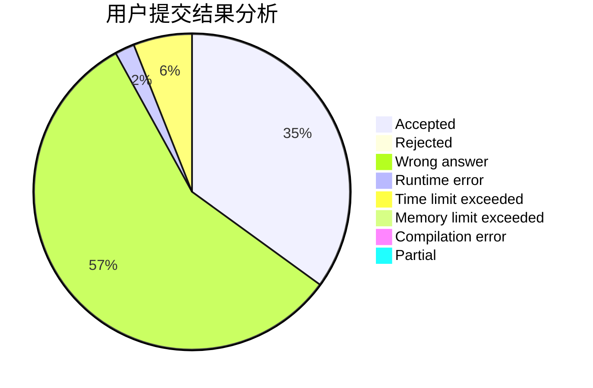
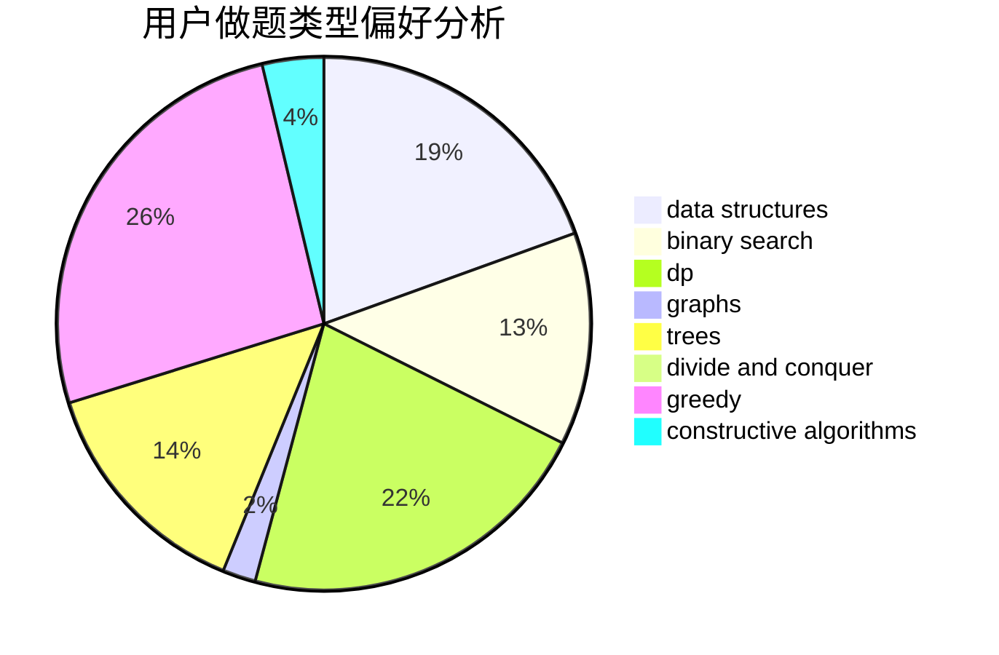

# Juanzhang

<!-- tabs:start -->

#### **用户提交结果分析**

#### **用户做题类型偏好分析**

#### **用户错题知识点分析**

<!-- tabs:end -->
# 推荐题目
[1416F](https://codeforces.com/contest/1416/problem/F)		flows,
                        graph matchings,
                        greedy,
                        implementation		  
[1019E](https://codeforces.com/contest/1019/problem/E)		data structures,
                        divide and conquer,
                        trees		  
[1100F](https://codeforces.com/contest/1100/problem/F)		data structures,
                        divide and conquer,
                        greedy,
                        math		  
[1302F](https://codeforces.com/contest/1302/problem/F)		bitmasks,
                        brute force,
                        expression parsing		  
[645G](https://codeforces.com/contest/645/problem/G)		binary search,
                        geometry		  
[816C](https://codeforces.com/contest/816/problem/C)		dsu,graphs,sortings,trees		  
[39C](https://codeforces.com/contest/39/problem/C)		dp,
                        sortings		  
[1029E](https://codeforces.com/contest/1029/problem/E)		dp,
                        graphs,
                        greedy		  
[1041C](https://codeforces.com/contest/1041/problem/C)		binary search,
                        data structures,
                        greedy,
                        two pointers		  
[749E](https://codeforces.com/contest/749/problem/E)		data structures,
                        probabilities		  
