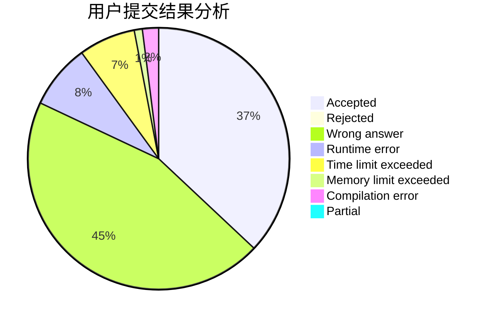
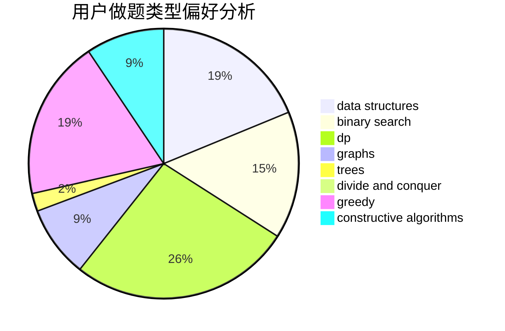
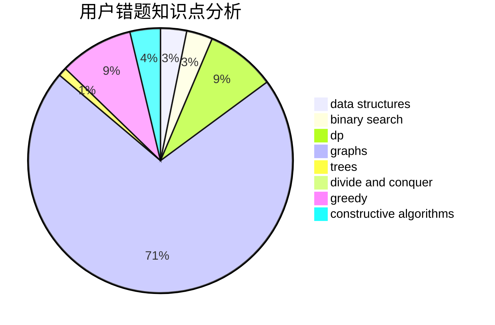

# JustWayYouAre

<!-- tabs:start -->

#### **用户提交结果分析**

#### **用户做题类型偏好分析**

#### **用户错题知识点分析**

<!-- tabs:end -->
# 推荐题目
[1513B](https://codeforces.com/contest/1513/problem/B)		bitmasks,
                        combinatorics,
                        constructive algorithms,
                        math		  
[682D](https://codeforces.com/contest/682/problem/D)		dp,
                        strings		  
[576D](https://codeforces.com/contest/576/problem/D)		dp,
                        matrices		  
[1092E](https://codeforces.com/contest/1092/problem/E)		constructive algorithms,
                        dfs and similar,
                        greedy,
                        trees		  
[281A](https://codeforces.com/contest/281/problem/A)		implementation,
                        strings		  
[937A](https://codeforces.com/contest/937/problem/A)		implementation,
                        sortings		  
[893C](https://codeforces.com/contest/893/problem/C)		dfs and similar,
                        graphs,
                        greedy		  
[652B](https://codeforces.com/contest/652/problem/B)		sortings		  
[166E](https://codeforces.com/contest/166/problem/E)		dp,
                        math,
                        matrices		  
[462B](https://codeforces.com/contest/462/problem/B)		greedy		  
