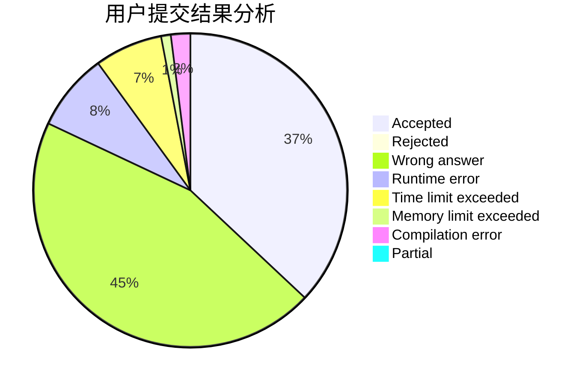
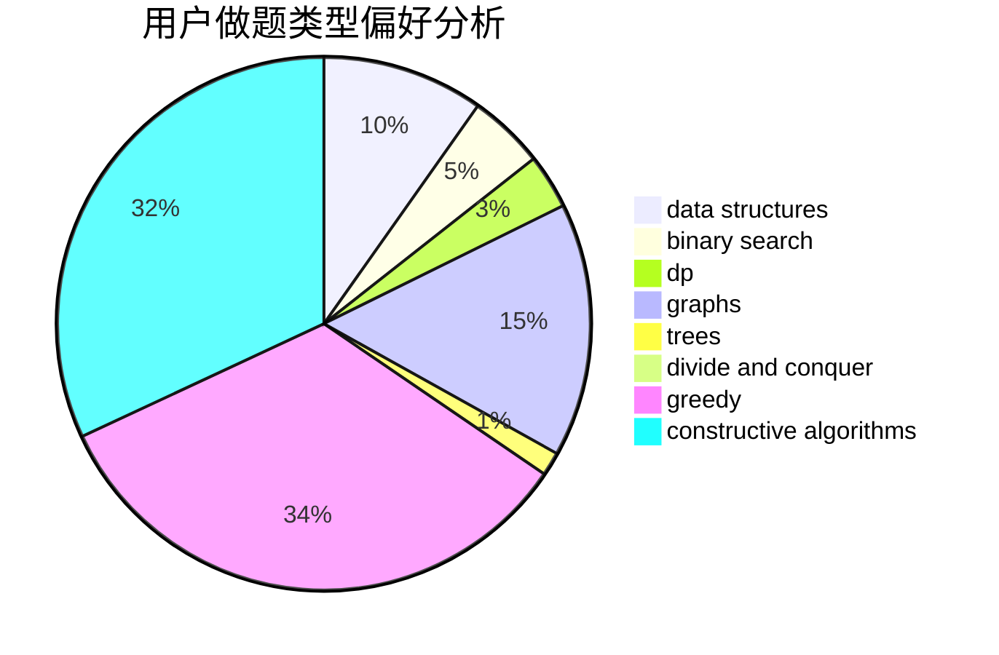
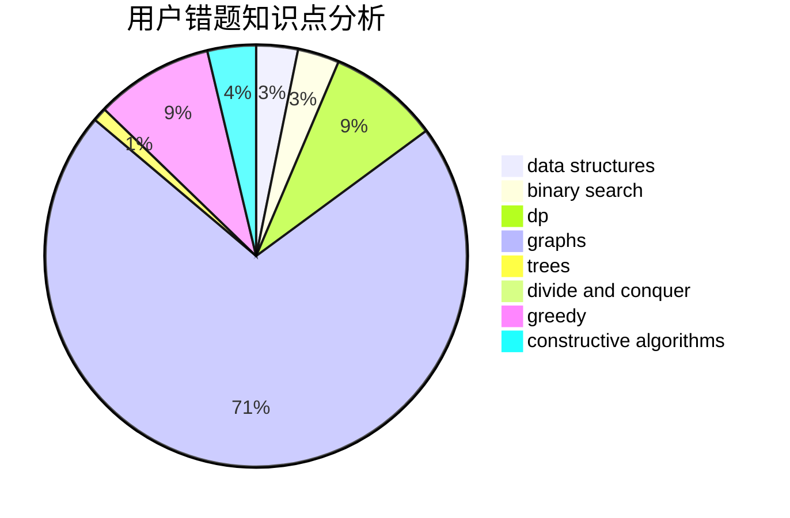

# JustWayYouAre

<!-- tabs:start -->

#### **用户提交结果分析**

#### **用户做题类型偏好分析**

#### **用户错题知识点分析**

<!-- tabs:end -->
# 推荐题目
[1504C](https://codeforces.com/contest/1504/problem/C)		dsu,graphs,sortings,trees		  
[662D](https://codeforces.com/contest/662/problem/D)		constructive algorithms,
                        greedy,
                        implementation,
                        math		  
[551C](https://codeforces.com/contest/551/problem/C)		binary search,
                        greedy		  
[1092B](https://codeforces.com/contest/1092/problem/B)		sortings		  
[265D](https://codeforces.com/contest/265/problem/D)		dsu,graphs,sortings,trees		  
[916E](https://codeforces.com/contest/916/problem/E)		data structures,
                        trees		  
[872A](https://codeforces.com/contest/872/problem/A)		dsu,graphs,sortings,trees		  
[624A](https://codeforces.com/contest/624/problem/A)		math		  
[1510K](https://codeforces.com/contest/1510/problem/K)		brute force,
                        graphs,
                        implementation		  
[441D](https://codeforces.com/contest/441/problem/D)		constructive algorithms,
                        dsu,
                        graphs,
                        implementation,
                        math,
                        string suffix structures		  
