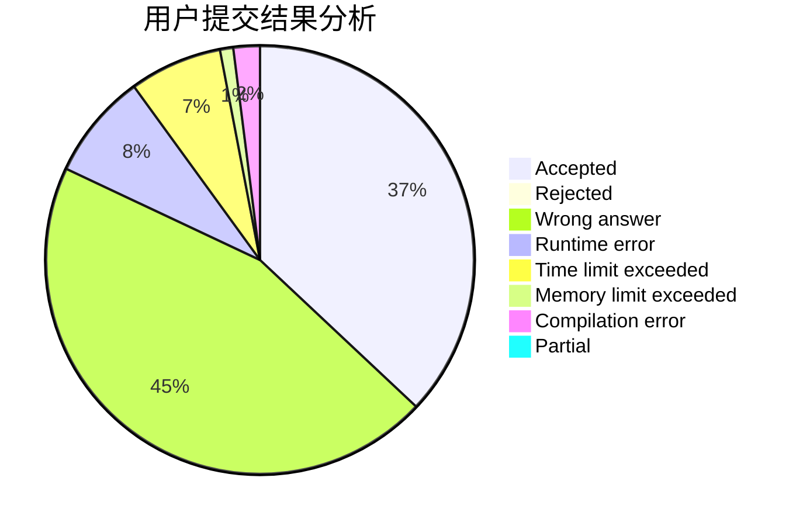
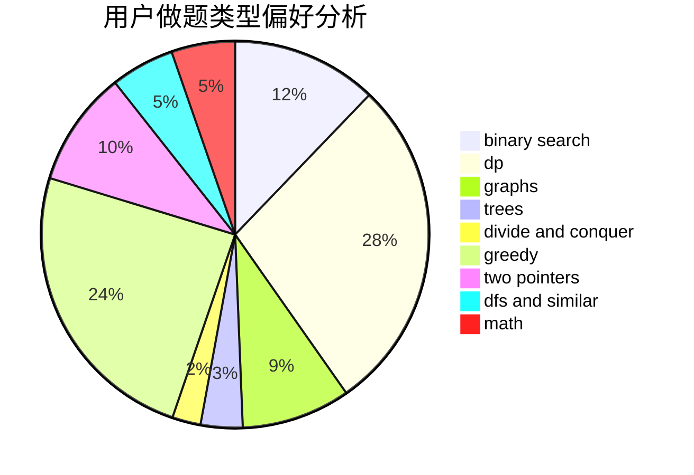

# JustWayYouAre

<!-- tabs:start -->

#### **用户提交结果分析**

#### **用户做题类型偏好分析**

<!-- tabs:end -->
# 推荐题目
[1513B](https://codeforces.com/contest/1513/problem/B)
[682D](https://codeforces.com/contest/682/problem/D)
[576D](https://codeforces.com/contest/576/problem/D)
[1092E](https://codeforces.com/contest/1092/problem/E)
[281A](https://codeforces.com/contest/281/problem/A)
[937A](https://codeforces.com/contest/937/problem/A)
[893C](https://codeforces.com/contest/893/problem/C)
[652B](https://codeforces.com/contest/652/problem/B)
[166E](https://codeforces.com/contest/166/problem/E)
[462B](https://codeforces.com/contest/462/problem/B)
