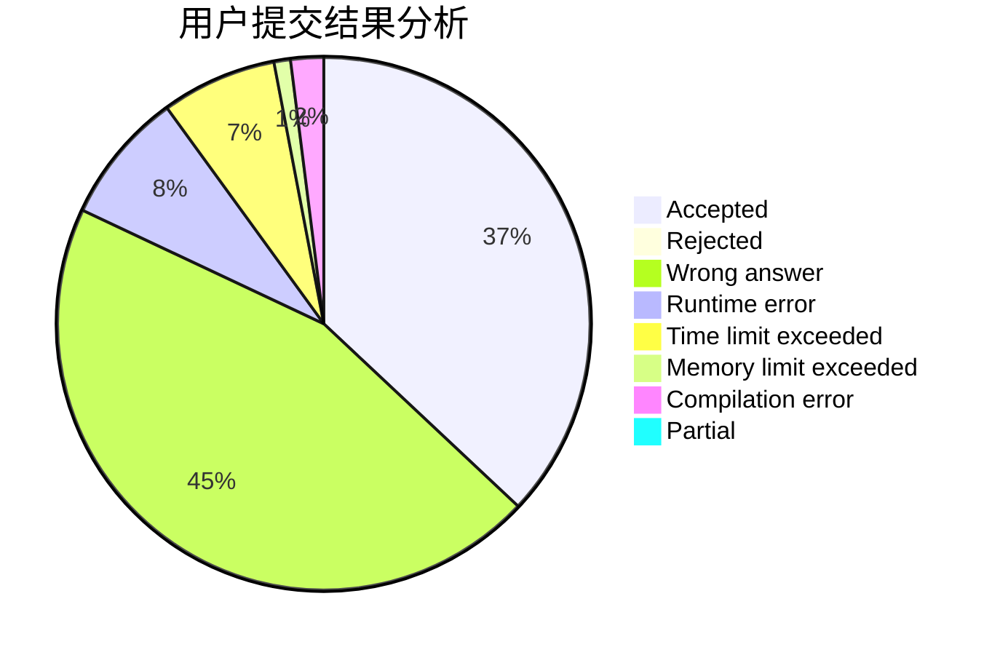
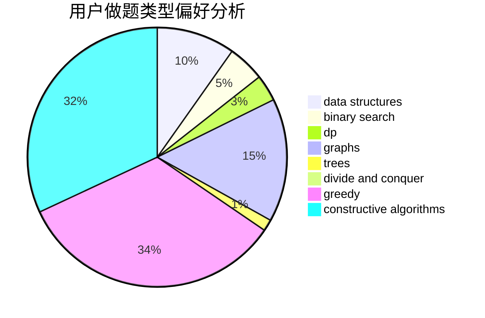
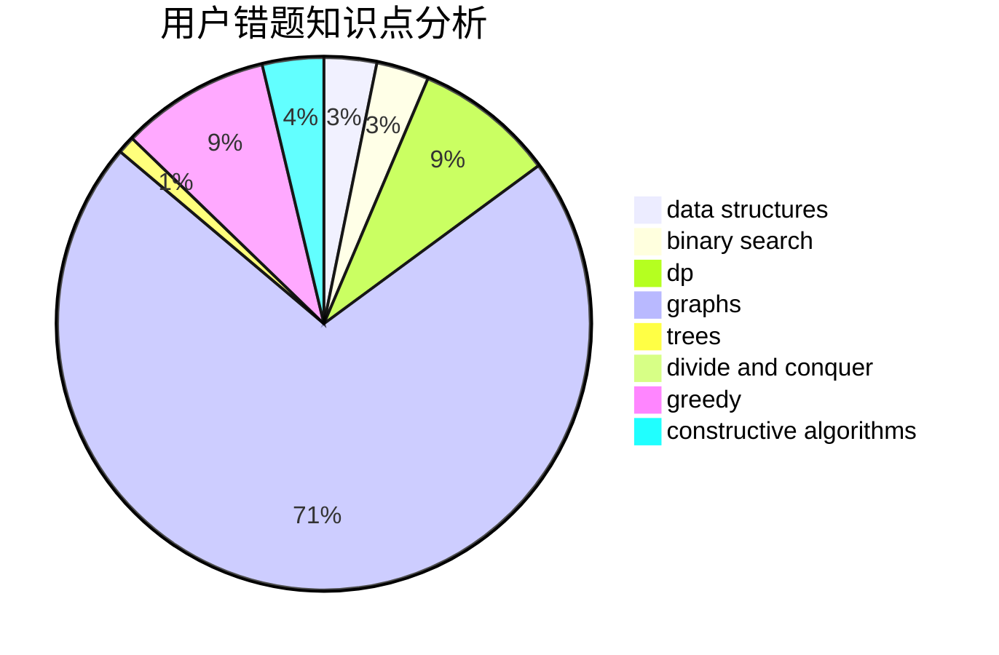

# JustWayYouAre
<!-- tabs:start -->
#### **用户提交结果分析**

#### **用户做题类型偏好分析**

#### **用户错题知识点分析**

<!-- tabs:end -->
# 推荐题目
[Balance the Bits](https://codeforces.com/contest/1504/problem/C)		constructive algorithms,
                        greedy		  
[A Prosperous Lot](http://codeforces.com/problemset/problem/934/B)		constructive algorithms,
                        implementation		  
[Good Sequences](https://codeforces.com/contest/265/problem/D)		dp,
                        number theory		  
[Ehab Fails to Be Thanos](http://codeforces.com/problemset/problem/1174/A)		constructive algorithms,
                        greedy,
                        sortings		  
[Search for Pretty Integers](https://codeforces.com/contest/872/problem/A)		brute force,
                        implementation		  
[Teams Forming](http://codeforces.com/problemset/problem/1092/B)		sortings		  
[International Olympiad](http://codeforces.com/problemset/problem/662/D)		constructive algorithms,
                        greedy,
                        implementation,
                        math		  
[Toy Army](http://codeforces.com/problemset/problem/84/A)		math,
                        number theory		  
[Number of Components](http://codeforces.com/problemset/problem/1270/H)		data structures		  
[An unavoidable detour for home](http://codeforces.com/problemset/problem/814/E)		combinatorics,
                        dp,
                        graphs,
                        shortest paths		  
<!-- tabs:start -->
#### **data structures**
[Balance the Bits](http://codeforces.com/problemset/problem/1270/H)		data structures		  
[A Prosperous Lot](http://codeforces.com/problemset/problem/916/E)		data structures,
                        trees		  
[Good Sequences](http://codeforces.com/problemset/problem/1401/F)		binary search,
                        bitmasks,
                        data structures		  
[Ehab Fails to Be Thanos](http://codeforces.com/problemset/problem/567/D)		binary search,
                        data structures,
                        greedy,
                        sortings		  
[Search for Pretty Integers](http://codeforces.com/problemset/problem/1386/C)		*special problem,
                        bitmasks,
                        data structures,
                        divide and conquer,
                        dsu		  
[Teams Forming](http://codeforces.com/problemset/problem/1276/C)		brute force,
                        combinatorics,
                        constructive algorithms,
                        data structures,
                        greedy,
                        math		  
[International Olympiad](http://codeforces.com/problemset/problem/1492/C)		binary search,
                        data structures,
                        dp,
                        greedy,
                        two pointers		  
[Toy Army](http://codeforces.com/problemset/problem/1490/G)		binary search,
                        data structures,
                        math		  
[Number of Components](http://codeforces.com/problemset/problem/1479/D)		binary search,
                        bitmasks,
                        brute force,
                        data structures,
                        probabilities,
                        trees		  
[An unavoidable detour for home](http://codeforces.com/problemset/problem/1497/A)		brute force,
                        data structures,
                        greedy,
                        sortings		  
#### **binary search**
[Balance the Bits](https://codeforces.com/contest/779/problem/D)		binary search,
                        greedy,
                        strings		  
[A Prosperous Lot](http://codeforces.com/problemset/problem/1366/A)		binary search,
                        greedy,
                        math		  
[Good Sequences](http://codeforces.com/problemset/problem/1401/F)		binary search,
                        bitmasks,
                        data structures		  
[Ehab Fails to Be Thanos](http://codeforces.com/problemset/problem/567/D)		binary search,
                        data structures,
                        greedy,
                        sortings		  
[Search for Pretty Integers](http://codeforces.com/problemset/problem/551/C)		binary search,
                        greedy		  
[Teams Forming](https://codeforces.com/contest/1169/problem/C)		binary search,
                        greedy		  
[International Olympiad](http://codeforces.com/problemset/problem/1492/C)		binary search,
                        data structures,
                        dp,
                        greedy,
                        two pointers		  
[Toy Army](http://codeforces.com/problemset/problem/1463/D)		binary search,
                        constructive algorithms,
                        greedy,
                        two pointers		  
[Number of Components](http://codeforces.com/problemset/problem/1490/G)		binary search,
                        data structures,
                        math		  
[An unavoidable detour for home](http://codeforces.com/problemset/problem/1479/D)		binary search,
                        bitmasks,
                        brute force,
                        data structures,
                        probabilities,
                        trees		  
#### **dp**
[Balance the Bits](https://codeforces.com/contest/265/problem/D)		dp,
                        number theory		  
[A Prosperous Lot](http://codeforces.com/problemset/problem/814/E)		combinatorics,
                        dp,
                        graphs,
                        shortest paths		  
[Good Sequences](http://codeforces.com/problemset/problem/1245/C)		dp		  
[Ehab Fails to Be Thanos](http://codeforces.com/problemset/problem/1492/C)		binary search,
                        data structures,
                        dp,
                        greedy,
                        two pointers		  
[Search for Pretty Integers](https://codeforces.com/contest/1457/problem/C)		brute force,
                        dp,
                        implementation		  
[Teams Forming](http://codeforces.com/problemset/problem/1491/C)		brute force,
                        data structures,
                        dp,
                        greedy,
                        implementation		  
[International Olympiad](http://codeforces.com/problemset/problem/1437/C)		dp,
                        flows,
                        graph matchings,
                        greedy,
                        math,
                        sortings		  
[Toy Army](http://codeforces.com/problemset/problem/1499/B)		brute force,
                        dp,
                        greedy,
                        implementation		  
[Number of Components](http://codeforces.com/problemset/problem/1491/D)		bitmasks,
                        constructive algorithms,
                        dp,
                        greedy,
                        math		  
[An unavoidable detour for home](http://codeforces.com/problemset/problem/1497/E1)		data structures,
                        dp,
                        greedy,
                        math,
                        number theory,
                        two pointers		  
#### **graph**
[Balance the Bits](http://codeforces.com/problemset/problem/814/E)		combinatorics,
                        dp,
                        graphs,
                        shortest paths		  
[A Prosperous Lot](http://codeforces.com/problemset/problem/441/D)		constructive algorithms,
                        dsu,
                        graphs,
                        implementation,
                        math,
                        string suffix structures		  
[Good Sequences](http://codeforces.com/problemset/problem/1510/K)		brute force,
                        graphs,
                        implementation		  
[Ehab Fails to Be Thanos](http://codeforces.com/problemset/problem/1383/F)		flows,
                        graphs		  
[Search for Pretty Integers](http://codeforces.com/problemset/problem/1105/D)		dfs and similar,
                        graphs,
                        implementation,
                        shortest paths		  
[Teams Forming](http://codeforces.com/problemset/problem/1487/C)		brute force,
                        constructive algorithms,
                        dfs and similar,
                        graphs,
                        greedy,
                        implementation,
                        math		  
[International Olympiad](http://codeforces.com/problemset/problem/1437/C)		dp,
                        flows,
                        graph matchings,
                        greedy,
                        math,
                        sortings		  
[Toy Army](http://codeforces.com/problemset/problem/1470/D)		constructive algorithms,
                        dfs and similar,
                        graph matchings,
                        graphs,
                        greedy		  
[Number of Components](http://codeforces.com/problemset/problem/1476/C)		dp,
                        graphs,
                        greedy		  
[An unavoidable detour for home](http://codeforces.com/problemset/problem/1304/D)		constructive algorithms,
                        graphs,
                        greedy,
                        two pointers		  
#### **trees**
[Balance the Bits](http://codeforces.com/problemset/problem/916/E)		data structures,
                        trees		  
[A Prosperous Lot](http://codeforces.com/problemset/problem/1479/D)		binary search,
                        bitmasks,
                        brute force,
                        data structures,
                        probabilities,
                        trees		  
[Good Sequences](http://codeforces.com/problemset/problem/1511/C)		brute force,
                        data structures,
                        implementation,
                        trees		  
[Ehab Fails to Be Thanos](http://codeforces.com/problemset/problem/1499/F)		combinatorics,
                        dfs and similar,
                        dp,
                        trees		  
[Search for Pretty Integers](http://codeforces.com/problemset/problem/1491/E)		brute force,
                        dfs and similar,
                        divide and conquer,
                        number theory,
                        trees		  
[Teams Forming](http://codeforces.com/problemset/problem/1466/D)		data structures,
                        greedy,
                        sortings,
                        trees		  
[International Olympiad](http://codeforces.com/problemset/problem/1495/D)		combinatorics,
                        dfs and similar,
                        graphs,
                        math,
                        shortest paths,
                        trees		  
[Toy Army](http://codeforces.com/problemset/problem/1303/G)		data structures,
                        divide and conquer,
                        geometry,
                        trees		  
[Number of Components](http://codeforces.com/problemset/problem/1454/E)		combinatorics,
                        dfs and similar,
                        graphs,
                        trees		  
[An unavoidable detour for home](http://codeforces.com/problemset/problem/1494/D)		constructive algorithms,
                        data structures,
                        dfs and similar,
                        divide and conquer,
                        dsu,
                        greedy,
                        sortings,
                        trees		  
#### **divide and conquer**
[Balance the Bits](http://codeforces.com/problemset/problem/1386/C)		*special problem,
                        bitmasks,
                        data structures,
                        divide and conquer,
                        dsu		  
[A Prosperous Lot](http://codeforces.com/problemset/problem/1461/D)		binary search,
                        brute force,
                        data structures,
                        divide and conquer,
                        implementation,
                        sortings		  
[Good Sequences](http://codeforces.com/problemset/problem/1466/G)		combinatorics,
                        divide and conquer,
                        hashing,
                        math,
                        string suffix structures,
                        strings		  
[Ehab Fails to Be Thanos](http://codeforces.com/problemset/problem/1490/D)		dfs and similar,
                        divide and conquer,
                        implementation		  
[Search for Pretty Integers](https://codeforces.com/contest/1483/problem/C)		data structures,
                        divide and conquer,
                        dp		  
[Teams Forming](http://codeforces.com/problemset/problem/1491/E)		brute force,
                        dfs and similar,
                        divide and conquer,
                        number theory,
                        trees		  
[International Olympiad](http://codeforces.com/problemset/problem/1303/G)		data structures,
                        divide and conquer,
                        geometry,
                        trees		  
[Toy Army](http://codeforces.com/problemset/problem/1494/D)		constructive algorithms,
                        data structures,
                        dfs and similar,
                        divide and conquer,
                        dsu,
                        greedy,
                        sortings,
                        trees		  
[Number of Components](http://codeforces.com/problemset/problem/1482/E)		data structures,
                        divide and conquer,
                        dp		  
[An unavoidable detour for home](http://codeforces.com/problemset/problem/566/C)		dfs and similar,
                        divide and conquer,
                        trees		  
#### **greedy**
[Balance the Bits](https://codeforces.com/contest/1504/problem/C)		constructive algorithms,
                        greedy		  
[A Prosperous Lot](http://codeforces.com/problemset/problem/1174/A)		constructive algorithms,
                        greedy,
                        sortings		  
[Good Sequences](http://codeforces.com/problemset/problem/662/D)		constructive algorithms,
                        greedy,
                        implementation,
                        math		  
[Ehab Fails to Be Thanos](http://codeforces.com/problemset/problem/570/B)		constructive algorithms,
                        games,
                        greedy,
                        implementation,
                        math		  
[Search for Pretty Integers](https://codeforces.com/contest/779/problem/D)		binary search,
                        greedy,
                        strings		  
[Teams Forming](http://codeforces.com/problemset/problem/1366/A)		binary search,
                        greedy,
                        math		  
[International Olympiad](http://codeforces.com/problemset/problem/567/D)		binary search,
                        data structures,
                        greedy,
                        sortings		  
[Toy Army](http://codeforces.com/problemset/problem/551/C)		binary search,
                        greedy		  
[Number of Components](http://codeforces.com/problemset/problem/1474/A)		greedy		  
[An unavoidable detour for home](http://codeforces.com/problemset/problem/1276/C)		brute force,
                        combinatorics,
                        constructive algorithms,
                        data structures,
                        greedy,
                        math		  
#### **constructive algorithms**
[Balance the Bits](https://codeforces.com/contest/1504/problem/C)		constructive algorithms,
                        greedy		  
[A Prosperous Lot](http://codeforces.com/problemset/problem/934/B)		constructive algorithms,
                        implementation		  
[Good Sequences](http://codeforces.com/problemset/problem/1174/A)		constructive algorithms,
                        greedy,
                        sortings		  
[Ehab Fails to Be Thanos](http://codeforces.com/problemset/problem/662/D)		constructive algorithms,
                        greedy,
                        implementation,
                        math		  
[Search for Pretty Integers](http://codeforces.com/problemset/problem/441/D)		constructive algorithms,
                        dsu,
                        graphs,
                        implementation,
                        math,
                        string suffix structures		  
[Teams Forming](http://codeforces.com/problemset/problem/570/B)		constructive algorithms,
                        games,
                        greedy,
                        implementation,
                        math		  
[International Olympiad](http://codeforces.com/problemset/problem/1276/C)		brute force,
                        combinatorics,
                        constructive algorithms,
                        data structures,
                        greedy,
                        math		  
[Toy Army](http://codeforces.com/problemset/problem/1316/C)		constructive algorithms,
                        math,
                        ternary search		  
[Number of Components](http://codeforces.com/problemset/problem/1493/A)		constructive algorithms,
                        greedy		  
[An unavoidable detour for home](http://codeforces.com/problemset/problem/1463/D)		binary search,
                        constructive algorithms,
                        greedy,
                        two pointers		  
#### **sortings**
[Balance the Bits](http://codeforces.com/problemset/problem/1174/A)		constructive algorithms,
                        greedy,
                        sortings		  
[A Prosperous Lot](http://codeforces.com/problemset/problem/1092/B)		sortings		  
[Good Sequences](http://codeforces.com/problemset/problem/567/D)		binary search,
                        data structures,
                        greedy,
                        sortings		  
[Ehab Fails to Be Thanos](http://codeforces.com/problemset/problem/1198/A)		sortings,
                        two pointers		  
[Search for Pretty Integers](https://codeforces.com/contest/1496/problem/C)		geometry,
                        greedy,
                        math,
                        sortings		  
[Teams Forming](http://codeforces.com/problemset/problem/1495/A)		geometry,
                        greedy,
                        math,
                        sortings		  
[International Olympiad](http://codeforces.com/problemset/problem/1497/A)		brute force,
                        data structures,
                        greedy,
                        sortings		  
[Toy Army](http://codeforces.com/problemset/problem/1427/A)		math,
                        sortings		  
[Number of Components](http://codeforces.com/problemset/problem/1461/D)		binary search,
                        brute force,
                        data structures,
                        divide and conquer,
                        implementation,
                        sortings		  
[An unavoidable detour for home](http://codeforces.com/problemset/problem/1437/C)		dp,
                        flows,
                        graph matchings,
                        greedy,
                        math,
                        sortings		  
<!-- tabs:end -->
