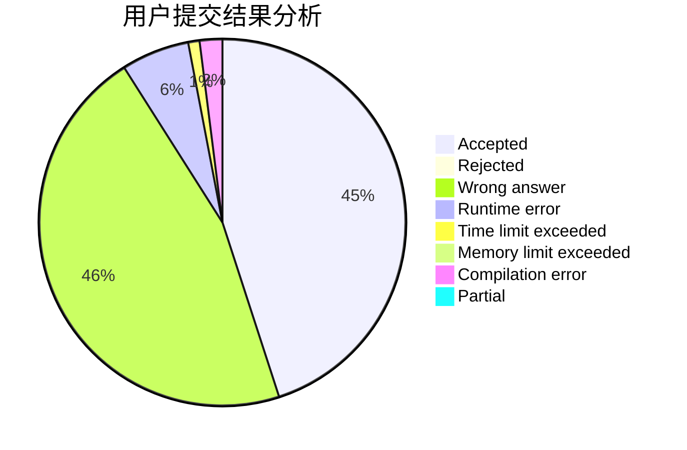
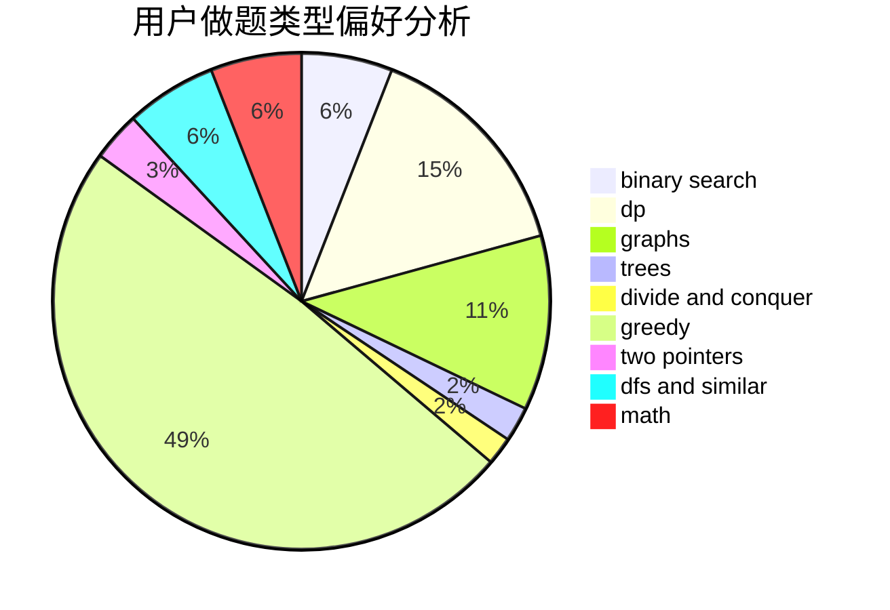

# JvJv

<!-- tabs:start -->

#### **用户提交结果分析**

#### **用户做题类型偏好分析**

<!-- tabs:end -->
# 推荐题目
[1168E](https://codeforces.com/contest/1168/problem/E)
[10C](https://codeforces.com/contest/10/problem/C)
[886F](https://codeforces.com/contest/886/problem/F)
[232D](https://codeforces.com/contest/232/problem/D)
[825F](https://codeforces.com/contest/825/problem/F)
[1009C](https://codeforces.com/contest/1009/problem/C)
[894E](https://codeforces.com/contest/894/problem/E)
[1031C](https://codeforces.com/contest/1031/problem/C)
[1360E](https://codeforces.com/contest/1360/problem/E)
[1373C](https://codeforces.com/contest/1373/problem/C)
