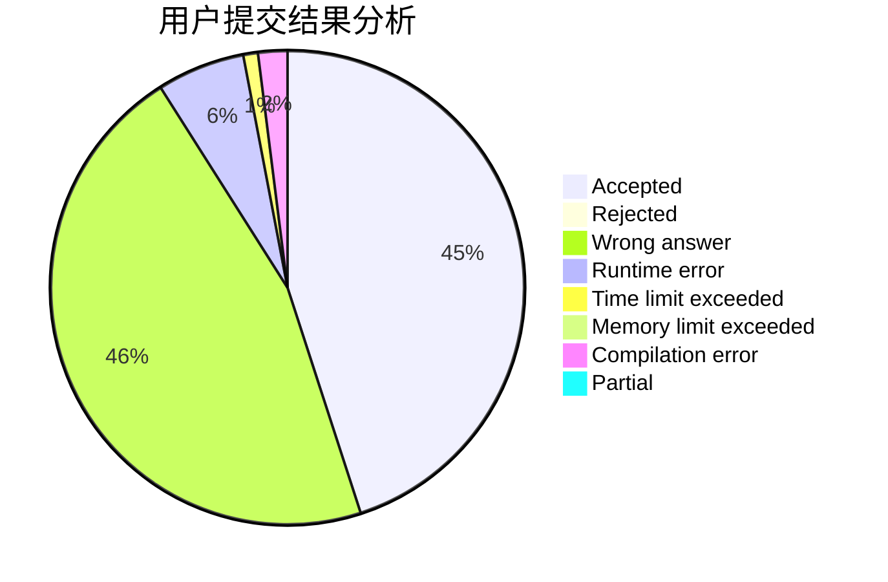
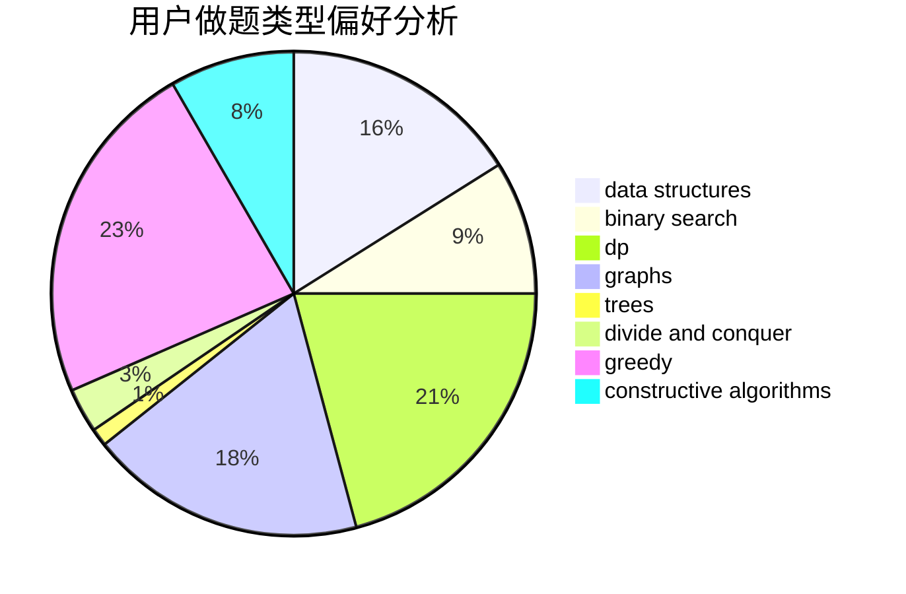
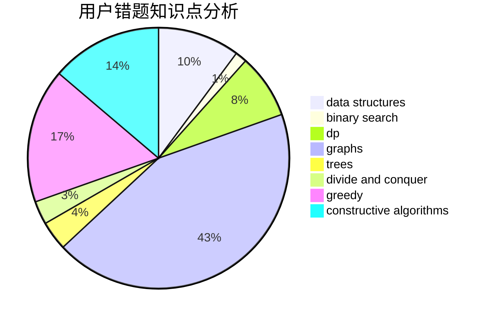

# JvJv

<!-- tabs:start -->

#### **用户提交结果分析**

#### **用户做题类型偏好分析**

#### **用户错题知识点分析**

<!-- tabs:end -->
# 推荐题目
[1168E](https://codeforces.com/contest/1168/problem/E)		constructive algorithms,
                        math		  
[10C](https://codeforces.com/contest/10/problem/C)		number theory		  
[886F](https://codeforces.com/contest/886/problem/F)		geometry		  
[232D](https://codeforces.com/contest/232/problem/D)		binary search,
                        data structures,
                        string suffix structures		  
[825F](https://codeforces.com/contest/825/problem/F)		dp,
                        hashing,
                        string suffix structures,
                        strings		  
[1009C](https://codeforces.com/contest/1009/problem/C)		greedy,
                        math		  
[894E](https://codeforces.com/contest/894/problem/E)		dp,
                        graphs		  
[1031C](https://codeforces.com/contest/1031/problem/C)		greedy		  
[1360E](https://codeforces.com/contest/1360/problem/E)		dp,
                        graphs,
                        implementation,
                        shortest paths		  
[1373C](https://codeforces.com/contest/1373/problem/C)		math		  
