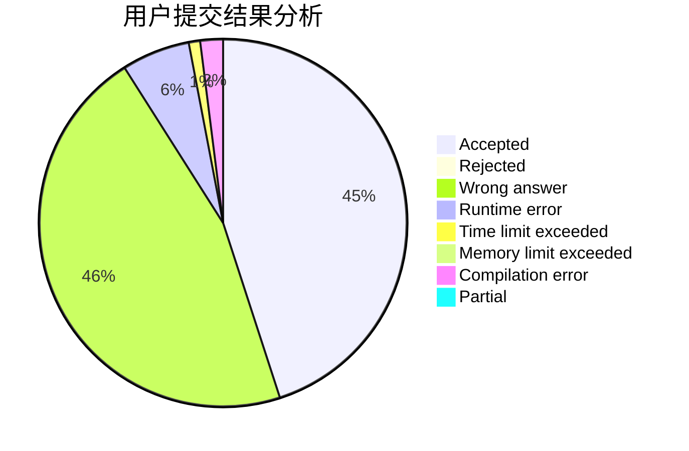
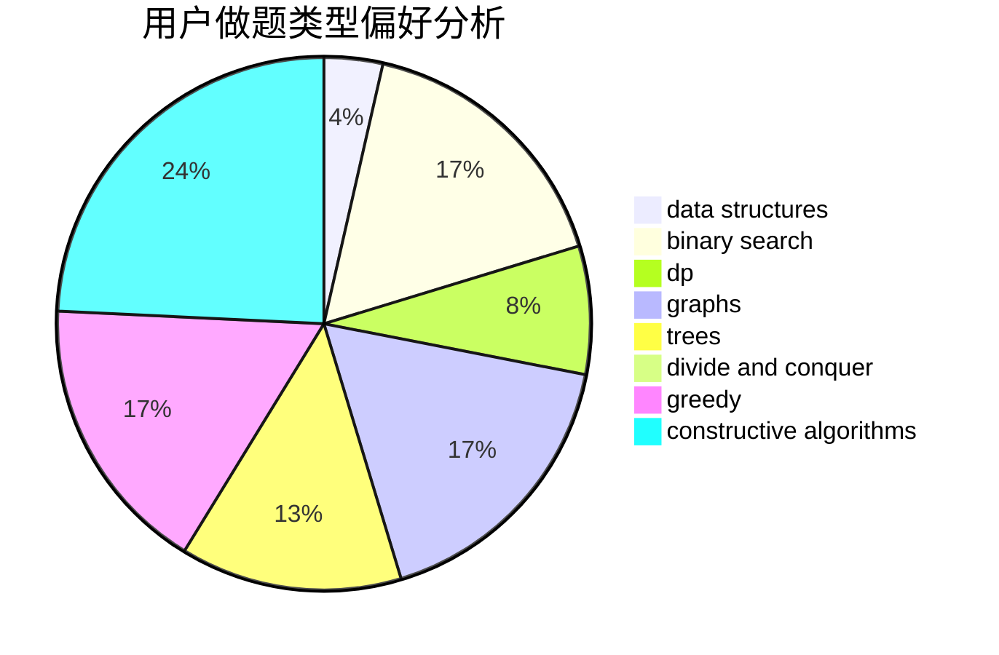
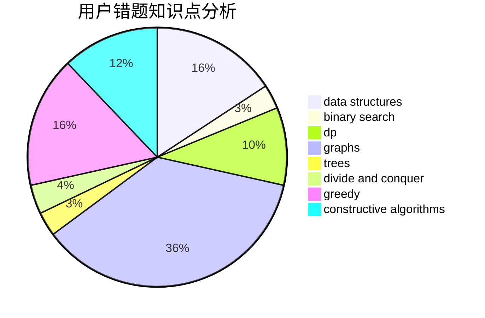

# JvJv
<!-- tabs:start -->
#### **用户提交结果分析**

#### **用户做题类型偏好分析**

#### **用户错题知识点分析**

<!-- tabs:end -->
# 推荐题目
[Lonely Numbers](https://codeforces.com/contest/1424/problem/J)		binary search,
                        math,
                        number theory,
                        two pointers		  
[Silent Classroom](http://codeforces.com/problemset/problem/1166/A)		combinatorics,
                        greedy		  
[Linear Congruential Generator](http://codeforces.com/problemset/problem/1030/G)		number theory		  
[Rank List](http://codeforces.com/problemset/problem/166/A)		binary search,
                        implementation,
                        sortings		  
[Equalize Prices Again](https://codeforces.com/contest/1432/problem/C)		math		  
[Guess two numbers](https://codeforces.com/contest/1008/problem/E)		binary search,
                        interactive		  
[Buy Low Sell High](https://codeforces.com/contest/866/problem/D)		constructive algorithms,
                        data structures,
                        greedy		  
[Ball](http://codeforces.com/problemset/problem/12/D)		data structures,
                        sortings		  
[Alarm Clock](http://codeforces.com/problemset/problem/1354/A)		math		  
[Lucky Sum of Digits](http://codeforces.com/problemset/problem/109/A)		brute force,
                        implementation		  
<!-- tabs:start -->
#### **data structures**
[Lonely Numbers](https://codeforces.com/contest/866/problem/D)		constructive algorithms,
                        data structures,
                        greedy		  
[Silent Classroom](http://codeforces.com/problemset/problem/12/D)		data structures,
                        sortings		  
[Linear Congruential Generator](http://codeforces.com/problemset/problem/631/E)		data structures,
                        dp,
                        geometry		  
[Rank List](https://codeforces.com/contest/759/problem/C)		data structures		  
[Equalize Prices Again](http://codeforces.com/problemset/problem/1470/E)		binary search,
                        combinatorics,
                        data structures,
                        dp,
                        graphs,
                        implementation,
                        two pointers		  
[Guess two numbers](http://codeforces.com/problemset/problem/1492/C)		binary search,
                        data structures,
                        dp,
                        greedy,
                        two pointers		  
[Buy Low Sell High](http://codeforces.com/problemset/problem/1490/G)		binary search,
                        data structures,
                        math		  
[Ball](http://codeforces.com/problemset/problem/1479/D)		binary search,
                        bitmasks,
                        brute force,
                        data structures,
                        probabilities,
                        trees		  
[Alarm Clock](http://codeforces.com/problemset/problem/1497/A)		brute force,
                        data structures,
                        greedy,
                        sortings		  
[Lucky Sum of Digits](http://codeforces.com/problemset/problem/1491/C)		brute force,
                        data structures,
                        dp,
                        greedy,
                        implementation		  
#### **binary search**
[Lonely Numbers](https://codeforces.com/contest/1424/problem/J)		binary search,
                        math,
                        number theory,
                        two pointers		  
[Silent Classroom](http://codeforces.com/problemset/problem/166/A)		binary search,
                        implementation,
                        sortings		  
[Linear Congruential Generator](https://codeforces.com/contest/1008/problem/E)		binary search,
                        interactive		  
[Rank List](http://codeforces.com/problemset/problem/1470/E)		binary search,
                        combinatorics,
                        data structures,
                        dp,
                        graphs,
                        implementation,
                        two pointers		  
[Equalize Prices Again](http://codeforces.com/problemset/problem/1492/C)		binary search,
                        data structures,
                        dp,
                        greedy,
                        two pointers		  
[Guess two numbers](http://codeforces.com/problemset/problem/1463/D)		binary search,
                        constructive algorithms,
                        greedy,
                        two pointers		  
[Buy Low Sell High](http://codeforces.com/problemset/problem/1490/G)		binary search,
                        data structures,
                        math		  
[Ball](http://codeforces.com/problemset/problem/1479/D)		binary search,
                        bitmasks,
                        brute force,
                        data structures,
                        probabilities,
                        trees		  
[Alarm Clock](http://codeforces.com/problemset/problem/1436/E)		binary search,
                        data structures,
                        two pointers		  
[Lucky Sum of Digits](http://codeforces.com/problemset/problem/1461/D)		binary search,
                        brute force,
                        data structures,
                        divide and conquer,
                        implementation,
                        sortings		  
#### **dp**
[Lonely Numbers](http://codeforces.com/problemset/problem/631/E)		data structures,
                        dp,
                        geometry		  
[Silent Classroom](http://codeforces.com/problemset/problem/225/C)		dp,
                        matrices		  
[Linear Congruential Generator](http://codeforces.com/problemset/problem/212/E)		dfs and similar,
                        dp,
                        trees		  
[Rank List](https://codeforces.com/contest/934/problem/C)		dp		  
[Equalize Prices Again](http://codeforces.com/problemset/problem/808/G)		dp,
                        strings		  
[Guess two numbers](http://codeforces.com/problemset/problem/1470/E)		binary search,
                        combinatorics,
                        data structures,
                        dp,
                        graphs,
                        implementation,
                        two pointers		  
[Buy Low Sell High](http://codeforces.com/problemset/problem/1492/C)		binary search,
                        data structures,
                        dp,
                        greedy,
                        two pointers		  
[Ball](https://codeforces.com/contest/1457/problem/C)		brute force,
                        dp,
                        implementation		  
[Alarm Clock](http://codeforces.com/problemset/problem/1491/C)		brute force,
                        data structures,
                        dp,
                        greedy,
                        implementation		  
[Lucky Sum of Digits](http://codeforces.com/problemset/problem/1437/C)		dp,
                        flows,
                        graph matchings,
                        greedy,
                        math,
                        sortings		  
#### **graph**
[Lonely Numbers](http://codeforces.com/problemset/problem/1266/F)		dfs and similar,
                        graphs		  
[Silent Classroom](https://codeforces.com/contest/742/problem/E)		constructive algorithms,
                        dfs and similar,
                        graphs		  
[Linear Congruential Generator](http://codeforces.com/problemset/problem/1470/E)		binary search,
                        combinatorics,
                        data structures,
                        dp,
                        graphs,
                        implementation,
                        two pointers		  
[Rank List](http://codeforces.com/problemset/problem/1487/C)		brute force,
                        constructive algorithms,
                        dfs and similar,
                        graphs,
                        greedy,
                        implementation,
                        math		  
[Equalize Prices Again](http://codeforces.com/problemset/problem/1437/C)		dp,
                        flows,
                        graph matchings,
                        greedy,
                        math,
                        sortings		  
[Guess two numbers](http://codeforces.com/problemset/problem/1470/D)		constructive algorithms,
                        dfs and similar,
                        graph matchings,
                        graphs,
                        greedy		  
[Buy Low Sell High](http://codeforces.com/problemset/problem/1476/C)		dp,
                        graphs,
                        greedy		  
[Ball](http://codeforces.com/problemset/problem/1304/D)		constructive algorithms,
                        graphs,
                        greedy,
                        two pointers		  
[Alarm Clock](http://codeforces.com/problemset/problem/1475/C)		combinatorics,
                        graphs,
                        math		  
[Lucky Sum of Digits](http://codeforces.com/problemset/problem/553/E)		dp,
                        fft,
                        graphs,
                        math,
                        probabilities		  
#### **trees**
[Lonely Numbers](http://codeforces.com/problemset/problem/212/E)		dfs and similar,
                        dp,
                        trees		  
[Silent Classroom](https://codeforces.com/contest/1246/problem/D)		constructive algorithms,
                        greedy,
                        trees		  
[Linear Congruential Generator](http://codeforces.com/problemset/problem/1479/D)		binary search,
                        bitmasks,
                        brute force,
                        data structures,
                        probabilities,
                        trees		  
[Rank List](http://codeforces.com/problemset/problem/1511/C)		brute force,
                        data structures,
                        implementation,
                        trees		  
[Equalize Prices Again](http://codeforces.com/problemset/problem/1499/F)		combinatorics,
                        dfs and similar,
                        dp,
                        trees		  
[Guess two numbers](http://codeforces.com/problemset/problem/1491/E)		brute force,
                        dfs and similar,
                        divide and conquer,
                        number theory,
                        trees		  
[Buy Low Sell High](http://codeforces.com/problemset/problem/1466/D)		data structures,
                        greedy,
                        sortings,
                        trees		  
[Ball](http://codeforces.com/problemset/problem/1495/D)		combinatorics,
                        dfs and similar,
                        graphs,
                        math,
                        shortest paths,
                        trees		  
[Alarm Clock](http://codeforces.com/problemset/problem/1303/G)		data structures,
                        divide and conquer,
                        geometry,
                        trees		  
[Lucky Sum of Digits](http://codeforces.com/problemset/problem/1454/E)		combinatorics,
                        dfs and similar,
                        graphs,
                        trees		  
#### **divide and conquer**
[Lonely Numbers](http://codeforces.com/problemset/problem/1461/D)		binary search,
                        brute force,
                        data structures,
                        divide and conquer,
                        implementation,
                        sortings		  
[Silent Classroom](http://codeforces.com/problemset/problem/1466/G)		combinatorics,
                        divide and conquer,
                        hashing,
                        math,
                        string suffix structures,
                        strings		  
[Linear Congruential Generator](http://codeforces.com/problemset/problem/1490/D)		dfs and similar,
                        divide and conquer,
                        implementation		  
[Rank List](https://codeforces.com/contest/1483/problem/C)		data structures,
                        divide and conquer,
                        dp		  
[Equalize Prices Again](http://codeforces.com/problemset/problem/1491/E)		brute force,
                        dfs and similar,
                        divide and conquer,
                        number theory,
                        trees		  
[Guess two numbers](http://codeforces.com/problemset/problem/1303/G)		data structures,
                        divide and conquer,
                        geometry,
                        trees		  
[Buy Low Sell High](http://codeforces.com/problemset/problem/1494/D)		constructive algorithms,
                        data structures,
                        dfs and similar,
                        divide and conquer,
                        dsu,
                        greedy,
                        sortings,
                        trees		  
[Ball](http://codeforces.com/problemset/problem/1482/E)		data structures,
                        divide and conquer,
                        dp		  
[Alarm Clock](http://codeforces.com/problemset/problem/566/C)		dfs and similar,
                        divide and conquer,
                        trees		  
[Lucky Sum of Digits](http://codeforces.com/problemset/problem/1428/F)		binary search,
                        data structures,
                        divide and conquer,
                        dp,
                        two pointers		  
#### **greedy**
[Lonely Numbers](http://codeforces.com/problemset/problem/1166/A)		combinatorics,
                        greedy		  
[Silent Classroom](https://codeforces.com/contest/866/problem/D)		constructive algorithms,
                        data structures,
                        greedy		  
[Linear Congruential Generator](http://codeforces.com/problemset/problem/920/C)		dfs and similar,
                        greedy,
                        math,
                        sortings,
                        two pointers		  
[Rank List](https://codeforces.com/contest/1246/problem/D)		constructive algorithms,
                        greedy,
                        trees		  
[Equalize Prices Again](http://codeforces.com/problemset/problem/1492/C)		binary search,
                        data structures,
                        dp,
                        greedy,
                        two pointers		  
[Guess two numbers](https://codeforces.com/contest/1496/problem/C)		geometry,
                        greedy,
                        math,
                        sortings		  
[Buy Low Sell High](http://codeforces.com/problemset/problem/1493/A)		constructive algorithms,
                        greedy		  
[Ball](http://codeforces.com/problemset/problem/1463/D)		binary search,
                        constructive algorithms,
                        greedy,
                        two pointers		  
[Alarm Clock](http://codeforces.com/problemset/problem/1462/C)		brute force,
                        greedy,
                        math		  
[Lucky Sum of Digits](http://codeforces.com/problemset/problem/1494/B)		bitmasks,
                        brute force,
                        greedy,
                        implementation		  
#### **constructive algorithms**
[Lonely Numbers](https://codeforces.com/contest/866/problem/D)		constructive algorithms,
                        data structures,
                        greedy		  
[Silent Classroom](http://codeforces.com/problemset/problem/297/A)		constructive algorithms		  
[Linear Congruential Generator](https://codeforces.com/contest/742/problem/E)		constructive algorithms,
                        dfs and similar,
                        graphs		  
[Rank List](http://codeforces.com/problemset/problem/1227/G)		constructive algorithms		  
[Equalize Prices Again](https://codeforces.com/contest/1246/problem/D)		constructive algorithms,
                        greedy,
                        trees		  
[Guess two numbers](http://codeforces.com/problemset/problem/1059/C)		constructive algorithms,
                        math		  
[Buy Low Sell High](http://codeforces.com/problemset/problem/1366/D)		constructive algorithms,
                        math,
                        number theory		  
[Ball](http://codeforces.com/problemset/problem/1493/A)		constructive algorithms,
                        greedy		  
[Alarm Clock](http://codeforces.com/problemset/problem/1463/D)		binary search,
                        constructive algorithms,
                        greedy,
                        two pointers		  
[Lucky Sum of Digits](https://codeforces.com/contest/1456/problem/B)		bitmasks,
                        brute force,
                        constructive algorithms		  
#### **sortings**
[Lonely Numbers](http://codeforces.com/problemset/problem/166/A)		binary search,
                        implementation,
                        sortings		  
[Silent Classroom](http://codeforces.com/problemset/problem/12/D)		data structures,
                        sortings		  
[Linear Congruential Generator](http://codeforces.com/problemset/problem/920/C)		dfs and similar,
                        greedy,
                        math,
                        sortings,
                        two pointers		  
[Rank List](https://codeforces.com/contest/1496/problem/C)		geometry,
                        greedy,
                        math,
                        sortings		  
[Equalize Prices Again](http://codeforces.com/problemset/problem/1495/A)		geometry,
                        greedy,
                        math,
                        sortings		  
[Guess two numbers](http://codeforces.com/problemset/problem/1497/A)		brute force,
                        data structures,
                        greedy,
                        sortings		  
[Buy Low Sell High](http://codeforces.com/problemset/problem/1427/A)		math,
                        sortings		  
[Ball](http://codeforces.com/problemset/problem/1461/D)		binary search,
                        brute force,
                        data structures,
                        divide and conquer,
                        implementation,
                        sortings		  
[Alarm Clock](http://codeforces.com/problemset/problem/1437/C)		dp,
                        flows,
                        graph matchings,
                        greedy,
                        math,
                        sortings		  
[Lucky Sum of Digits](http://codeforces.com/problemset/problem/1473/A)		greedy,
                        implementation,
                        math,
                        sortings		  
<!-- tabs:end -->
