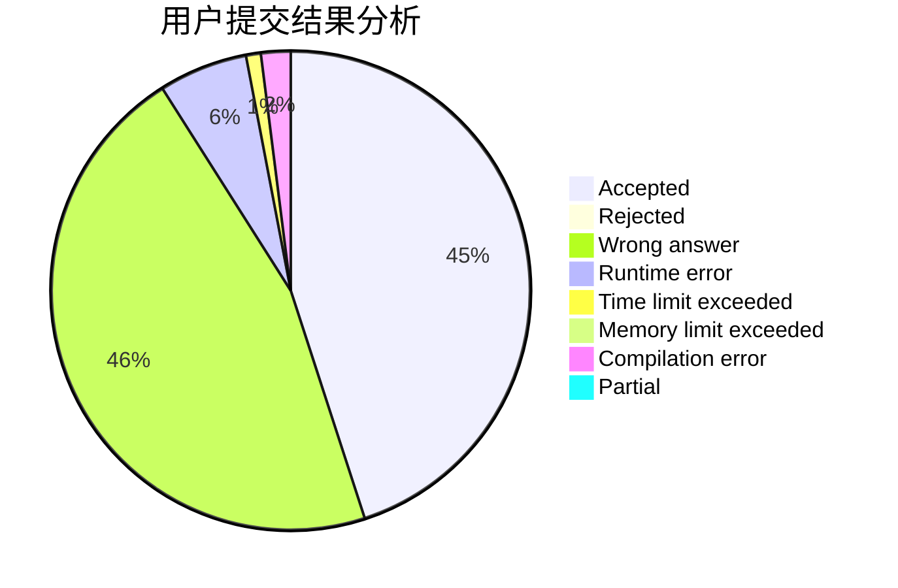
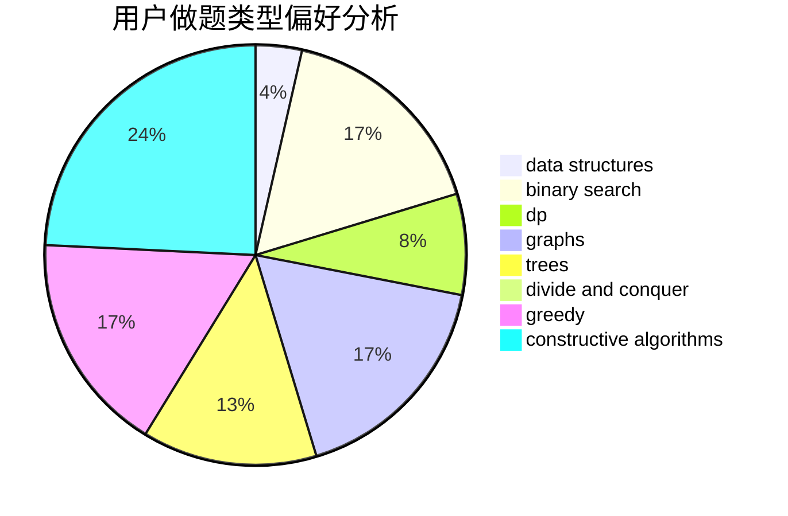
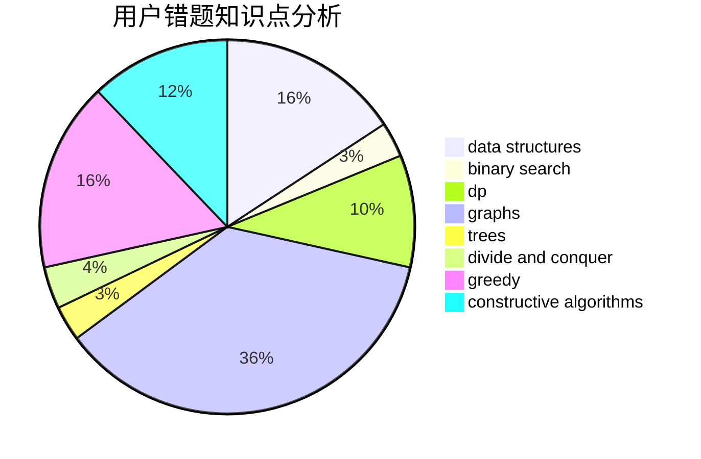

# JvJv

<!-- tabs:start -->

#### **用户提交结果分析**

#### **用户做题类型偏好分析**

#### **用户错题知识点分析**

<!-- tabs:end -->
# 推荐题目
[1166A](https://codeforces.com/contest/1166/problem/A)		combinatorics,
                        greedy		  
[109A](https://codeforces.com/contest/109/problem/A)		brute force,
                        implementation		  
[866D](https://codeforces.com/contest/866/problem/D)		dsu,graphs,sortings,trees		  
[212E](https://codeforces.com/contest/212/problem/E)		dfs and similar,
                        dp,
                        trees		  
[808G](https://codeforces.com/contest/808/problem/G)		dp,
                        strings		  
[1008E](https://codeforces.com/contest/1008/problem/E)		dsu,graphs,sortings,trees		  
[875A](https://codeforces.com/contest/875/problem/A)		brute force,
                        math		  
[1030G](https://codeforces.com/contest/1030/problem/G)		number theory		  
[1354A](https://codeforces.com/contest/1354/problem/A)		math		  
[1366D](https://codeforces.com/contest/1366/problem/D)		constructive algorithms,
                        math,
                        number theory		  
