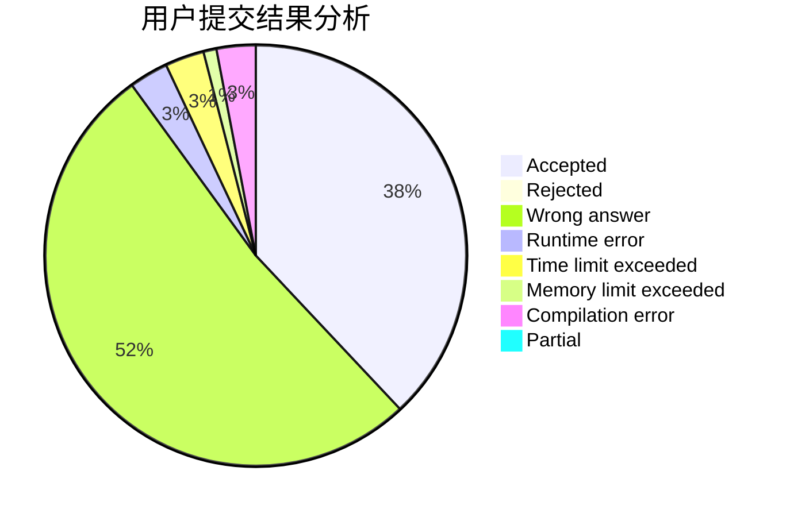
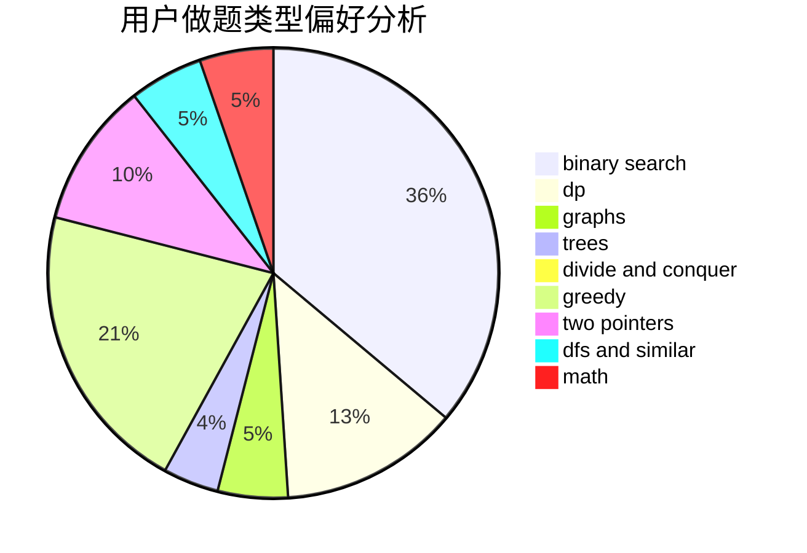

# K0u1e

<!-- tabs:start -->

#### **用户提交结果分析**

#### **用户做题类型偏好分析**

<!-- tabs:end -->
# 推荐题目
[516D](https://codeforces.com/contest/516/problem/D)
[1066F](https://codeforces.com/contest/1066/problem/F)
[1041C](https://codeforces.com/contest/1041/problem/C)
[516C](https://codeforces.com/contest/516/problem/C)
[1105D](https://codeforces.com/contest/1105/problem/D)
[957A](https://codeforces.com/contest/957/problem/A)
[919D](https://codeforces.com/contest/919/problem/D)
[832D](https://codeforces.com/contest/832/problem/D)
[860D](https://codeforces.com/contest/860/problem/D)
[1418F](https://codeforces.com/contest/1418/problem/F)
