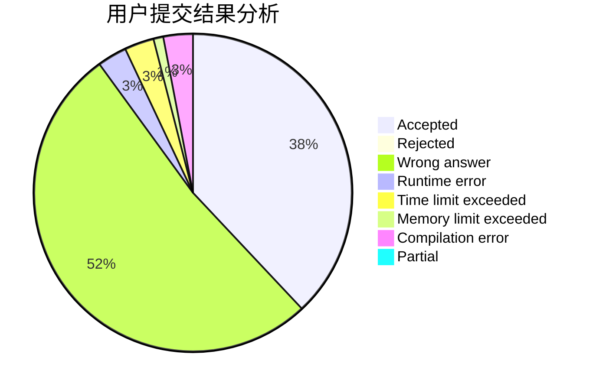
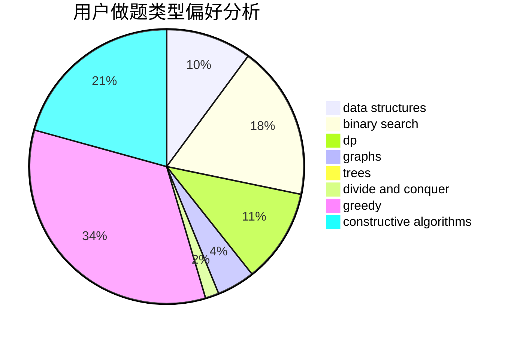
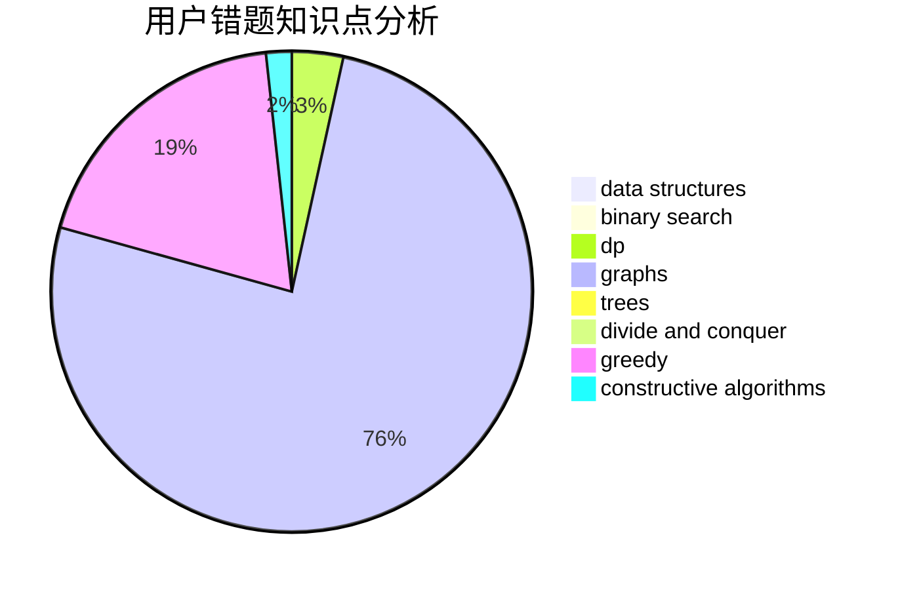

# K0u1e

<!-- tabs:start -->

#### **用户提交结果分析**

#### **用户做题类型偏好分析**

#### **用户错题知识点分析**

<!-- tabs:end -->
# 推荐题目
[497C](https://codeforces.com/contest/497/problem/C)		dsu,graphs,sortings,trees		  
[1066C](https://codeforces.com/contest/1066/problem/C)		implementation		  
[1040D](https://codeforces.com/contest/1040/problem/D)		dsu,graphs,sortings,trees		  
[497B](https://codeforces.com/contest/497/problem/B)		dsu,graphs,sortings,trees		  
[1105A](https://codeforces.com/contest/1105/problem/A)		brute force,
                        implementation		  
[935B](https://codeforces.com/contest/935/problem/B)		implementation		  
[903D](https://codeforces.com/contest/903/problem/D)		data structures,
                        math		  
[814B](https://codeforces.com/contest/814/problem/B)		constructive algorithms		  
[841D](https://codeforces.com/contest/841/problem/D)		dsu,graphs,sortings,trees		  
[1408B](https://codeforces.com/contest/1408/problem/B)		constructive algorithms,
                        greedy,
                        math		  
