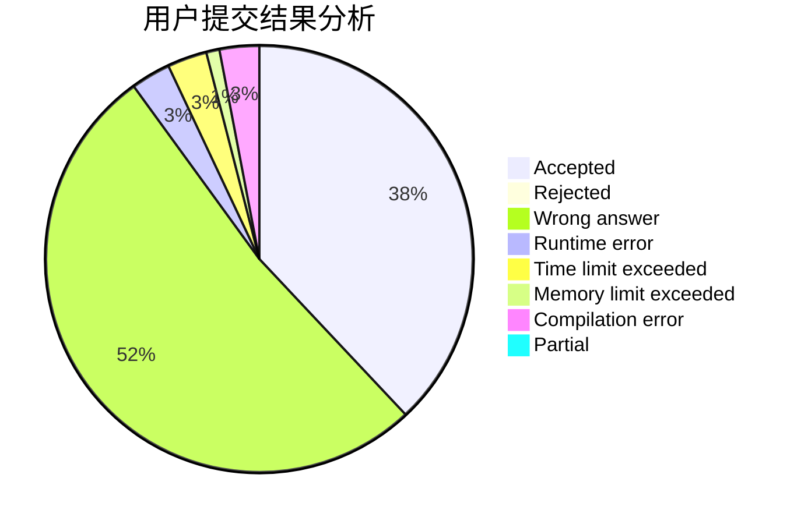
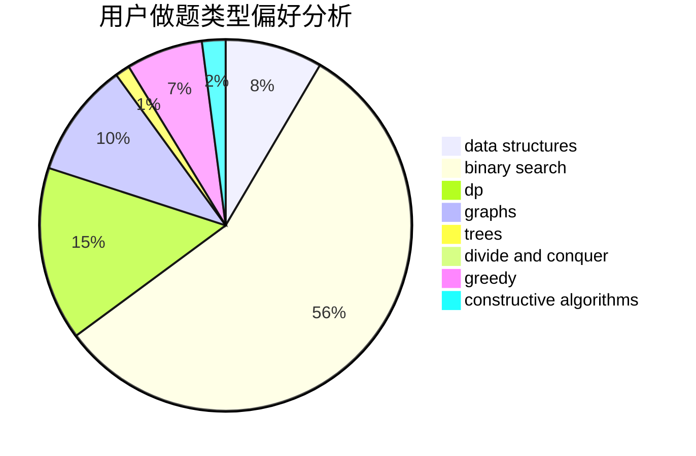
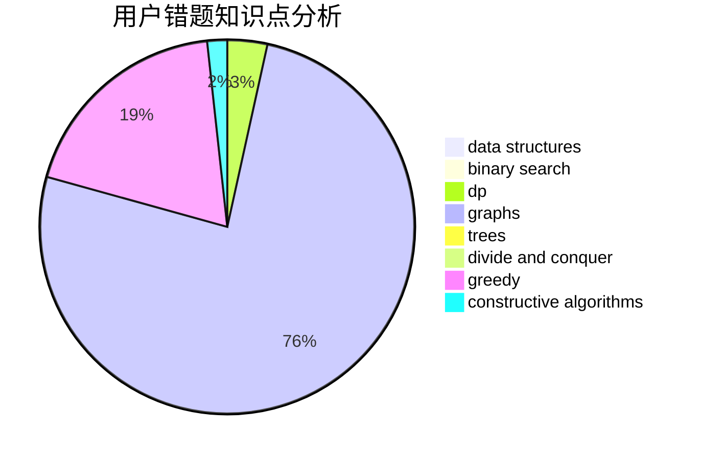

# K0u1e

<!-- tabs:start -->

#### **用户提交结果分析**

#### **用户做题类型偏好分析**

#### **用户错题知识点分析**

<!-- tabs:end -->
# 推荐题目
[516D](https://codeforces.com/contest/516/problem/D)		dfs and similar,
                        dp,
                        dsu,
                        trees,
                        two pointers		  
[1066F](https://codeforces.com/contest/1066/problem/F)		dp		  
[1041C](https://codeforces.com/contest/1041/problem/C)		binary search,
                        data structures,
                        greedy,
                        two pointers		  
[516C](https://codeforces.com/contest/516/problem/C)		dsu,graphs,sortings,trees		  
[1105D](https://codeforces.com/contest/1105/problem/D)		dfs and similar,
                        graphs,
                        implementation,
                        shortest paths		  
[957A](https://codeforces.com/contest/957/problem/A)		implementation		  
[919D](https://codeforces.com/contest/919/problem/D)		dfs and similar,
                        dp,
                        graphs		  
[832D](https://codeforces.com/contest/832/problem/D)		dfs and similar,
                        graphs,
                        trees		  
[860D](https://codeforces.com/contest/860/problem/D)		dsu,graphs,sortings,trees		  
[1418F](https://codeforces.com/contest/1418/problem/F)		data structures,
                        math,
                        number theory,
                        two pointers		  
