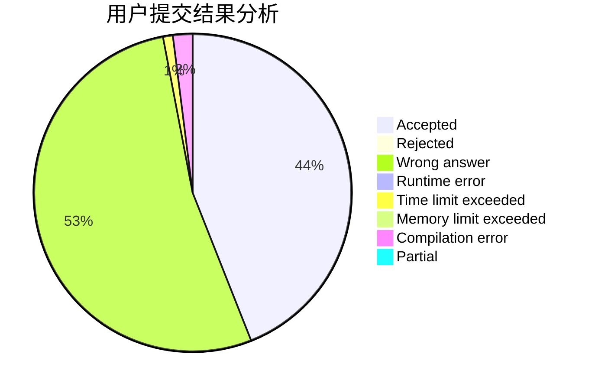
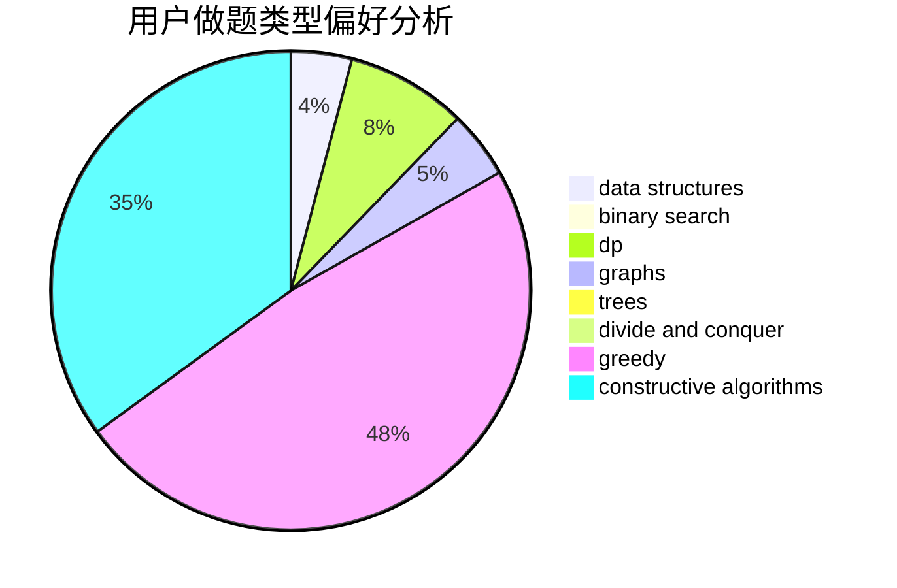
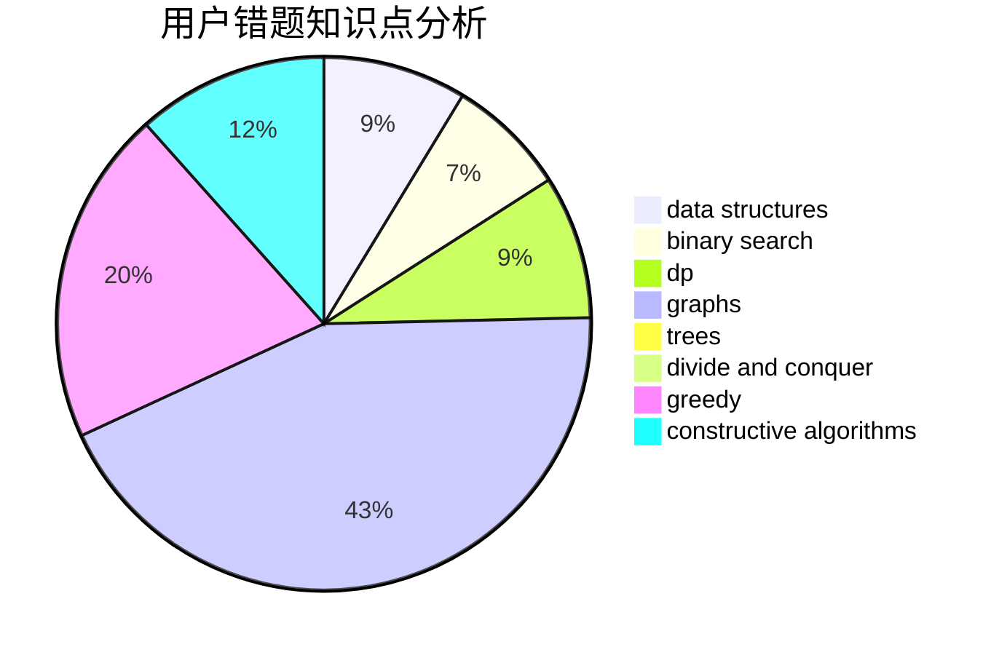

# KENSHIN

<!-- tabs:start -->

#### **用户提交结果分析**

#### **用户做题类型偏好分析**

#### **用户错题知识点分析**

<!-- tabs:end -->
# 推荐题目
[1388B](https://codeforces.com/contest/1388/problem/B)		greedy,
                        math		  
[797C](https://codeforces.com/contest/797/problem/C)		data structures,
                        greedy,
                        strings		  
[219A](https://codeforces.com/contest/219/problem/A)		implementation,
                        strings		  
[808F](https://codeforces.com/contest/808/problem/F)		binary search,
                        flows,
                        graphs		  
[635E](https://codeforces.com/contest/635/problem/E)		dsu,graphs,sortings,trees		  
[955B](https://codeforces.com/contest/955/problem/B)		implementation		  
[586F](https://codeforces.com/contest/586/problem/F)		dsu,graphs,sortings,trees		  
[11292](https://codeforces.com/contest/1129/problem/2)		dsu,graphs,sortings,trees		  
[1173A](https://codeforces.com/contest/1173/problem/A)		greedy		  
[827F](https://codeforces.com/contest/827/problem/F)		data structures,
                        dp,
                        graphs,
                        shortest paths		  
