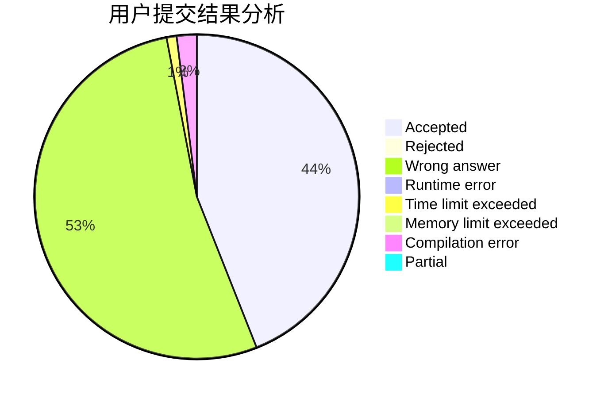
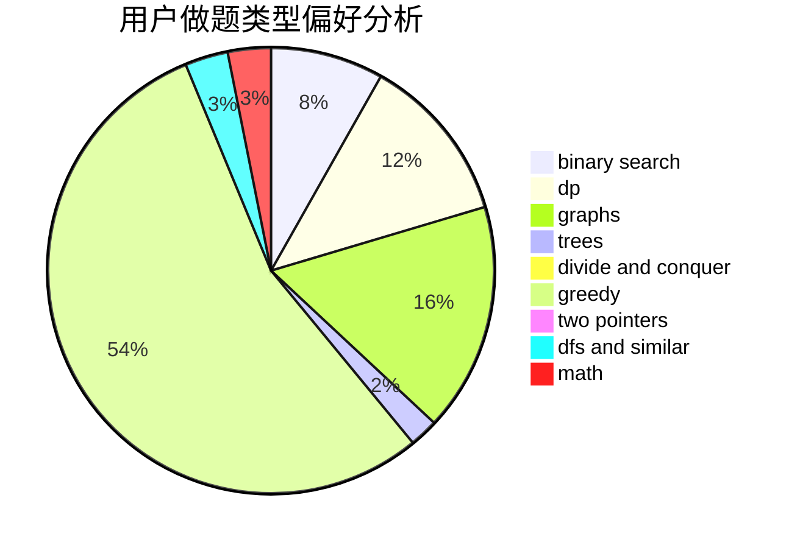

# KENSHIN

<!-- tabs:start -->

#### **用户提交结果分析**

#### **用户做题类型偏好分析**

<!-- tabs:end -->
# 推荐题目
[1388B](https://codeforces.com/contest/1388/problem/B)
[797C](https://codeforces.com/contest/797/problem/C)
[219A](https://codeforces.com/contest/219/problem/A)
[808F](https://codeforces.com/contest/808/problem/F)
[635E](https://codeforces.com/contest/635/problem/E)
[955B](https://codeforces.com/contest/955/problem/B)
[586F](https://codeforces.com/contest/586/problem/F)
[11292](https://codeforces.com/contest/1129/problem/2)
[1173A](https://codeforces.com/contest/1173/problem/A)
[827F](https://codeforces.com/contest/827/problem/F)
