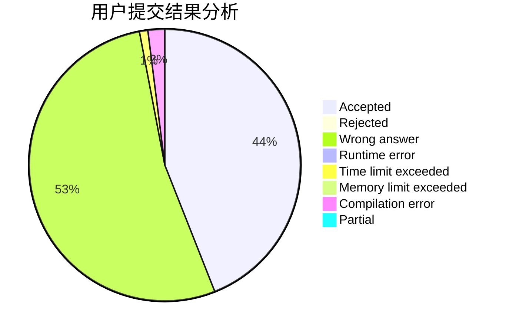
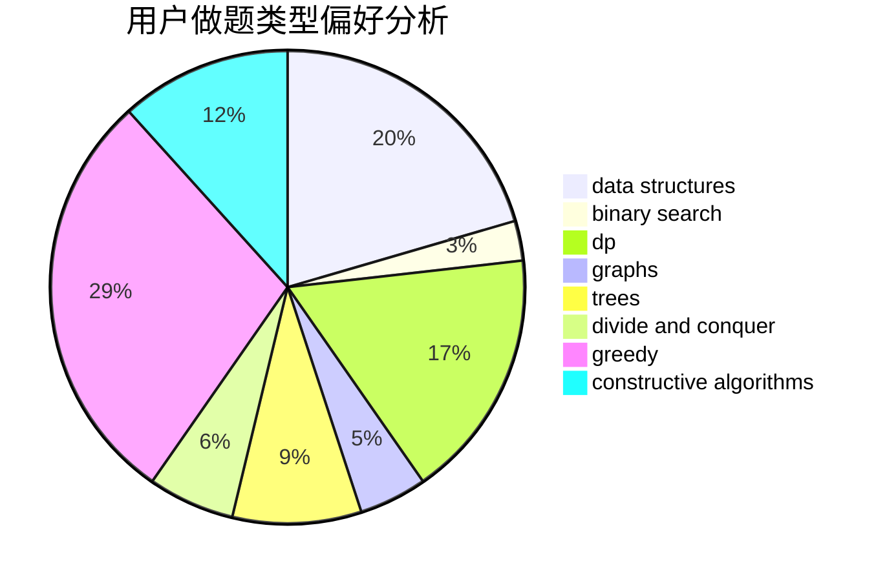
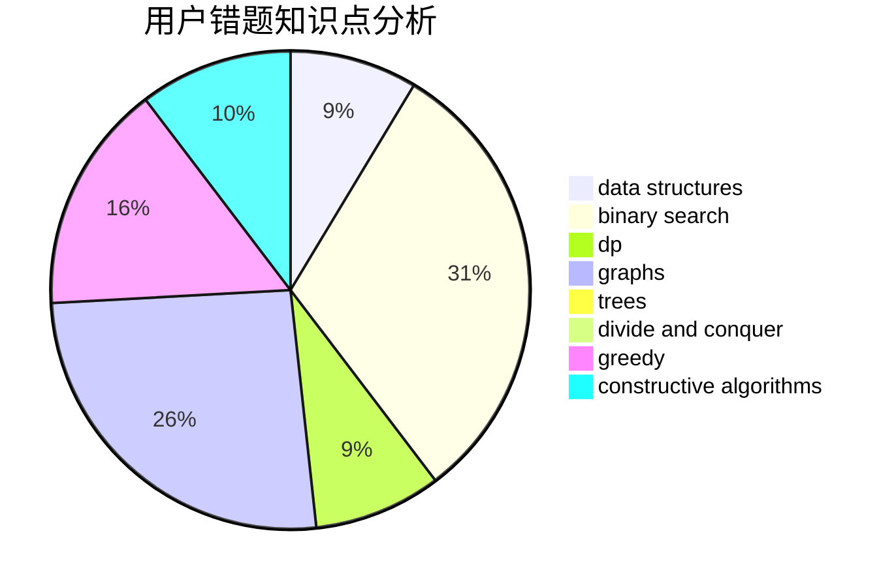

# KENSHIN

<!-- tabs:start -->

#### **用户提交结果分析**

#### **用户做题类型偏好分析**

#### **用户错题知识点分析**

<!-- tabs:end -->
# 推荐题目
[1379B](https://codeforces.com/contest/1379/problem/B)		binary search,
                        brute force,
                        math,
                        number theory		  
[779A](https://codeforces.com/contest/779/problem/A)		constructive algorithms,
                        math		  
[197A](https://codeforces.com/contest/197/problem/A)		constructive algorithms,
                        games,
                        math		  
[793D](https://codeforces.com/contest/793/problem/D)		dp,
                        graphs,
                        shortest paths		  
[617E](https://codeforces.com/contest/617/problem/E)		data structures		  
[933B](https://codeforces.com/contest/933/problem/B)		math		  
[567B](https://codeforces.com/contest/567/problem/B)		implementation		  
[1119E](https://codeforces.com/contest/1119/problem/E)		brute force,
                        dp,
                        fft,
                        greedy,
                        ternary search		  
[1168E](https://codeforces.com/contest/1168/problem/E)		constructive algorithms,
                        math		  
[80B](https://codeforces.com/contest/80/problem/B)		geometry,
                        math		  
