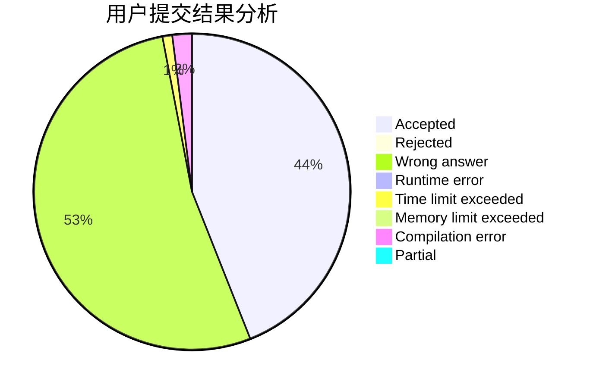
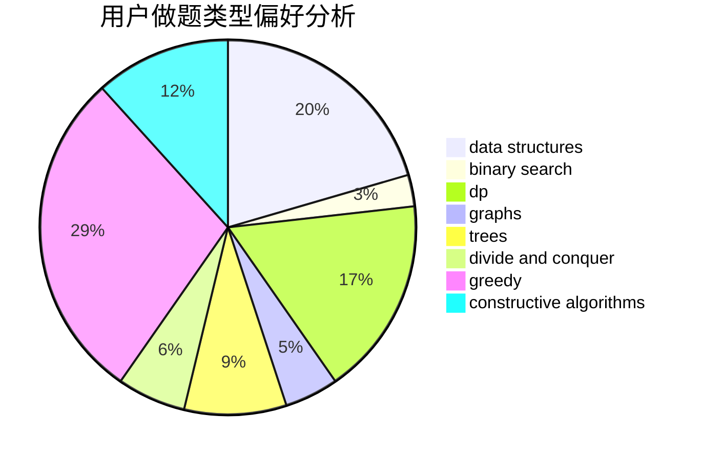
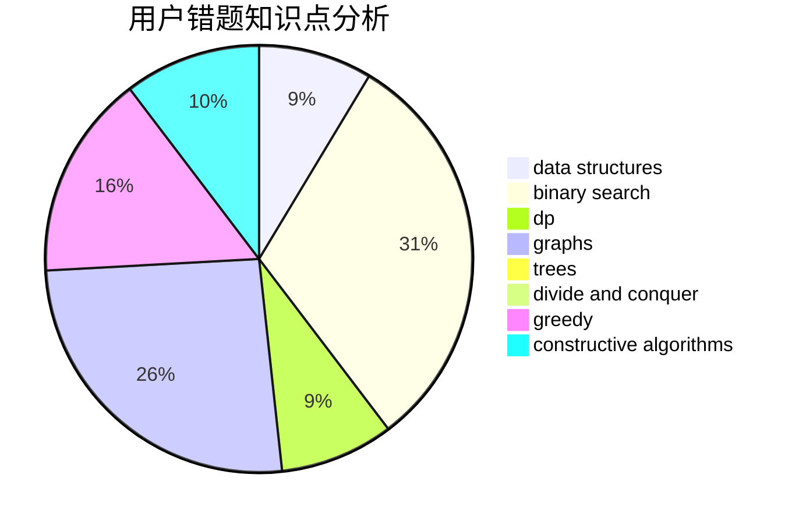

# KENSHIN
<!-- tabs:start -->
#### **用户提交结果分析**

#### **用户做题类型偏好分析**

#### **用户错题知识点分析**

<!-- tabs:end -->
# 推荐题目
[Dubious Cyrpto](http://codeforces.com/problemset/problem/1379/B)		binary search,
                        brute force,
                        math,
                        number theory		  
[Pupils Redistribution](http://codeforces.com/problemset/problem/779/A)		constructive algorithms,
                        math		  
[Xor Permutations](http://codeforces.com/problemset/problem/1168/E)		constructive algorithms,
                        math		  
[Generous Kefa](http://codeforces.com/problemset/problem/841/A)		brute force,
                        implementation		  
[ucyhf](http://codeforces.com/problemset/problem/171/F)		*special problem,
                        brute force,
                        implementation,
                        number theory		  
[A Determined Cleanup](http://codeforces.com/problemset/problem/933/B)		math		  
[Porcelain](http://codeforces.com/problemset/problem/148/E)		dp		  
[Plate Game](http://codeforces.com/problemset/problem/197/A)		constructive algorithms,
                        games,
                        math		  
[Infinite Sequence](http://codeforces.com/problemset/problem/622/A)		implementation,
                        math		  
[Moodular Arithmetic](http://codeforces.com/problemset/problem/603/B)		combinatorics,
                        dfs and similar,
                        dsu,
                        math,
                        number theory		  
<!-- tabs:start -->
#### **data structures**
[Dubious Cyrpto](http://codeforces.com/problemset/problem/343/D)		data structures,
                        dfs and similar,
                        graphs,
                        trees		  
[Pupils Redistribution](http://codeforces.com/problemset/problem/208/E)		binary search,
                        data structures,
                        dfs and similar,
                        trees		  
[Xor Permutations](http://codeforces.com/problemset/problem/1373/G)		data structures,
                        divide and conquer,
                        greedy		  
[Generous Kefa](http://codeforces.com/problemset/problem/1493/D)		brute force,
                        data structures,
                        hashing,
                        implementation,
                        math,
                        number theory,
                        sortings,
                        two pointers		  
[ucyhf](http://codeforces.com/problemset/problem/617/E)		data structures		  
[A Determined Cleanup](http://codeforces.com/problemset/problem/777/E)		brute force,
                        data structures,
                        dp,
                        greedy,
                        sortings		  
[Porcelain](http://codeforces.com/problemset/problem/1296/C)		data structures,
                        implementation		  
[Plate Game](http://codeforces.com/problemset/problem/1492/C)		binary search,
                        data structures,
                        dp,
                        greedy,
                        two pointers		  
[Infinite Sequence](http://codeforces.com/problemset/problem/1490/G)		binary search,
                        data structures,
                        math		  
[Moodular Arithmetic](http://codeforces.com/problemset/problem/1479/D)		binary search,
                        bitmasks,
                        brute force,
                        data structures,
                        probabilities,
                        trees		  
#### **binary search**
[Dubious Cyrpto](http://codeforces.com/problemset/problem/1379/B)		binary search,
                        brute force,
                        math,
                        number theory		  
[Pupils Redistribution](http://codeforces.com/problemset/problem/1102/F)		binary search,
                        bitmasks,
                        brute force,
                        dp,
                        graphs		  
[Xor Permutations](http://codeforces.com/problemset/problem/847/E)		binary search,
                        dp		  
[Generous Kefa](http://codeforces.com/problemset/problem/208/E)		binary search,
                        data structures,
                        dfs and similar,
                        trees		  
[ucyhf](http://codeforces.com/problemset/problem/1066/D)		binary search,
                        implementation		  
[A Determined Cleanup](http://codeforces.com/problemset/problem/75/C)		binary search,
                        number theory		  
[Porcelain](http://codeforces.com/problemset/problem/1077/D)		binary search,
                        sortings		  
[Plate Game](http://codeforces.com/problemset/problem/1119/D)		binary search,
                        sortings		  
[Infinite Sequence](http://codeforces.com/problemset/problem/1492/C)		binary search,
                        data structures,
                        dp,
                        greedy,
                        two pointers		  
[Moodular Arithmetic](http://codeforces.com/problemset/problem/1463/D)		binary search,
                        constructive algorithms,
                        greedy,
                        two pointers		  
#### **dp**
[Dubious Cyrpto](http://codeforces.com/problemset/problem/148/E)		dp		  
[Pupils Redistribution](http://codeforces.com/problemset/problem/793/D)		dp,
                        graphs,
                        shortest paths		  
[Xor Permutations](http://codeforces.com/problemset/problem/1102/F)		binary search,
                        bitmasks,
                        brute force,
                        dp,
                        graphs		  
[Generous Kefa](http://codeforces.com/problemset/problem/847/E)		binary search,
                        dp		  
[ucyhf](http://codeforces.com/problemset/problem/455/A)		dp		  
[A Determined Cleanup](http://codeforces.com/problemset/problem/777/E)		brute force,
                        data structures,
                        dp,
                        greedy,
                        sortings		  
[Porcelain](http://codeforces.com/problemset/problem/1292/D)		dp,
                        graphs,
                        greedy,
                        math,
                        number theory,
                        trees		  
[Plate Game](http://codeforces.com/problemset/problem/1119/E)		brute force,
                        dp,
                        fft,
                        greedy,
                        ternary search		  
[Infinite Sequence](http://codeforces.com/problemset/problem/1096/D)		dp		  
[Moodular Arithmetic](http://codeforces.com/problemset/problem/1492/C)		binary search,
                        data structures,
                        dp,
                        greedy,
                        two pointers		  
#### **graph**
[Dubious Cyrpto](http://codeforces.com/problemset/problem/793/D)		dp,
                        graphs,
                        shortest paths		  
[Pupils Redistribution](http://codeforces.com/problemset/problem/343/D)		data structures,
                        dfs and similar,
                        graphs,
                        trees		  
[Xor Permutations](http://codeforces.com/problemset/problem/1102/F)		binary search,
                        bitmasks,
                        brute force,
                        dp,
                        graphs		  
[Generous Kefa](http://codeforces.com/problemset/problem/1000/E)		dfs and similar,
                        graphs,
                        trees		  
[ucyhf](http://codeforces.com/problemset/problem/1198/C)		constructive algorithms,
                        graphs,
                        greedy,
                        sortings		  
[A Determined Cleanup](http://codeforces.com/problemset/problem/1292/D)		dp,
                        graphs,
                        greedy,
                        math,
                        number theory,
                        trees		  
[Porcelain](http://codeforces.com/problemset/problem/1487/C)		brute force,
                        constructive algorithms,
                        dfs and similar,
                        graphs,
                        greedy,
                        implementation,
                        math		  
[Plate Game](http://codeforces.com/problemset/problem/1437/C)		dp,
                        flows,
                        graph matchings,
                        greedy,
                        math,
                        sortings		  
[Infinite Sequence](http://codeforces.com/problemset/problem/1470/D)		constructive algorithms,
                        dfs and similar,
                        graph matchings,
                        graphs,
                        greedy		  
[Moodular Arithmetic](http://codeforces.com/problemset/problem/1476/C)		dp,
                        graphs,
                        greedy		  
#### **trees**
[Dubious Cyrpto](http://codeforces.com/problemset/problem/343/D)		data structures,
                        dfs and similar,
                        graphs,
                        trees		  
[Pupils Redistribution](http://codeforces.com/problemset/problem/208/E)		binary search,
                        data structures,
                        dfs and similar,
                        trees		  
[Xor Permutations](http://codeforces.com/problemset/problem/1000/E)		dfs and similar,
                        graphs,
                        trees		  
[Generous Kefa](http://codeforces.com/problemset/problem/1292/D)		dp,
                        graphs,
                        greedy,
                        math,
                        number theory,
                        trees		  
[ucyhf](http://codeforces.com/problemset/problem/1479/D)		binary search,
                        bitmasks,
                        brute force,
                        data structures,
                        probabilities,
                        trees		  
[A Determined Cleanup](http://codeforces.com/problemset/problem/1511/C)		brute force,
                        data structures,
                        implementation,
                        trees		  
[Porcelain](http://codeforces.com/problemset/problem/1499/F)		combinatorics,
                        dfs and similar,
                        dp,
                        trees		  
[Plate Game](http://codeforces.com/problemset/problem/1491/E)		brute force,
                        dfs and similar,
                        divide and conquer,
                        number theory,
                        trees		  
[Infinite Sequence](http://codeforces.com/problemset/problem/1466/D)		data structures,
                        greedy,
                        sortings,
                        trees		  
[Moodular Arithmetic](http://codeforces.com/problemset/problem/1495/D)		combinatorics,
                        dfs and similar,
                        graphs,
                        math,
                        shortest paths,
                        trees		  
#### **divide and conquer**
[Dubious Cyrpto](http://codeforces.com/problemset/problem/1373/G)		data structures,
                        divide and conquer,
                        greedy		  
[Pupils Redistribution](http://codeforces.com/problemset/problem/1461/D)		binary search,
                        brute force,
                        data structures,
                        divide and conquer,
                        implementation,
                        sortings		  
[Xor Permutations](http://codeforces.com/problemset/problem/1466/G)		combinatorics,
                        divide and conquer,
                        hashing,
                        math,
                        string suffix structures,
                        strings		  
[Generous Kefa](http://codeforces.com/problemset/problem/1490/D)		dfs and similar,
                        divide and conquer,
                        implementation		  
[ucyhf](https://codeforces.com/contest/1483/problem/C)		data structures,
                        divide and conquer,
                        dp		  
[A Determined Cleanup](http://codeforces.com/problemset/problem/1491/E)		brute force,
                        dfs and similar,
                        divide and conquer,
                        number theory,
                        trees		  
[Porcelain](http://codeforces.com/problemset/problem/1303/G)		data structures,
                        divide and conquer,
                        geometry,
                        trees		  
[Plate Game](http://codeforces.com/problemset/problem/1494/D)		constructive algorithms,
                        data structures,
                        dfs and similar,
                        divide and conquer,
                        dsu,
                        greedy,
                        sortings,
                        trees		  
[Infinite Sequence](http://codeforces.com/problemset/problem/1482/E)		data structures,
                        divide and conquer,
                        dp		  
[Moodular Arithmetic](http://codeforces.com/problemset/problem/566/C)		dfs and similar,
                        divide and conquer,
                        trees		  
#### **greedy**
[Dubious Cyrpto](http://codeforces.com/problemset/problem/588/A)		greedy		  
[Pupils Redistribution](http://codeforces.com/problemset/problem/1198/C)		constructive algorithms,
                        graphs,
                        greedy,
                        sortings		  
[Xor Permutations](http://codeforces.com/problemset/problem/1373/G)		data structures,
                        divide and conquer,
                        greedy		  
[Generous Kefa](http://codeforces.com/problemset/problem/16/B)		greedy,
                        implementation,
                        sortings		  
[ucyhf](http://codeforces.com/problemset/problem/777/E)		brute force,
                        data structures,
                        dp,
                        greedy,
                        sortings		  
[A Determined Cleanup](http://codeforces.com/problemset/problem/1292/D)		dp,
                        graphs,
                        greedy,
                        math,
                        number theory,
                        trees		  
[Porcelain](http://codeforces.com/problemset/problem/1119/E)		brute force,
                        dp,
                        fft,
                        greedy,
                        ternary search		  
[Plate Game](http://codeforces.com/problemset/problem/1371/C)		greedy,
                        implementation,
                        math		  
[Infinite Sequence](http://codeforces.com/problemset/problem/1492/C)		binary search,
                        data structures,
                        dp,
                        greedy,
                        two pointers		  
[Moodular Arithmetic](https://codeforces.com/contest/1496/problem/C)		geometry,
                        greedy,
                        math,
                        sortings		  
#### **constructive algorithms**
[Dubious Cyrpto](http://codeforces.com/problemset/problem/779/A)		constructive algorithms,
                        math		  
[Pupils Redistribution](http://codeforces.com/problemset/problem/1168/E)		constructive algorithms,
                        math		  
[Xor Permutations](http://codeforces.com/problemset/problem/197/A)		constructive algorithms,
                        games,
                        math		  
[Generous Kefa](http://codeforces.com/problemset/problem/1198/C)		constructive algorithms,
                        graphs,
                        greedy,
                        sortings		  
[ucyhf](http://codeforces.com/problemset/problem/803/A)		constructive algorithms		  
[A Determined Cleanup](http://codeforces.com/problemset/problem/1427/E)		bitmasks,
                        constructive algorithms,
                        math,
                        matrices,
                        number theory		  
[Porcelain](http://codeforces.com/problemset/problem/1493/A)		constructive algorithms,
                        greedy		  
[Plate Game](http://codeforces.com/problemset/problem/1463/D)		binary search,
                        constructive algorithms,
                        greedy,
                        two pointers		  
[Infinite Sequence](https://codeforces.com/contest/1456/problem/B)		bitmasks,
                        brute force,
                        constructive algorithms		  
[Moodular Arithmetic](http://codeforces.com/problemset/problem/1492/D)		bitmasks,
                        constructive algorithms,
                        greedy,
                        math		  
#### **sortings**
[Dubious Cyrpto](http://codeforces.com/problemset/problem/1198/C)		constructive algorithms,
                        graphs,
                        greedy,
                        sortings		  
[Pupils Redistribution](http://codeforces.com/problemset/problem/1493/D)		brute force,
                        data structures,
                        hashing,
                        implementation,
                        math,
                        number theory,
                        sortings,
                        two pointers		  
[Xor Permutations](http://codeforces.com/problemset/problem/16/B)		greedy,
                        implementation,
                        sortings		  
[Generous Kefa](http://codeforces.com/problemset/problem/777/E)		brute force,
                        data structures,
                        dp,
                        greedy,
                        sortings		  
[ucyhf](http://codeforces.com/problemset/problem/1077/D)		binary search,
                        sortings		  
[A Determined Cleanup](http://codeforces.com/problemset/problem/1119/D)		binary search,
                        sortings		  
[Porcelain](https://codeforces.com/contest/1496/problem/C)		geometry,
                        greedy,
                        math,
                        sortings		  
[Plate Game](http://codeforces.com/problemset/problem/1495/A)		geometry,
                        greedy,
                        math,
                        sortings		  
[Infinite Sequence](http://codeforces.com/problemset/problem/1497/A)		brute force,
                        data structures,
                        greedy,
                        sortings		  
[Moodular Arithmetic](http://codeforces.com/problemset/problem/1427/A)		math,
                        sortings		  
<!-- tabs:end -->
