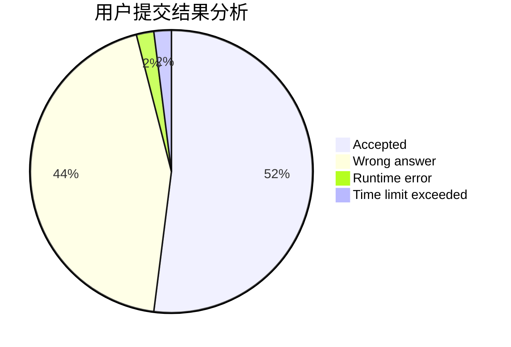
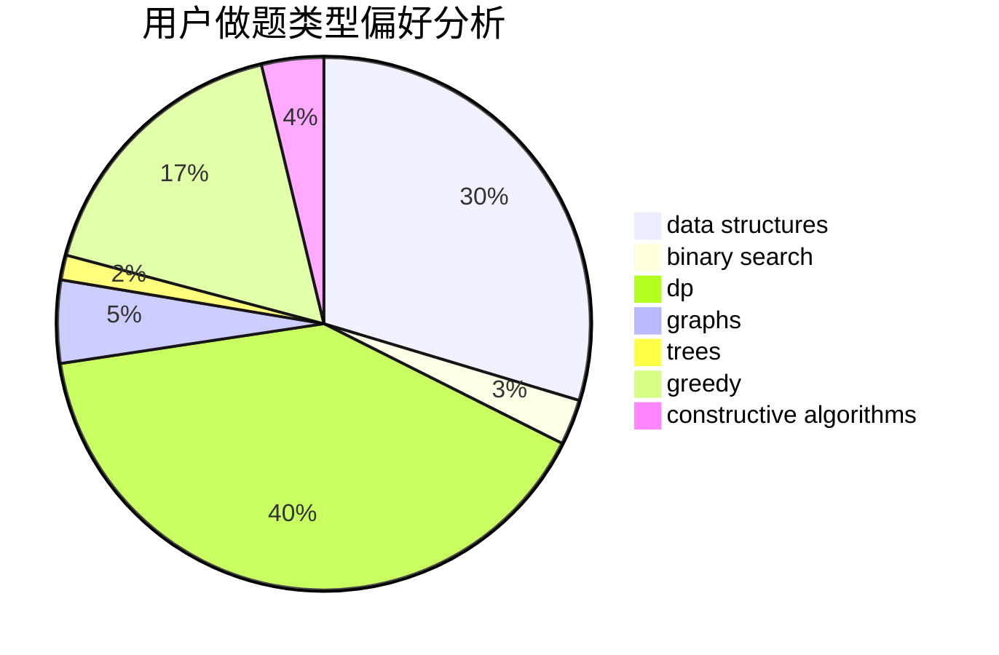
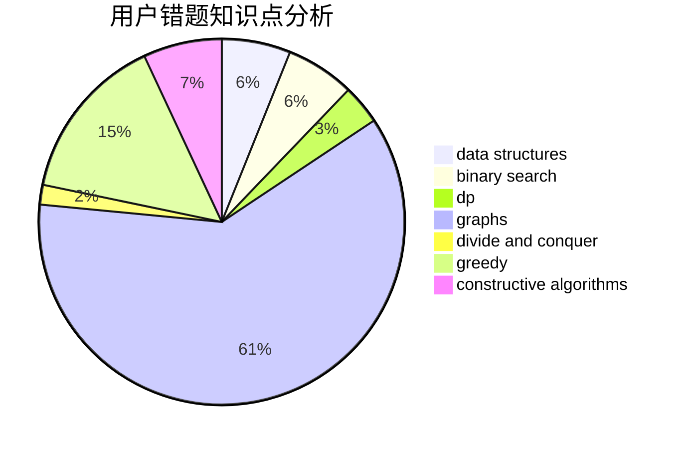

# KFC_wc
<!-- tabs:start -->
#### **用户提交结果分析**

#### **用户做题类型偏好分析**

#### **用户错题知识点分析**

<!-- tabs:end -->
# 推荐题目
[Minimum Path](http://codeforces.com/problemset/problem/1473/E)		graphs,
                        shortest paths		  
[Goodbye Souvenir](http://codeforces.com/problemset/problem/848/C)		data structures,
                        divide and conquer		  
[Strange Covering](http://codeforces.com/problemset/problem/1470/F)		divide and conquer		  
[Quest](http://codeforces.com/problemset/problem/542/F)		dp,
                        greedy		  
[Little Elephant and Cards](https://codeforces.com/contest/205/problem/D)		binary search,
                        data structures		  
[Maximum Xor Secondary](https://codeforces.com/contest/281/problem/D)		data structures,
                        implementation,
                        two pointers		  
[Water Balance](https://codeforces.com/contest/1300/problem/E)		data structures,
                        geometry,
                        greedy		  
[One-dimensional Japanese Crossword](http://codeforces.com/problemset/problem/721/A)		implementation		  
[Summer Homework](http://codeforces.com/problemset/problem/316/E2)		data structures,
                        math		  
[Number Challenge](http://codeforces.com/problemset/problem/235/E)		combinatorics,
                        dp,
                        implementation,
                        math,
                        number theory		  
<!-- tabs:start -->
#### **data structures**
[Goodbye Souvenir](http://codeforces.com/problemset/problem/848/C)		data structures,
                        divide and conquer		  
[Little Elephant and Cards](https://codeforces.com/contest/205/problem/D)		binary search,
                        data structures		  
[Maximum Xor Secondary](https://codeforces.com/contest/281/problem/D)		data structures,
                        implementation,
                        two pointers		  
[Water Balance](https://codeforces.com/contest/1300/problem/E)		data structures,
                        geometry,
                        greedy		  
[Summer Homework](http://codeforces.com/problemset/problem/316/E2)		data structures,
                        math		  
[Vicky's Delivery Service](http://codeforces.com/problemset/problem/1166/F)		data structures,
                        dsu,
                        graphs,
                        hashing		  
[Construct the String](http://codeforces.com/problemset/problem/1366/G)		data structures,
                        dp,
                        strings		  
[Functions On The Segments](http://codeforces.com/problemset/problem/837/G)		data structures		  
[Economic Difficulties](http://codeforces.com/problemset/problem/1263/F)		data structures,
                        dfs and similar,
                        dp,
                        flows,
                        graphs,
                        trees		  
[Teodor is not a liar!](http://codeforces.com/problemset/problem/930/C)		data structures,
                        dp		  
#### **binary search**
[Little Elephant and Cards](https://codeforces.com/contest/205/problem/D)		binary search,
                        data structures		  
[Maximum width](http://codeforces.com/problemset/problem/1492/C)		binary search,
                        data structures,
                        dp,
                        greedy,
                        two pointers		  
[Pairs](http://codeforces.com/problemset/problem/1463/D)		binary search,
                        constructive algorithms,
                        greedy,
                        two pointers		  
[Old Floppy Drive](http://codeforces.com/problemset/problem/1490/G)		binary search,
                        data structures,
                        math		  
[Odd Mineral Resource](http://codeforces.com/problemset/problem/1479/D)		binary search,
                        bitmasks,
                        brute force,
                        data structures,
                        probabilities,
                        trees		  
[Complicated Computations](http://codeforces.com/problemset/problem/1436/E)		binary search,
                        data structures,
                        two pointers		  
[Divide and Summarize](http://codeforces.com/problemset/problem/1461/D)		binary search,
                        brute force,
                        data structures,
                        divide and conquer,
                        implementation,
                        sortings		  
[K-beautiful Strings](http://codeforces.com/problemset/problem/1493/C)		binary search,
                        brute force,
                        constructive algorithms,
                        greedy,
                        strings		  
[Pythagorean Triples](http://codeforces.com/problemset/problem/1487/D)		binary search,
                        brute force,
                        math,
                        number theory		  
[Eastern Exhibition](http://codeforces.com/problemset/problem/1486/B)		binary search,
                        geometry,
                        shortest paths,
                        sortings		  
#### **dp**
[Quest](http://codeforces.com/problemset/problem/542/F)		dp,
                        greedy		  
[Number Challenge](http://codeforces.com/problemset/problem/235/E)		combinatorics,
                        dp,
                        implementation,
                        math,
                        number theory		  
[Expected Square Beauty](http://codeforces.com/problemset/problem/1187/F)		dp,
                        math,
                        probabilities		  
[Construct the String](http://codeforces.com/problemset/problem/1366/G)		data structures,
                        dp,
                        strings		  
[Economic Difficulties](http://codeforces.com/problemset/problem/1263/F)		data structures,
                        dfs and similar,
                        dp,
                        flows,
                        graphs,
                        trees		  
[Rectangle Painting 1](https://codeforces.com/contest/1199/problem/F)		dp		  
[Alternative Thinking](https://codeforces.com/contest/604/problem/C)		dp,
                        greedy,
                        math		  
[Polo the Penguin and Lucky Numbers](http://codeforces.com/problemset/problem/288/E)		dp,
                        implementation,
                        math		  
[Teodor is not a liar!](http://codeforces.com/problemset/problem/930/C)		data structures,
                        dp		  
[Decorate Apple Tree](http://codeforces.com/problemset/problem/1056/D)		constructive algorithms,
                        dfs and similar,
                        dp,
                        graphs,
                        greedy,
                        sortings,
                        trees		  
#### **graph**
[Minimum Path](http://codeforces.com/problemset/problem/1473/E)		graphs,
                        shortest paths		  
[Three States](http://codeforces.com/problemset/problem/590/C)		dfs and similar,
                        graphs,
                        shortest paths		  
[Vicky's Delivery Service](http://codeforces.com/problemset/problem/1166/F)		data structures,
                        dsu,
                        graphs,
                        hashing		  
[Economic Difficulties](http://codeforces.com/problemset/problem/1263/F)		data structures,
                        dfs and similar,
                        dp,
                        flows,
                        graphs,
                        trees		  
[Decorate Apple Tree](http://codeforces.com/problemset/problem/1056/D)		constructive algorithms,
                        dfs and similar,
                        dp,
                        graphs,
                        greedy,
                        sortings,
                        trees		  
[Petya and Graph](http://codeforces.com/problemset/problem/1082/G)		flows,
                        graphs		  
[Minimum Ties](http://codeforces.com/problemset/problem/1487/C)		brute force,
                        constructive algorithms,
                        dfs and similar,
                        graphs,
                        greedy,
                        implementation,
                        math		  
[Chef Monocarp](http://codeforces.com/problemset/problem/1437/C)		dp,
                        flows,
                        graph matchings,
                        greedy,
                        math,
                        sortings		  
[Strange Housing](http://codeforces.com/problemset/problem/1470/D)		constructive algorithms,
                        dfs and similar,
                        graph matchings,
                        graphs,
                        greedy		  
[Longest Simple Cycle](http://codeforces.com/problemset/problem/1476/C)		dp,
                        graphs,
                        greedy		  
#### **trees**
[Economic Difficulties](http://codeforces.com/problemset/problem/1263/F)		data structures,
                        dfs and similar,
                        dp,
                        flows,
                        graphs,
                        trees		  
[Decorate Apple Tree](http://codeforces.com/problemset/problem/1056/D)		constructive algorithms,
                        dfs and similar,
                        dp,
                        graphs,
                        greedy,
                        sortings,
                        trees		  
[Odd Mineral Resource](http://codeforces.com/problemset/problem/1479/D)		binary search,
                        bitmasks,
                        brute force,
                        data structures,
                        probabilities,
                        trees		  
[Yet Another Card Deck](http://codeforces.com/problemset/problem/1511/C)		brute force,
                        data structures,
                        implementation,
                        trees		  
[Diameter Cuts](http://codeforces.com/problemset/problem/1499/F)		combinatorics,
                        dfs and similar,
                        dp,
                        trees		  
[Fib-tree](http://codeforces.com/problemset/problem/1491/E)		brute force,
                        dfs and similar,
                        divide and conquer,
                        number theory,
                        trees		  
[13th Labour of Heracles](http://codeforces.com/problemset/problem/1466/D)		data structures,
                        greedy,
                        sortings,
                        trees		  
[BFS Trees](http://codeforces.com/problemset/problem/1495/D)		combinatorics,
                        dfs and similar,
                        graphs,
                        math,
                        shortest paths,
                        trees		  
[Sum of Prefix Sums](http://codeforces.com/problemset/problem/1303/G)		data structures,
                        divide and conquer,
                        geometry,
                        trees		  
[Number of Simple Paths](http://codeforces.com/problemset/problem/1454/E)		combinatorics,
                        dfs and similar,
                        graphs,
                        trees		  
#### **divide and conquer**
[Goodbye Souvenir](http://codeforces.com/problemset/problem/848/C)		data structures,
                        divide and conquer		  
[Strange Covering](http://codeforces.com/problemset/problem/1470/F)		divide and conquer		  
[Divide and Summarize](http://codeforces.com/problemset/problem/1461/D)		binary search,
                        brute force,
                        data structures,
                        divide and conquer,
                        implementation,
                        sortings		  
[Song of the Sirens](http://codeforces.com/problemset/problem/1466/G)		combinatorics,
                        divide and conquer,
                        hashing,
                        math,
                        string suffix structures,
                        strings		  
[Permutation Transformation](http://codeforces.com/problemset/problem/1490/D)		dfs and similar,
                        divide and conquer,
                        implementation		  
[Skyline Photo](https://codeforces.com/contest/1483/problem/C)		data structures,
                        divide and conquer,
                        dp		  
[Fib-tree](http://codeforces.com/problemset/problem/1491/E)		brute force,
                        dfs and similar,
                        divide and conquer,
                        number theory,
                        trees		  
[Sum of Prefix Sums](http://codeforces.com/problemset/problem/1303/G)		data structures,
                        divide and conquer,
                        geometry,
                        trees		  
[Dogeforces](http://codeforces.com/problemset/problem/1494/D)		constructive algorithms,
                        data structures,
                        dfs and similar,
                        divide and conquer,
                        dsu,
                        greedy,
                        sortings,
                        trees		  
[Logistical Questions](http://codeforces.com/problemset/problem/566/C)		dfs and similar,
                        divide and conquer,
                        trees		  
#### **greedy**
[Quest](http://codeforces.com/problemset/problem/542/F)		dp,
                        greedy		  
[Water Balance](https://codeforces.com/contest/1300/problem/E)		data structures,
                        geometry,
                        greedy		  
[Queue](http://codeforces.com/problemset/problem/545/D)		greedy,
                        implementation,
                        sortings		  
[Boot Camp](http://codeforces.com/problemset/problem/1346/B)		*special problem,
                        greedy		  
[Berland Elections](http://codeforces.com/problemset/problem/847/F)		greedy,
                        sortings		  
[Alternative Thinking](https://codeforces.com/contest/604/problem/C)		dp,
                        greedy,
                        math		  
[Cards](http://codeforces.com/problemset/problem/701/A)		greedy,
                        implementation		  
[Decorate Apple Tree](http://codeforces.com/problemset/problem/1056/D)		constructive algorithms,
                        dfs and similar,
                        dp,
                        graphs,
                        greedy,
                        sortings,
                        trees		  
[Tennis Championship](http://codeforces.com/problemset/problem/735/C)		combinatorics,
                        constructive algorithms,
                        greedy,
                        math		  
[Woodcutters](http://codeforces.com/problemset/problem/545/C)		dp,
                        greedy		  
#### **constructive algorithms**
[New Year's Eve](http://codeforces.com/problemset/problem/912/B)		bitmasks,
                        constructive algorithms,
                        number theory		  
[The minimal unique substring](http://codeforces.com/problemset/problem/1158/B)		constructive algorithms,
                        math,
                        strings		  
[Magic Odd Square](http://codeforces.com/problemset/problem/710/C)		constructive algorithms,
                        math		  
[Prefix Product Sequence](http://codeforces.com/problemset/problem/487/C)		constructive algorithms,
                        math,
                        number theory		  
[Decorate Apple Tree](http://codeforces.com/problemset/problem/1056/D)		constructive algorithms,
                        dfs and similar,
                        dp,
                        graphs,
                        greedy,
                        sortings,
                        trees		  
[Tennis Championship](http://codeforces.com/problemset/problem/735/C)		combinatorics,
                        constructive algorithms,
                        greedy,
                        math		  
[Yet Another Array Partitioning Task](http://codeforces.com/problemset/problem/1114/B)		constructive algorithms,
                        greedy,
                        sortings		  
[Binary Table (Easy Version)](https://codeforces.com/contest/1440/problem/C1)		constructive algorithms,
                        implementation		  
[Anti-knapsack](http://codeforces.com/problemset/problem/1493/A)		constructive algorithms,
                        greedy		  
[Pairs](http://codeforces.com/problemset/problem/1463/D)		binary search,
                        constructive algorithms,
                        greedy,
                        two pointers		  
#### **sortings**
[Queue](http://codeforces.com/problemset/problem/545/D)		greedy,
                        implementation,
                        sortings		  
[Berland Elections](http://codeforces.com/problemset/problem/847/F)		greedy,
                        sortings		  
[Year of University Entrance](http://codeforces.com/problemset/problem/769/A)		*special problem,
                        implementation,
                        sortings		  
[Decorate Apple Tree](http://codeforces.com/problemset/problem/1056/D)		constructive algorithms,
                        dfs and similar,
                        dp,
                        graphs,
                        greedy,
                        sortings,
                        trees		  
[Yet Another Array Partitioning Task](http://codeforces.com/problemset/problem/1114/B)		constructive algorithms,
                        greedy,
                        sortings		  
[Young Explorers](http://codeforces.com/problemset/problem/1355/B)		dp,
                        greedy,
                        sortings		  
[Diamond Miner](https://codeforces.com/contest/1496/problem/C)		geometry,
                        greedy,
                        math,
                        sortings		  
[Meximization](http://codeforces.com/problemset/problem/1497/A)		brute force,
                        data structures,
                        greedy,
                        sortings		  
[Avoiding Zero](http://codeforces.com/problemset/problem/1427/A)		math,
                        sortings		  
[Divide and Summarize](http://codeforces.com/problemset/problem/1461/D)		binary search,
                        brute force,
                        data structures,
                        divide and conquer,
                        implementation,
                        sortings		  
<!-- tabs:end -->
