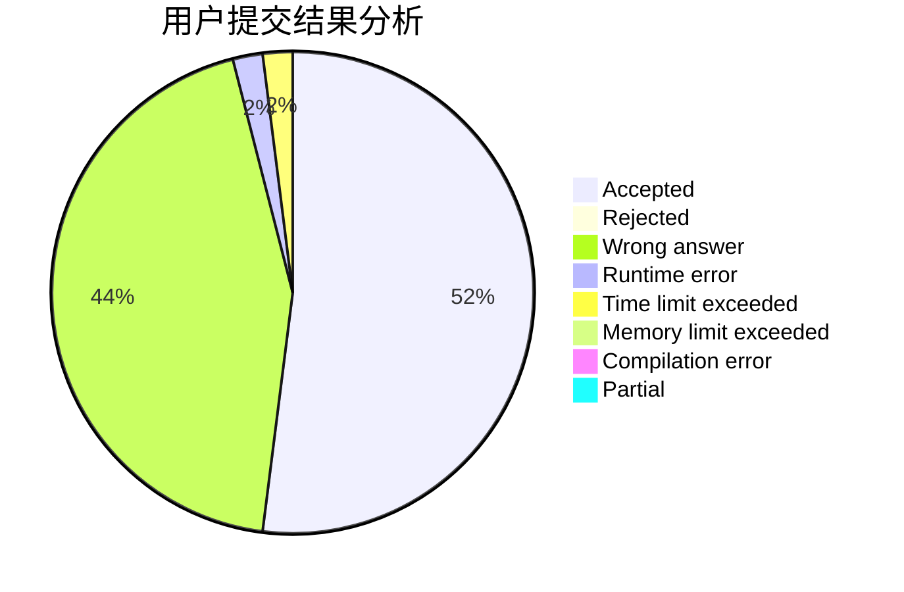
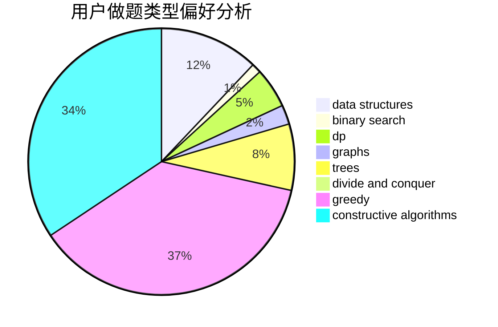
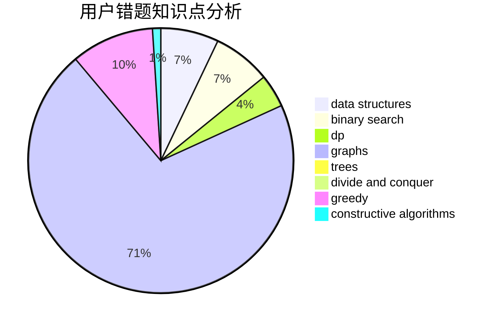

# KFC_wc

<!-- tabs:start -->

#### **用户提交结果分析**

#### **用户做题类型偏好分析**

#### **用户错题知识点分析**

<!-- tabs:end -->
# 推荐题目
[1479A](https://codeforces.com/contest/1479/problem/A)		binary search,
                        interactive,
                        ternary search		  
[1353C](https://codeforces.com/contest/1353/problem/C)		math		  
[1310C](https://codeforces.com/contest/1310/problem/C)		binary search,
                        dp,
                        strings		  
[567B](https://codeforces.com/contest/567/problem/B)		implementation		  
[1482B](https://codeforces.com/contest/1482/problem/B)		implementation,
                        math		  
[343A](https://codeforces.com/contest/343/problem/A)		math,
                        number theory		  
[865G](https://codeforces.com/contest/865/problem/G)		combinatorics,
                        math,
                        matrices		  
[909A](https://codeforces.com/contest/909/problem/A)		brute force,
                        greedy,
                        sortings		  
[755G](https://codeforces.com/contest/755/problem/G)		combinatorics,
                        divide and conquer,
                        dp,
                        fft,
                        math,
                        number theory		  
[1191C](https://codeforces.com/contest/1191/problem/C)		dsu,graphs,sortings,trees		  
