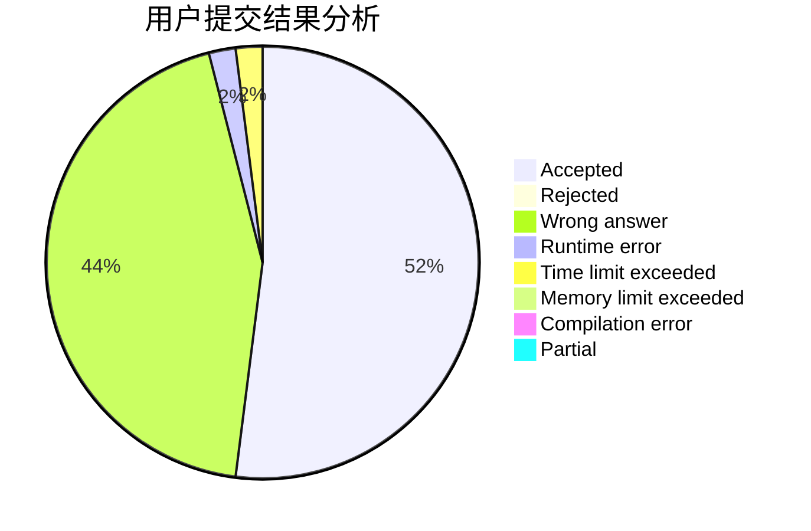
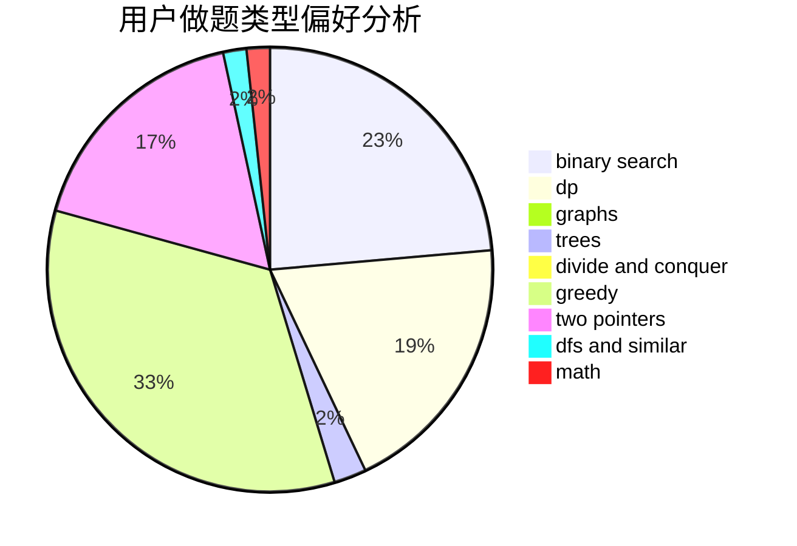

# KFC_wc

<!-- tabs:start -->

#### **用户提交结果分析**

#### **用户做题类型偏好分析**

<!-- tabs:end -->
# 推荐题目
[1479A](https://codeforces.com/contest/1479/problem/A)
[1353C](https://codeforces.com/contest/1353/problem/C)
[1310C](https://codeforces.com/contest/1310/problem/C)
[567B](https://codeforces.com/contest/567/problem/B)
[1482B](https://codeforces.com/contest/1482/problem/B)
[343A](https://codeforces.com/contest/343/problem/A)
[865G](https://codeforces.com/contest/865/problem/G)
[909A](https://codeforces.com/contest/909/problem/A)
[755G](https://codeforces.com/contest/755/problem/G)
[1191C](https://codeforces.com/contest/1191/problem/C)
