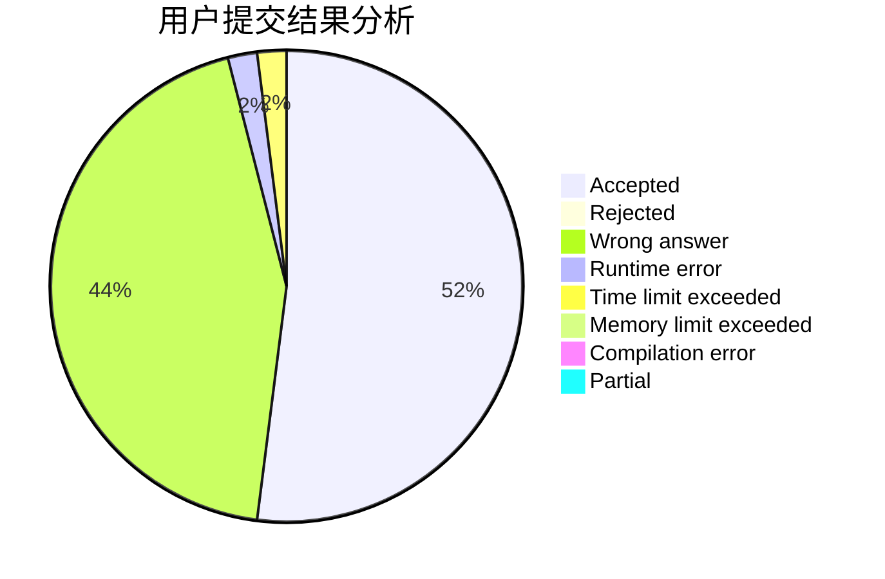
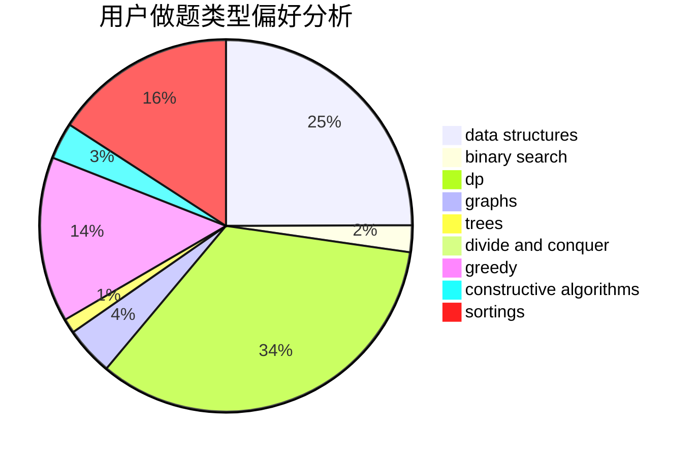
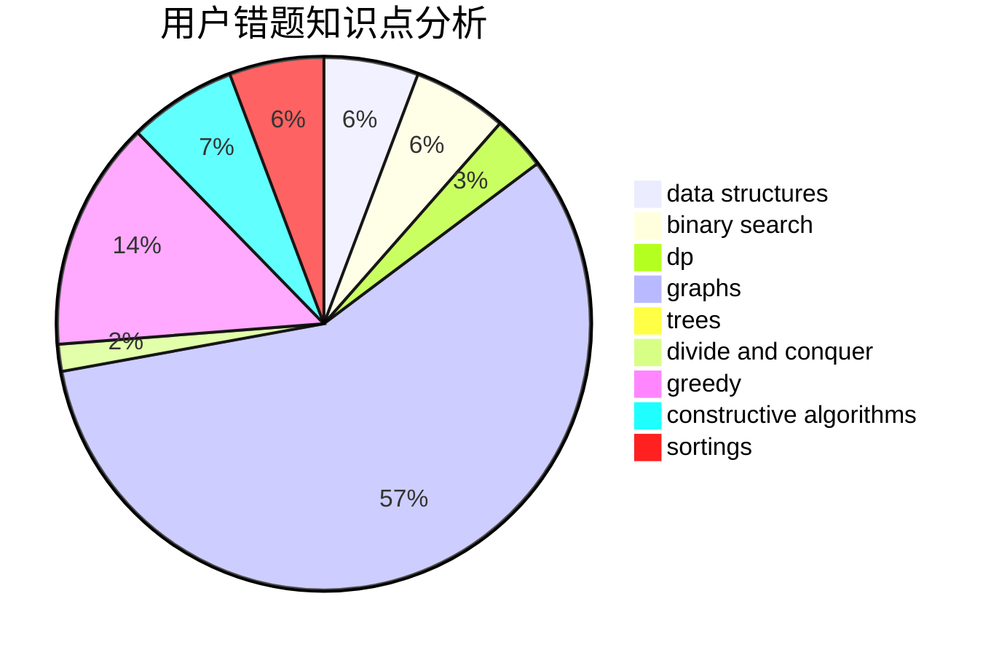

# KFC_wc
<!-- tabs:start -->
#### **用户提交结果分析**

#### **用户做题类型偏好分析**

#### **用户错题知识点分析**

<!-- tabs:end -->
# 推荐题目
[1473E](http://codeforces.com/problemset/problem/1473/E)		graphs,
                        shortest paths		  
[848C](http://codeforces.com/problemset/problem/848/C)		data structures,
                        divide and conquer		  
[1470F](http://codeforces.com/problemset/problem/1470/F)		divide and conquer		  
[542F](http://codeforces.com/problemset/problem/542/F)		dp,
                        greedy		  
[205D](https://codeforces.com/contest/205/problem/D)		binary search,
                        data structures		  
[281D](https://codeforces.com/contest/281/problem/D)		data structures,
                        implementation,
                        two pointers		  
[1300E](https://codeforces.com/contest/1300/problem/E)		data structures,
                        geometry,
                        greedy		  
[721A](http://codeforces.com/problemset/problem/721/A)		implementation		  
[316E2](http://codeforces.com/problemset/problem/316/E2)		data structures,
                        math		  
[235E](http://codeforces.com/problemset/problem/235/E)		combinatorics,
                        dp,
                        implementation,
                        math,
                        number theory		  
<!-- tabs:start -->
#### **data structures**
[848C](http://codeforces.com/problemset/problem/848/C)		data structures,
                        divide and conquer		  
[205D](https://codeforces.com/contest/205/problem/D)		binary search,
                        data structures		  
[281D](https://codeforces.com/contest/281/problem/D)		data structures,
                        implementation,
                        two pointers		  
[1300E](https://codeforces.com/contest/1300/problem/E)		data structures,
                        geometry,
                        greedy		  
[316E2](http://codeforces.com/problemset/problem/316/E2)		data structures,
                        math		  
[1166F](http://codeforces.com/problemset/problem/1166/F)		data structures,
                        dsu,
                        graphs,
                        hashing		  
[1366G](http://codeforces.com/problemset/problem/1366/G)		data structures,
                        dp,
                        strings		  
[837G](http://codeforces.com/problemset/problem/837/G)		data structures		  
[1263F](http://codeforces.com/problemset/problem/1263/F)		data structures,
                        dfs and similar,
                        dp,
                        flows,
                        graphs,
                        trees		  
[930C](http://codeforces.com/problemset/problem/930/C)		data structures,
                        dp		  
#### **binary search**
[205D](https://codeforces.com/contest/205/problem/D)		binary search,
                        data structures		  
[1492C](http://codeforces.com/problemset/problem/1492/C)		binary search,
                        data structures,
                        dp,
                        greedy,
                        two pointers		  
[1463D](http://codeforces.com/problemset/problem/1463/D)		binary search,
                        constructive algorithms,
                        greedy,
                        two pointers		  
[1490G](http://codeforces.com/problemset/problem/1490/G)		binary search,
                        data structures,
                        math		  
[1479D](http://codeforces.com/problemset/problem/1479/D)		binary search,
                        bitmasks,
                        brute force,
                        data structures,
                        probabilities,
                        trees		  
[1436E](http://codeforces.com/problemset/problem/1436/E)		binary search,
                        data structures,
                        two pointers		  
[1461D](http://codeforces.com/problemset/problem/1461/D)		binary search,
                        brute force,
                        data structures,
                        divide and conquer,
                        implementation,
                        sortings		  
[1493C](http://codeforces.com/problemset/problem/1493/C)		binary search,
                        brute force,
                        constructive algorithms,
                        greedy,
                        strings		  
[1487D](http://codeforces.com/problemset/problem/1487/D)		binary search,
                        brute force,
                        math,
                        number theory		  
[1486B](http://codeforces.com/problemset/problem/1486/B)		binary search,
                        geometry,
                        shortest paths,
                        sortings		  
#### **dp**
[542F](http://codeforces.com/problemset/problem/542/F)		dp,
                        greedy		  
[235E](http://codeforces.com/problemset/problem/235/E)		combinatorics,
                        dp,
                        implementation,
                        math,
                        number theory		  
[1187F](http://codeforces.com/problemset/problem/1187/F)		dp,
                        math,
                        probabilities		  
[1366G](http://codeforces.com/problemset/problem/1366/G)		data structures,
                        dp,
                        strings		  
[1263F](http://codeforces.com/problemset/problem/1263/F)		data structures,
                        dfs and similar,
                        dp,
                        flows,
                        graphs,
                        trees		  
[1199F](https://codeforces.com/contest/1199/problem/F)		dp		  
[604C](https://codeforces.com/contest/604/problem/C)		dp,
                        greedy,
                        math		  
[288E](http://codeforces.com/problemset/problem/288/E)		dp,
                        implementation,
                        math		  
[930C](http://codeforces.com/problemset/problem/930/C)		data structures,
                        dp		  
[1056D](http://codeforces.com/problemset/problem/1056/D)		constructive algorithms,
                        dfs and similar,
                        dp,
                        graphs,
                        greedy,
                        sortings,
                        trees		  
#### **graph**
[1473E](http://codeforces.com/problemset/problem/1473/E)		graphs,
                        shortest paths		  
[590C](http://codeforces.com/problemset/problem/590/C)		dfs and similar,
                        graphs,
                        shortest paths		  
[1166F](http://codeforces.com/problemset/problem/1166/F)		data structures,
                        dsu,
                        graphs,
                        hashing		  
[1263F](http://codeforces.com/problemset/problem/1263/F)		data structures,
                        dfs and similar,
                        dp,
                        flows,
                        graphs,
                        trees		  
[1056D](http://codeforces.com/problemset/problem/1056/D)		constructive algorithms,
                        dfs and similar,
                        dp,
                        graphs,
                        greedy,
                        sortings,
                        trees		  
[1082G](http://codeforces.com/problemset/problem/1082/G)		flows,
                        graphs		  
[1487C](http://codeforces.com/problemset/problem/1487/C)		brute force,
                        constructive algorithms,
                        dfs and similar,
                        graphs,
                        greedy,
                        implementation,
                        math		  
[1437C](http://codeforces.com/problemset/problem/1437/C)		dp,
                        flows,
                        graph matchings,
                        greedy,
                        math,
                        sortings		  
[1470D](http://codeforces.com/problemset/problem/1470/D)		constructive algorithms,
                        dfs and similar,
                        graph matchings,
                        graphs,
                        greedy		  
[1476C](http://codeforces.com/problemset/problem/1476/C)		dp,
                        graphs,
                        greedy		  
#### **trees**
[1263F](http://codeforces.com/problemset/problem/1263/F)		data structures,
                        dfs and similar,
                        dp,
                        flows,
                        graphs,
                        trees		  
[1056D](http://codeforces.com/problemset/problem/1056/D)		constructive algorithms,
                        dfs and similar,
                        dp,
                        graphs,
                        greedy,
                        sortings,
                        trees		  
[1479D](http://codeforces.com/problemset/problem/1479/D)		binary search,
                        bitmasks,
                        brute force,
                        data structures,
                        probabilities,
                        trees		  
[1511C](http://codeforces.com/problemset/problem/1511/C)		brute force,
                        data structures,
                        implementation,
                        trees		  
[1499F](http://codeforces.com/problemset/problem/1499/F)		combinatorics,
                        dfs and similar,
                        dp,
                        trees		  
[1491E](http://codeforces.com/problemset/problem/1491/E)		brute force,
                        dfs and similar,
                        divide and conquer,
                        number theory,
                        trees		  
[1466D](http://codeforces.com/problemset/problem/1466/D)		data structures,
                        greedy,
                        sortings,
                        trees		  
[1495D](http://codeforces.com/problemset/problem/1495/D)		combinatorics,
                        dfs and similar,
                        graphs,
                        math,
                        shortest paths,
                        trees		  
[1303G](http://codeforces.com/problemset/problem/1303/G)		data structures,
                        divide and conquer,
                        geometry,
                        trees		  
[1454E](http://codeforces.com/problemset/problem/1454/E)		combinatorics,
                        dfs and similar,
                        graphs,
                        trees		  
#### **divide and conquer**
[848C](http://codeforces.com/problemset/problem/848/C)		data structures,
                        divide and conquer		  
[1470F](http://codeforces.com/problemset/problem/1470/F)		divide and conquer		  
[1461D](http://codeforces.com/problemset/problem/1461/D)		binary search,
                        brute force,
                        data structures,
                        divide and conquer,
                        implementation,
                        sortings		  
[1466G](http://codeforces.com/problemset/problem/1466/G)		combinatorics,
                        divide and conquer,
                        hashing,
                        math,
                        string suffix structures,
                        strings		  
[1490D](http://codeforces.com/problemset/problem/1490/D)		dfs and similar,
                        divide and conquer,
                        implementation		  
[1483C](https://codeforces.com/contest/1483/problem/C)		data structures,
                        divide and conquer,
                        dp		  
[1491E](http://codeforces.com/problemset/problem/1491/E)		brute force,
                        dfs and similar,
                        divide and conquer,
                        number theory,
                        trees		  
[1303G](http://codeforces.com/problemset/problem/1303/G)		data structures,
                        divide and conquer,
                        geometry,
                        trees		  
[1494D](http://codeforces.com/problemset/problem/1494/D)		constructive algorithms,
                        data structures,
                        dfs and similar,
                        divide and conquer,
                        dsu,
                        greedy,
                        sortings,
                        trees		  
[1482E](http://codeforces.com/problemset/problem/1482/E)		data structures,
                        divide and conquer,
                        dp		  
#### **greedy**
[542F](http://codeforces.com/problemset/problem/542/F)		dp,
                        greedy		  
[1300E](https://codeforces.com/contest/1300/problem/E)		data structures,
                        geometry,
                        greedy		  
[545D](http://codeforces.com/problemset/problem/545/D)		greedy,
                        implementation,
                        sortings		  
[1346B](http://codeforces.com/problemset/problem/1346/B)		*special problem,
                        greedy		  
[847F](http://codeforces.com/problemset/problem/847/F)		greedy,
                        sortings		  
[604C](https://codeforces.com/contest/604/problem/C)		dp,
                        greedy,
                        math		  
[701A](http://codeforces.com/problemset/problem/701/A)		greedy,
                        implementation		  
[1056D](http://codeforces.com/problemset/problem/1056/D)		constructive algorithms,
                        dfs and similar,
                        dp,
                        graphs,
                        greedy,
                        sortings,
                        trees		  
[735C](http://codeforces.com/problemset/problem/735/C)		combinatorics,
                        constructive algorithms,
                        greedy,
                        math		  
[545C](http://codeforces.com/problemset/problem/545/C)		dp,
                        greedy		  
#### **constructive algorithms**
[912B](http://codeforces.com/problemset/problem/912/B)		bitmasks,
                        constructive algorithms,
                        number theory		  
[1158B](http://codeforces.com/problemset/problem/1158/B)		constructive algorithms,
                        math,
                        strings		  
[710C](http://codeforces.com/problemset/problem/710/C)		constructive algorithms,
                        math		  
[487C](http://codeforces.com/problemset/problem/487/C)		constructive algorithms,
                        math,
                        number theory		  
[1056D](http://codeforces.com/problemset/problem/1056/D)		constructive algorithms,
                        dfs and similar,
                        dp,
                        graphs,
                        greedy,
                        sortings,
                        trees		  
[735C](http://codeforces.com/problemset/problem/735/C)		combinatorics,
                        constructive algorithms,
                        greedy,
                        math		  
[1114B](http://codeforces.com/problemset/problem/1114/B)		constructive algorithms,
                        greedy,
                        sortings		  
[1440C1](https://codeforces.com/contest/1440/problem/C1)		constructive algorithms,
                        implementation		  
[1493A](http://codeforces.com/problemset/problem/1493/A)		constructive algorithms,
                        greedy		  
[1463D](http://codeforces.com/problemset/problem/1463/D)		binary search,
                        constructive algorithms,
                        greedy,
                        two pointers		  
#### **sortings**
[545D](http://codeforces.com/problemset/problem/545/D)		greedy,
                        implementation,
                        sortings		  
[847F](http://codeforces.com/problemset/problem/847/F)		greedy,
                        sortings		  
[769A](http://codeforces.com/problemset/problem/769/A)		*special problem,
                        implementation,
                        sortings		  
[1056D](http://codeforces.com/problemset/problem/1056/D)		constructive algorithms,
                        dfs and similar,
                        dp,
                        graphs,
                        greedy,
                        sortings,
                        trees		  
[1114B](http://codeforces.com/problemset/problem/1114/B)		constructive algorithms,
                        greedy,
                        sortings		  
[1355B](http://codeforces.com/problemset/problem/1355/B)		dp,
                        greedy,
                        sortings		  
[1496C](https://codeforces.com/contest/1496/problem/C)		geometry,
                        greedy,
                        math,
                        sortings		  
[1495A](http://codeforces.com/problemset/problem/1495/A)		geometry,
                        greedy,
                        math,
                        sortings		  
[1497A](http://codeforces.com/problemset/problem/1497/A)		brute force,
                        data structures,
                        greedy,
                        sortings		  
[1427A](http://codeforces.com/problemset/problem/1427/A)		math,
                        sortings		  
<!-- tabs:end -->
