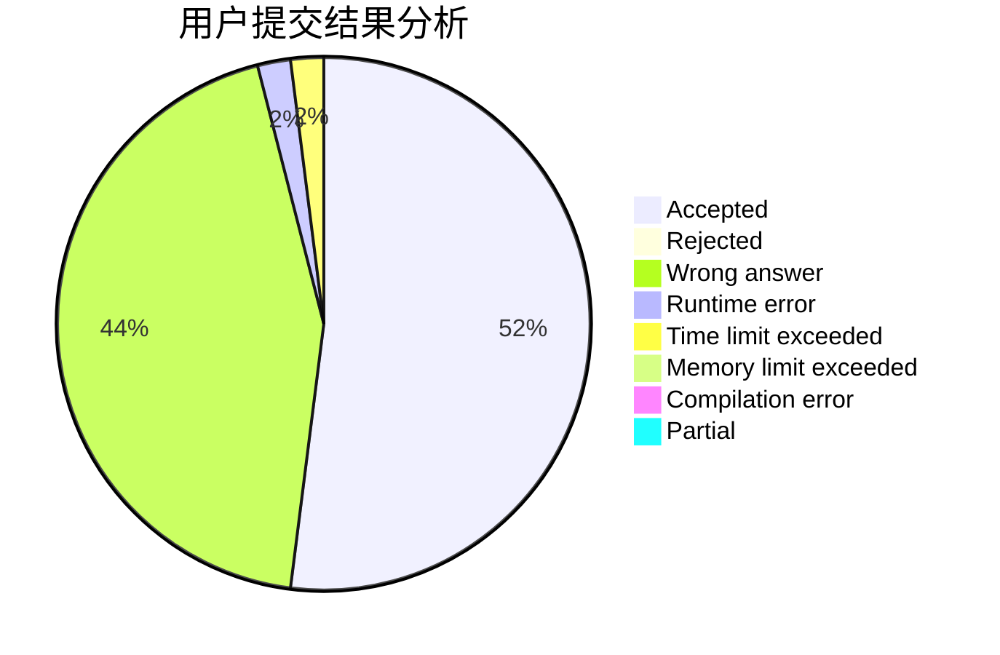
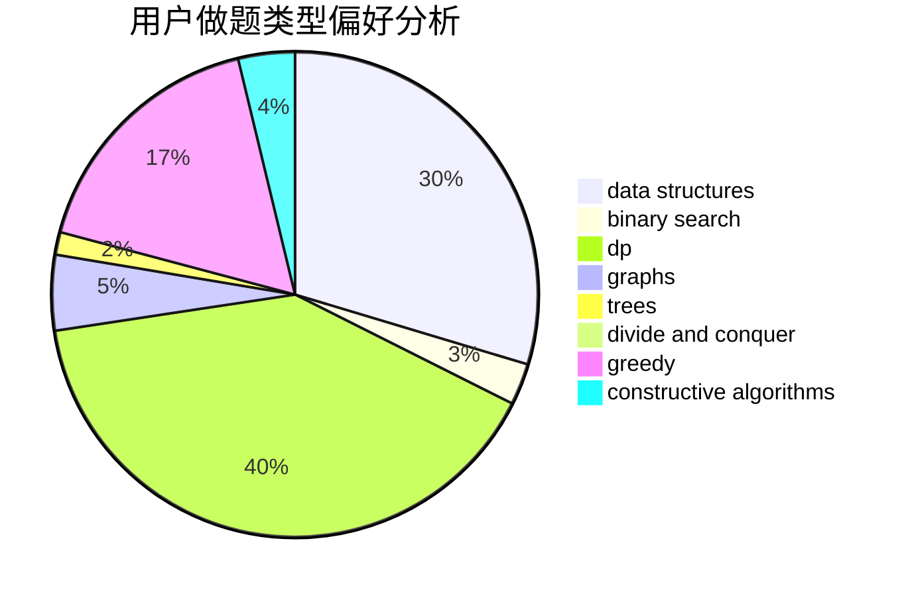
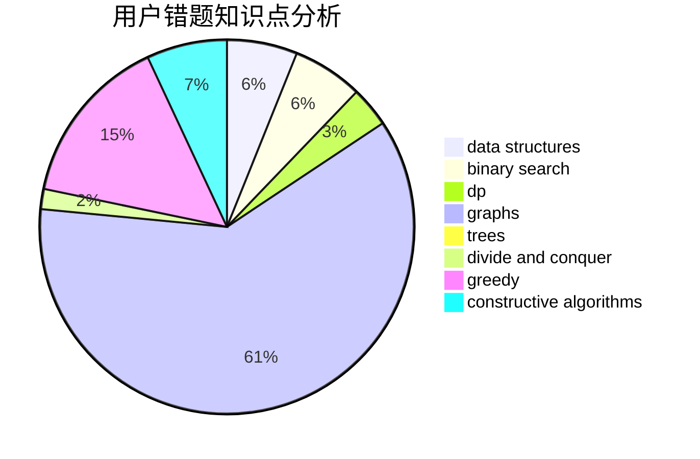

# KFC_wc

<!-- tabs:start -->

#### **用户提交结果分析**

#### **用户做题类型偏好分析**

#### **用户错题知识点分析**

<!-- tabs:end -->
# 推荐题目
[1470F](https://codeforces.com/contest/1470/problem/F)		divide and conquer		  
[1346B](https://codeforces.com/contest/1346/problem/B)		*special problem,
                        greedy		  
[1300E](https://codeforces.com/contest/1300/problem/E)		dsu,graphs,sortings,trees		  
[542F](https://codeforces.com/contest/542/problem/F)		dp,
                        greedy		  
[1473E](https://codeforces.com/contest/1473/problem/E)		graphs,
                        shortest paths		  
[316E2](https://codeforces.com/contest/316E/problem/2)		data structures,
                        math		  
[847F](https://codeforces.com/contest/847/problem/F)		greedy,
                        sortings		  
[88A](https://codeforces.com/contest/88/problem/A)		brute force,
                        implementation		  
[735A](https://codeforces.com/contest/735/problem/A)		implementation,
                        strings		  
[1187F](https://codeforces.com/contest/1187/problem/F)		dp,
                        math,
                        probabilities		  
