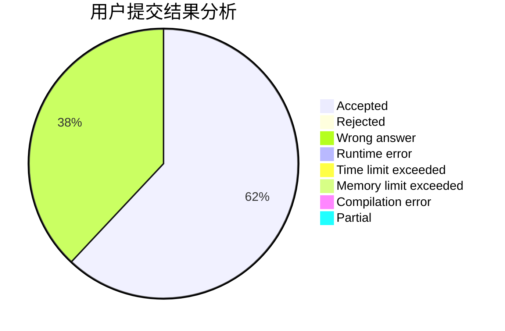
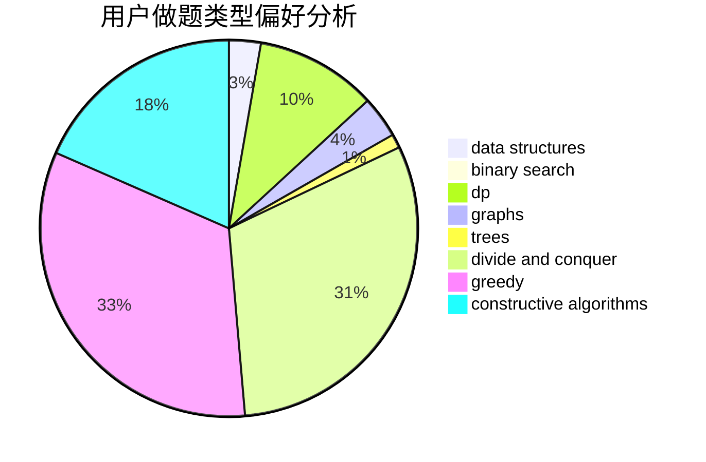

# KHIN_236807

<!-- tabs:start -->

#### **用户提交结果分析**

#### **用户做题类型偏好分析**

#### **用户错题知识点分析**

<!-- tabs:end -->
# 推荐题目
[1470E](https://codeforces.com/contest/1470/problem/E)		binary search,
                        combinatorics,
                        data structures,
                        dp,
                        graphs,
                        implementation,
                        two pointers		  
[1442A](https://codeforces.com/contest/1442/problem/A)		constructive algorithms,
                        dp,
                        greedy		  
[1473G](https://codeforces.com/contest/1473/problem/G)		combinatorics,
                        dp,
                        fft,
                        math		  
[1102B](https://codeforces.com/contest/1102/problem/B)		greedy,
                        sortings		  
[814C](https://codeforces.com/contest/814/problem/C)		brute force,
                        dp,
                        strings,
                        two pointers		  
[1020A](https://codeforces.com/contest/1020/problem/A)		math		  
[212E](https://codeforces.com/contest/212/problem/E)		dfs and similar,
                        dp,
                        trees		  
[414B](https://codeforces.com/contest/414/problem/B)		combinatorics,
                        dp,
                        number theory		  
[813D](https://codeforces.com/contest/813/problem/D)		dp,
                        flows		  
[264B](https://codeforces.com/contest/264/problem/B)		dp,
                        number theory		  
