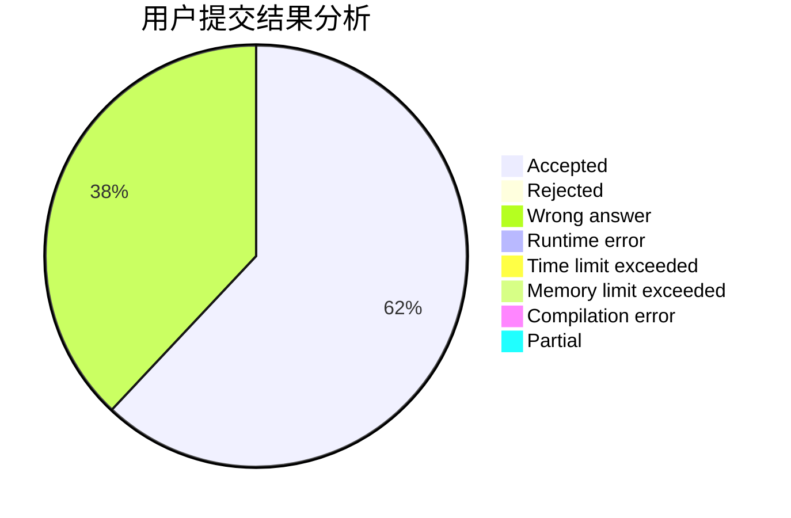
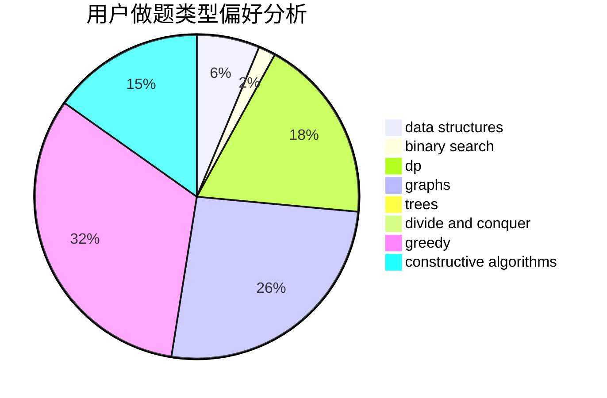

# KHIN_236807

<!-- tabs:start -->

#### **用户提交结果分析**

#### **用户做题类型偏好分析**

#### **用户错题知识点分析**

<!-- tabs:end -->
# 推荐题目
[1463D](https://codeforces.com/contest/1463/problem/D)		binary search,
                        constructive algorithms,
                        greedy,
                        two pointers		  
[1432B](https://codeforces.com/contest/1432/problem/B)		dsu,graphs,sortings,trees		  
[1466G](https://codeforces.com/contest/1466/problem/G)		combinatorics,
                        divide and conquer,
                        hashing,
                        math,
                        string suffix structures,
                        strings		  
[1101F](https://codeforces.com/contest/1101/problem/F)		binary search,
                        dp		  
[7B](https://codeforces.com/contest/7/problem/B)		implementation		  
[1019E](https://codeforces.com/contest/1019/problem/E)		data structures,
                        divide and conquer,
                        trees		  
[189A](https://codeforces.com/contest/189/problem/A)		brute force,
                        dp		  
[383A](https://codeforces.com/contest/383/problem/A)		data structures,
                        greedy		  
[799D](https://codeforces.com/contest/799/problem/D)		brute force,
                        dp,
                        meet-in-the-middle		  
[243A](https://codeforces.com/contest/243/problem/A)		bitmasks		  
