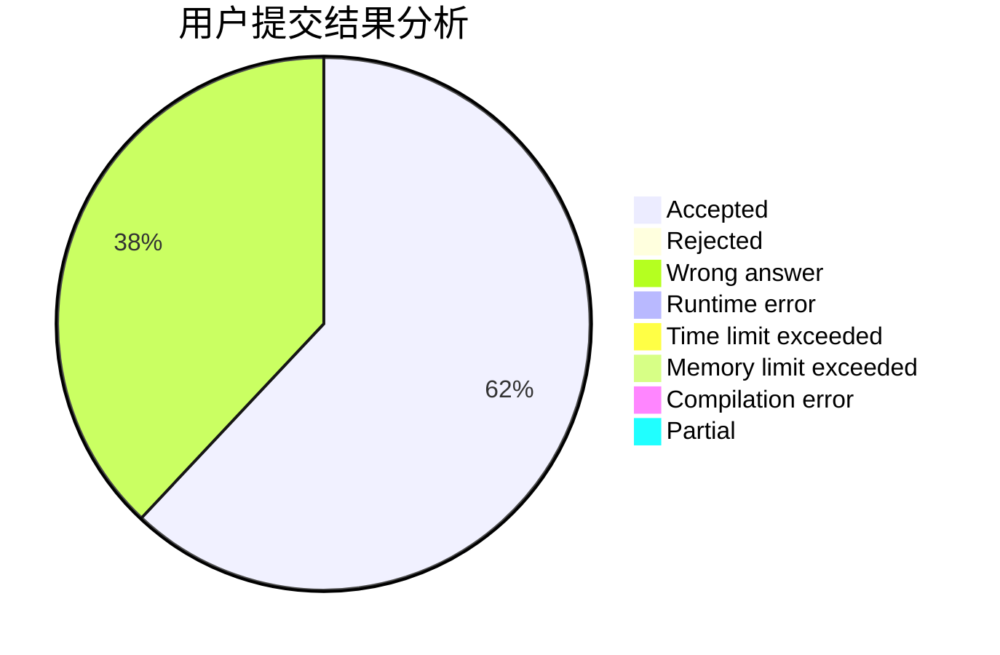
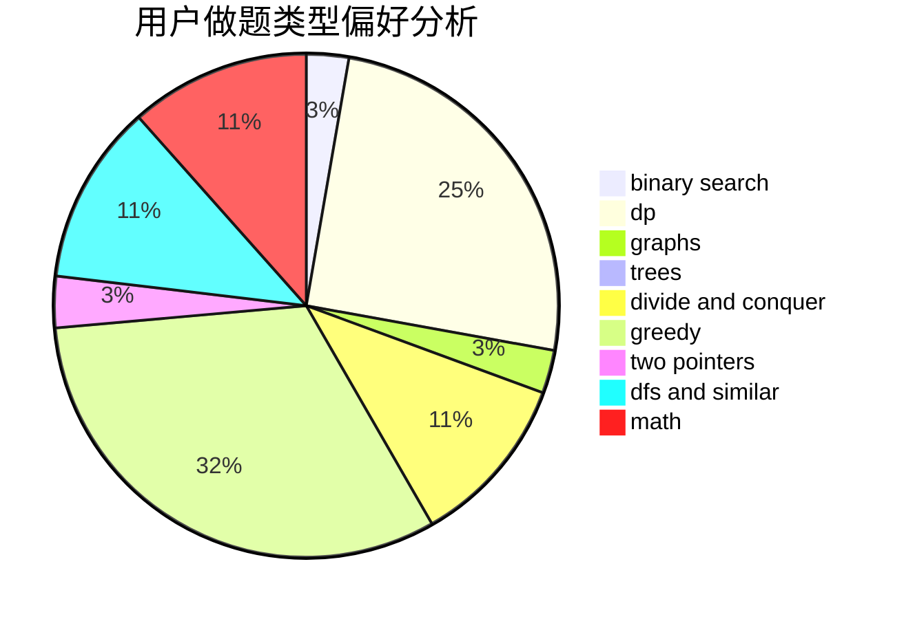

# KHIN_236807

<!-- tabs:start -->

#### **用户提交结果分析**

#### **用户做题类型偏好分析**

<!-- tabs:end -->
# 推荐题目
[1470E](https://codeforces.com/contest/1470/problem/E)
[1442A](https://codeforces.com/contest/1442/problem/A)
[1473G](https://codeforces.com/contest/1473/problem/G)
[1102B](https://codeforces.com/contest/1102/problem/B)
[814C](https://codeforces.com/contest/814/problem/C)
[1020A](https://codeforces.com/contest/1020/problem/A)
[212E](https://codeforces.com/contest/212/problem/E)
[414B](https://codeforces.com/contest/414/problem/B)
[813D](https://codeforces.com/contest/813/problem/D)
[264B](https://codeforces.com/contest/264/problem/B)
