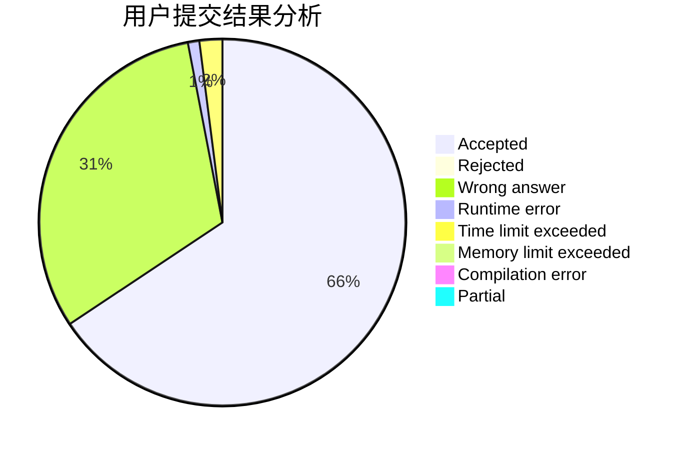
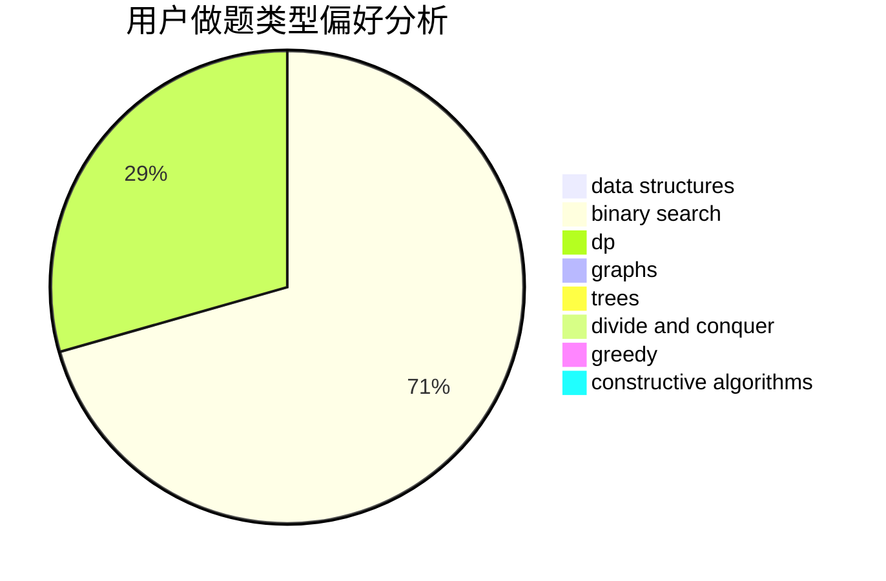
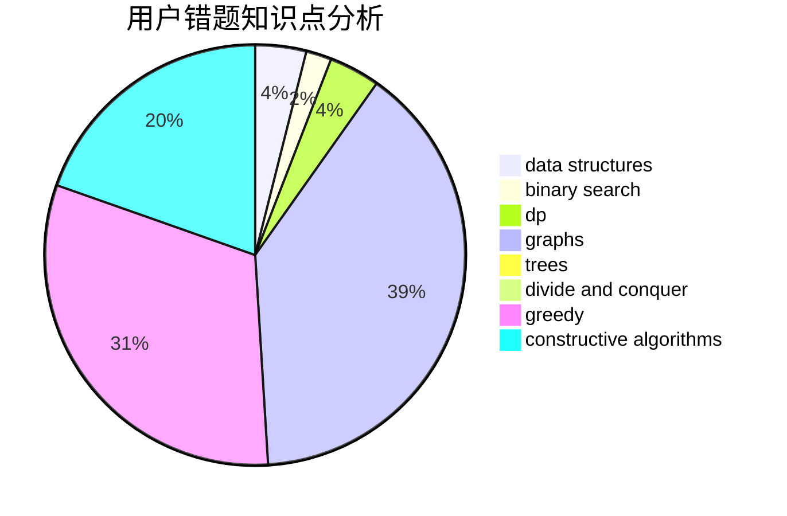

# 333lfy

<!-- tabs:start -->

#### **用户提交结果分析**

#### **用户做题类型偏好分析**

#### **用户错题知识点分析**

<!-- tabs:end -->
# 推荐题目
[1362A](https://codeforces.com/contest/1362/problem/A)		implementation		  
[1063C](https://codeforces.com/contest/1063/problem/C)		binary search,
                        constructive algorithms,
                        geometry,
                        interactive		  
[1361E](https://codeforces.com/contest/1361/problem/E)		dfs and similar,
                        graphs,
                        probabilities,
                        trees		  
[1362B](https://codeforces.com/contest/1362/problem/B)		bitmasks,
                        brute force		  
[1144B](https://codeforces.com/contest/1144/problem/B)		greedy,
                        implementation,
                        sortings		  
[1482E](https://codeforces.com/contest/1482/problem/E)		data structures,
                        divide and conquer,
                        dp		  
[1489D](https://codeforces.com/contest/1489/problem/D)		dsu,graphs,sortings,trees		  
[1483E](https://codeforces.com/contest/1483/problem/E)		dsu,graphs,sortings,trees		  
[1475F](https://codeforces.com/contest/1475/problem/F)		2-sat,
                        brute force,
                        constructive algorithms		  
[1472A](https://codeforces.com/contest/1472/problem/A)		greedy,
                        math		  
