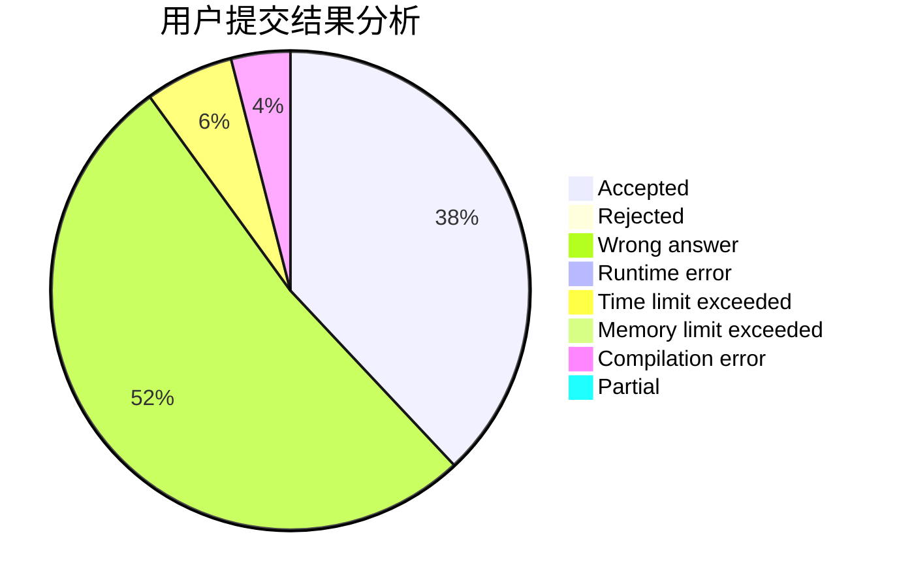
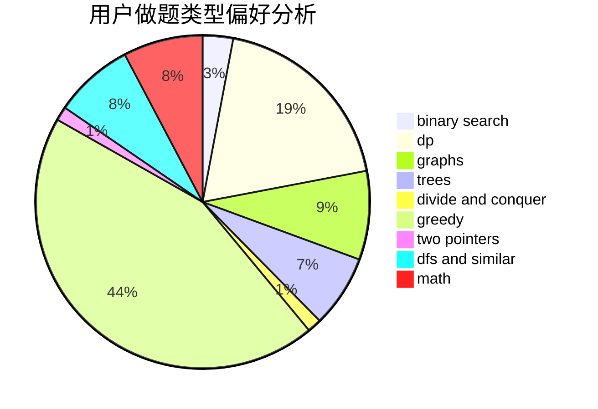

# KI-aq

<!-- tabs:start -->

#### **用户提交结果分析**

#### **用户做题类型偏好分析**

<!-- tabs:end -->
# 推荐题目
[567E](https://codeforces.com/contest/567/problem/E)
[828A](https://codeforces.com/contest/828/problem/A)
[689B](https://codeforces.com/contest/689/problem/B)
[957D](https://codeforces.com/contest/957/problem/D)
[729C](https://codeforces.com/contest/729/problem/C)
[271D](https://codeforces.com/contest/271/problem/D)
[811B](https://codeforces.com/contest/811/problem/B)
[46F](https://codeforces.com/contest/46/problem/F)
[1283E](https://codeforces.com/contest/1283/problem/E)
[611E](https://codeforces.com/contest/611/problem/E)
