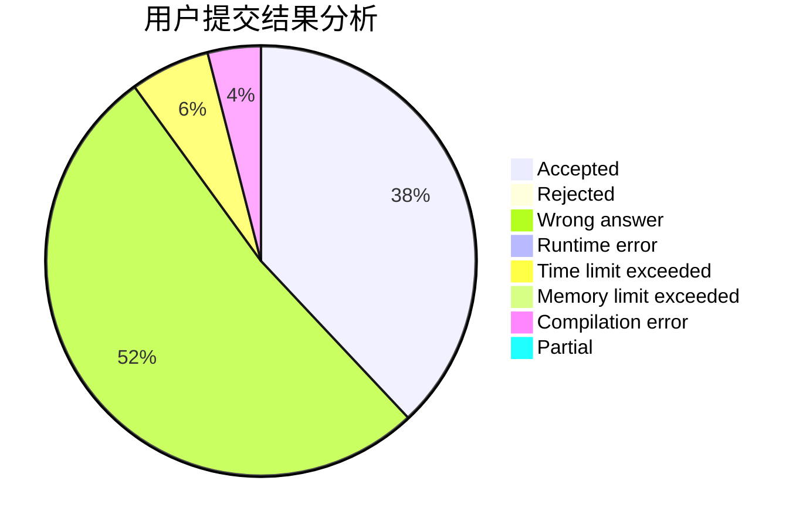
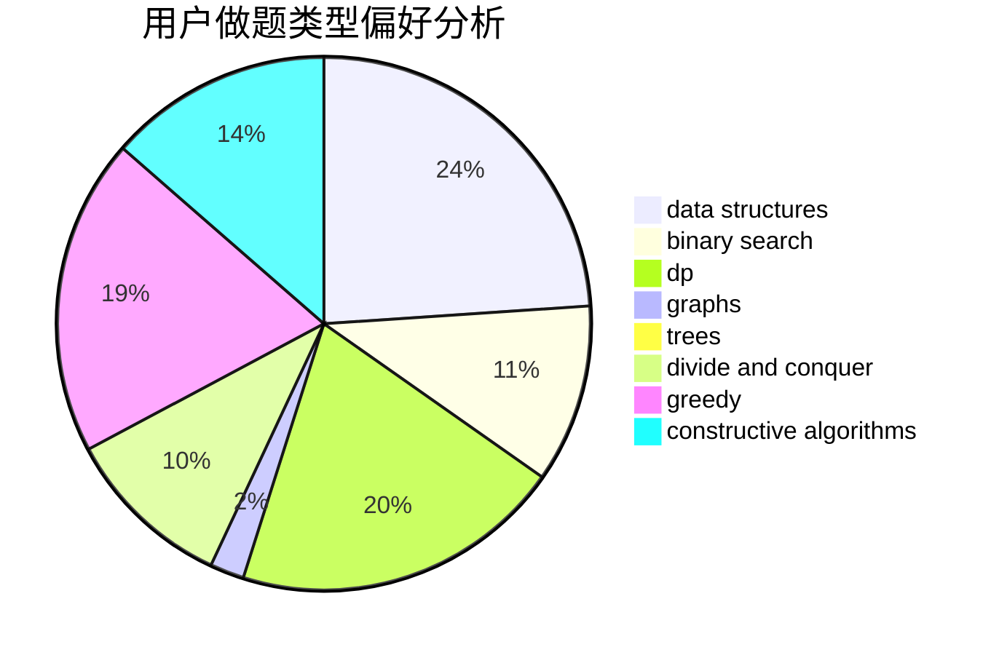
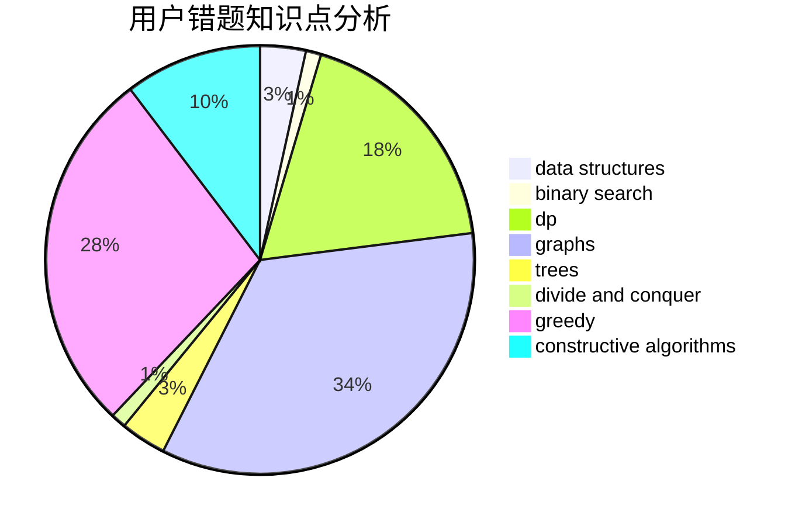

# KI-aq

<!-- tabs:start -->

#### **用户提交结果分析**

#### **用户做题类型偏好分析**

#### **用户错题知识点分析**

<!-- tabs:end -->
# 推荐题目
[543C](https://codeforces.com/contest/543/problem/C)		bitmasks,
                        dp		  
[810A](https://codeforces.com/contest/810/problem/A)		implementation,
                        math		  
[667B](https://codeforces.com/contest/667/problem/B)		constructive algorithms,
                        geometry		  
[935E](https://codeforces.com/contest/935/problem/E)		dfs and similar,
                        dp,
                        trees		  
[709B](https://codeforces.com/contest/709/problem/B)		greedy,
                        implementation,
                        sortings		  
[253D](https://codeforces.com/contest/253/problem/D)		brute force,
                        two pointers		  
[797C](https://codeforces.com/contest/797/problem/C)		data structures,
                        greedy,
                        strings		  
[44A](https://codeforces.com/contest/44/problem/A)		implementation		  
[1277C](https://codeforces.com/contest/1277/problem/C)		dsu,graphs,sortings,trees		  
[592C](https://codeforces.com/contest/592/problem/C)		math		  
