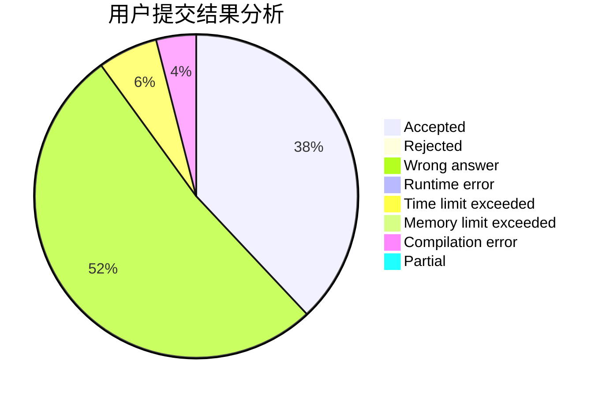
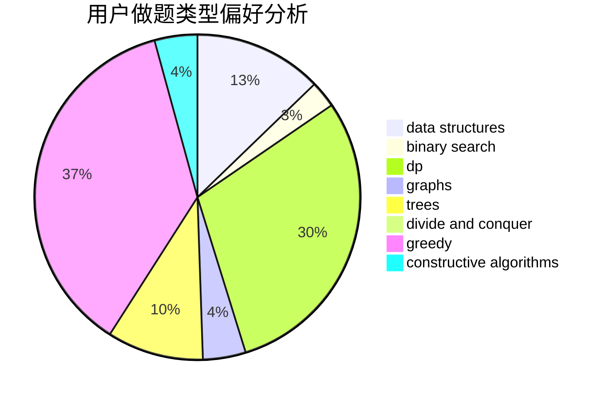
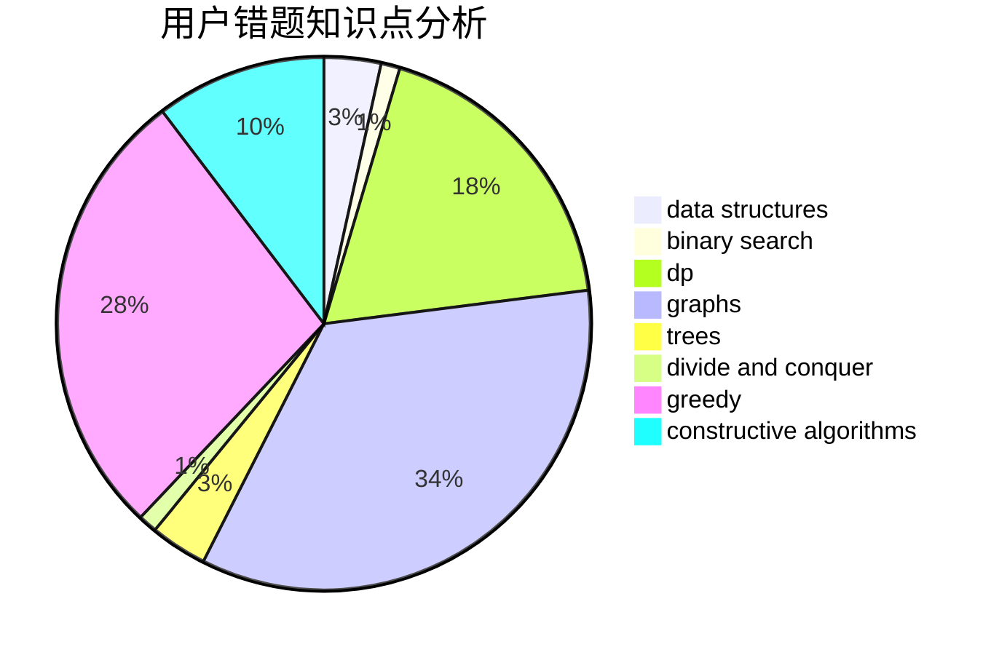

# KI-aq

<!-- tabs:start -->

#### **用户提交结果分析**

#### **用户做题类型偏好分析**

#### **用户错题知识点分析**

<!-- tabs:end -->
# 推荐题目
[567E](https://codeforces.com/contest/567/problem/E)		dfs and similar,
                        graphs,
                        hashing,
                        shortest paths		  
[828A](https://codeforces.com/contest/828/problem/A)		implementation		  
[689B](https://codeforces.com/contest/689/problem/B)		dfs and similar,
                        graphs,
                        greedy,
                        shortest paths		  
[957D](https://codeforces.com/contest/957/problem/D)		dsu,graphs,sortings,trees		  
[729C](https://codeforces.com/contest/729/problem/C)		binary search,
                        greedy,
                        sortings		  
[271D](https://codeforces.com/contest/271/problem/D)		data structures,
                        strings		  
[811B](https://codeforces.com/contest/811/problem/B)		implementation,
                        sortings		  
[46F](https://codeforces.com/contest/46/problem/F)		dsu,
                        graphs		  
[1283E](https://codeforces.com/contest/1283/problem/E)		dp,
                        greedy		  
[611E](https://codeforces.com/contest/611/problem/E)		data structures,
                        greedy,
                        sortings		  
