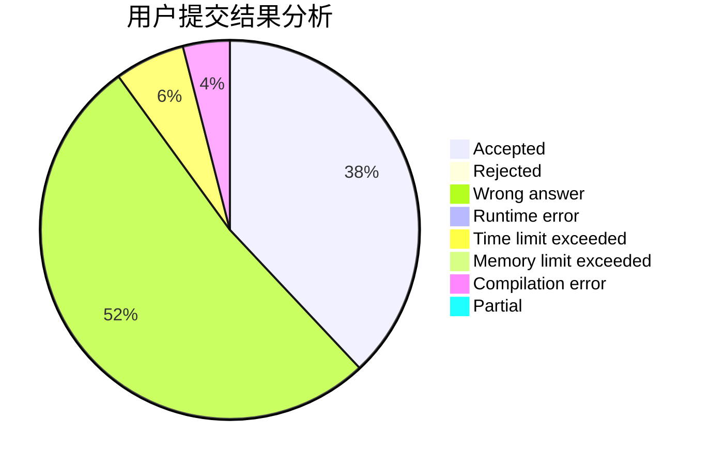
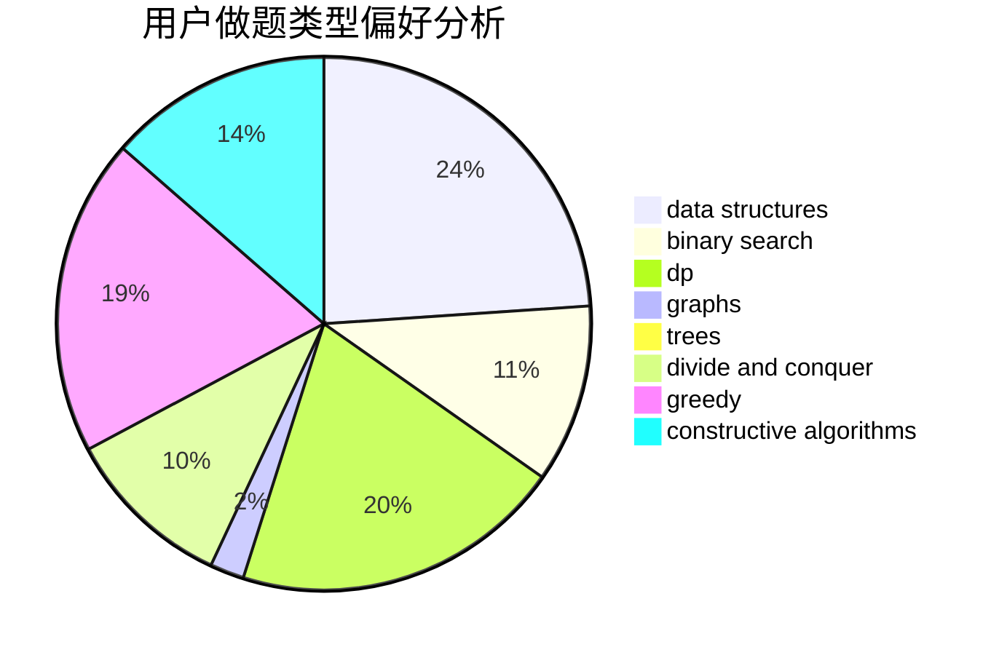
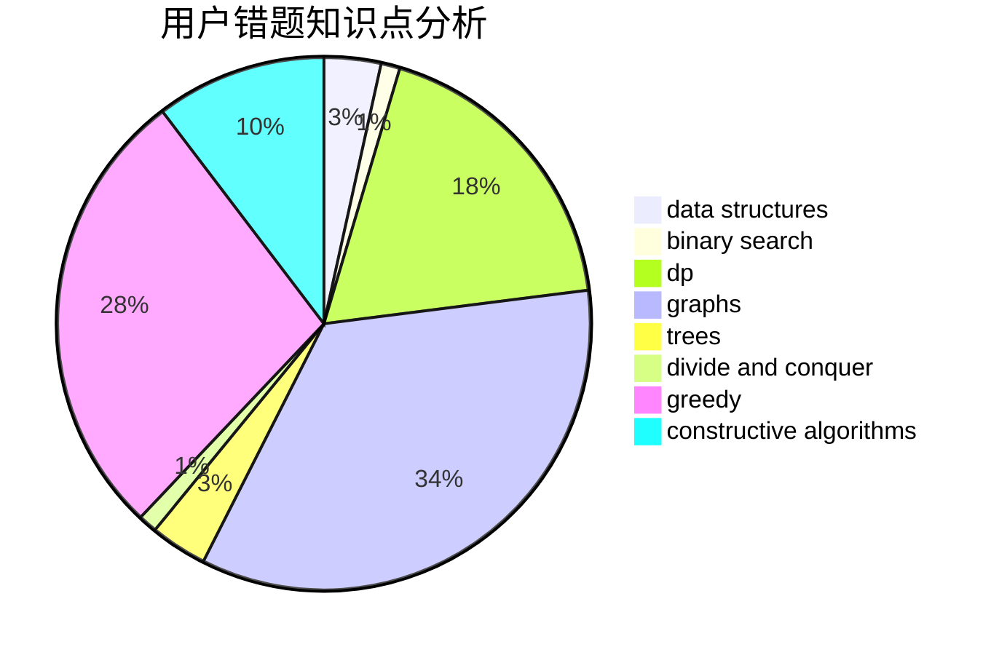

# KI-aq
<!-- tabs:start -->
#### **用户提交结果分析**

#### **用户做题类型偏好分析**

#### **用户错题知识点分析**

<!-- tabs:end -->
# 推荐题目
[Remembering Strings](http://codeforces.com/problemset/problem/543/C)		bitmasks,
                        dp		  
[Straight <<A>>](http://codeforces.com/problemset/problem/810/A)		implementation,
                        math		  
[Squats](http://codeforces.com/problemset/problem/424/A)		implementation		  
[Minimal string](http://codeforces.com/problemset/problem/797/C)		data structures,
                        greedy,
                        strings		  
[Fafa and Ancient Mathematics](http://codeforces.com/problemset/problem/935/E)		dfs and similar,
                        dp,
                        trees		  
[Checkpoints](http://codeforces.com/problemset/problem/709/B)		greedy,
                        implementation,
                        sortings		  
[Coat of Anticubism](http://codeforces.com/problemset/problem/667/B)		constructive algorithms,
                        geometry		  
[Table with Letters - 2](http://codeforces.com/problemset/problem/253/D)		brute force,
                        two pointers		  
[Indian Summer](http://codeforces.com/problemset/problem/44/A)		implementation		  
[Parity Game](http://codeforces.com/problemset/problem/297/A)		constructive algorithms		  
<!-- tabs:start -->
#### **data structures**
[Remembering Strings](http://codeforces.com/problemset/problem/797/C)		data structures,
                        greedy,
                        strings		  
[Straight <<A>>](http://codeforces.com/problemset/problem/1419/F)		binary search,
                        data structures,
                        dfs and similar,
                        dsu,
                        graphs,
                        implementation		  
[Squats](https://codeforces.com/contest/651/problem/C)		data structures,
                        geometry,
                        math		  
[Minimal string](http://codeforces.com/problemset/problem/513/D2)		constructive algorithms,
                        data structures		  
[Fafa and Ancient Mathematics](http://codeforces.com/problemset/problem/1492/C)		binary search,
                        data structures,
                        dp,
                        greedy,
                        two pointers		  
[Checkpoints](http://codeforces.com/problemset/problem/1490/G)		binary search,
                        data structures,
                        math		  
[Coat of Anticubism](http://codeforces.com/problemset/problem/1479/D)		binary search,
                        bitmasks,
                        brute force,
                        data structures,
                        probabilities,
                        trees		  
[Table with Letters - 2](http://codeforces.com/problemset/problem/1497/A)		brute force,
                        data structures,
                        greedy,
                        sortings		  
[Indian Summer](http://codeforces.com/problemset/problem/1491/C)		brute force,
                        data structures,
                        dp,
                        greedy,
                        implementation		  
[Parity Game](http://codeforces.com/problemset/problem/1492/B)		data structures,
                        greedy,
                        math		  
#### **binary search**
[Remembering Strings](http://codeforces.com/problemset/problem/1419/F)		binary search,
                        data structures,
                        dfs and similar,
                        dsu,
                        graphs,
                        implementation		  
[Straight <<A>>](https://codeforces.com/contest/1011/problem/D)		binary search,
                        interactive		  
[Squats](http://codeforces.com/problemset/problem/1492/C)		binary search,
                        data structures,
                        dp,
                        greedy,
                        two pointers		  
[Minimal string](http://codeforces.com/problemset/problem/1463/D)		binary search,
                        constructive algorithms,
                        greedy,
                        two pointers		  
[Fafa and Ancient Mathematics](http://codeforces.com/problemset/problem/1490/G)		binary search,
                        data structures,
                        math		  
[Checkpoints](http://codeforces.com/problemset/problem/1479/D)		binary search,
                        bitmasks,
                        brute force,
                        data structures,
                        probabilities,
                        trees		  
[Coat of Anticubism](http://codeforces.com/problemset/problem/1436/E)		binary search,
                        data structures,
                        two pointers		  
[Table with Letters - 2](http://codeforces.com/problemset/problem/1461/D)		binary search,
                        brute force,
                        data structures,
                        divide and conquer,
                        implementation,
                        sortings		  
[Indian Summer](http://codeforces.com/problemset/problem/1493/C)		binary search,
                        brute force,
                        constructive algorithms,
                        greedy,
                        strings		  
[Parity Game](http://codeforces.com/problemset/problem/1487/D)		binary search,
                        brute force,
                        math,
                        number theory		  
#### **dp**
[Remembering Strings](http://codeforces.com/problemset/problem/543/C)		bitmasks,
                        dp		  
[Straight <<A>>](http://codeforces.com/problemset/problem/935/E)		dfs and similar,
                        dp,
                        trees		  
[Squats](http://codeforces.com/problemset/problem/855/G)		dfs and similar,
                        dp,
                        graphs,
                        trees		  
[Minimal string](http://codeforces.com/problemset/problem/1204/E)		combinatorics,
                        dp,
                        math,
                        number theory		  
[Fafa and Ancient Mathematics](https://codeforces.com/contest/1277/problem/C)		dp,
                        greedy		  
[Checkpoints](http://codeforces.com/problemset/problem/6/D)		brute force,
                        dp		  
[Coat of Anticubism](http://codeforces.com/problemset/problem/1097/G)		combinatorics,
                        dp,
                        trees		  
[Table with Letters - 2](http://codeforces.com/problemset/problem/1492/C)		binary search,
                        data structures,
                        dp,
                        greedy,
                        two pointers		  
[Indian Summer](https://codeforces.com/contest/1457/problem/C)		brute force,
                        dp,
                        implementation		  
[Parity Game](http://codeforces.com/problemset/problem/1491/C)		brute force,
                        data structures,
                        dp,
                        greedy,
                        implementation		  
#### **graph**
[Remembering Strings](http://codeforces.com/problemset/problem/855/G)		dfs and similar,
                        dp,
                        graphs,
                        trees		  
[Straight <<A>>](https://codeforces.com/contest/1047/problem/D)		brute force,
                        constructive algorithms,
                        flows,
                        graph matchings		  
[Squats](http://codeforces.com/problemset/problem/1419/F)		binary search,
                        data structures,
                        dfs and similar,
                        dsu,
                        graphs,
                        implementation		  
[Minimal string](http://codeforces.com/problemset/problem/1411/C)		dfs and similar,
                        dsu,
                        graphs		  
[Fafa and Ancient Mathematics](https://codeforces.com/contest/1484/problem/F)		graphs,
                        shortest paths		  
[Checkpoints](http://codeforces.com/problemset/problem/76/A)		dsu,
                        graphs,
                        sortings,
                        trees		  
[Coat of Anticubism](http://codeforces.com/problemset/problem/1487/C)		brute force,
                        constructive algorithms,
                        dfs and similar,
                        graphs,
                        greedy,
                        implementation,
                        math		  
[Table with Letters - 2](http://codeforces.com/problemset/problem/1437/C)		dp,
                        flows,
                        graph matchings,
                        greedy,
                        math,
                        sortings		  
[Indian Summer](http://codeforces.com/problemset/problem/1470/D)		constructive algorithms,
                        dfs and similar,
                        graph matchings,
                        graphs,
                        greedy		  
[Parity Game](http://codeforces.com/problemset/problem/1476/C)		dp,
                        graphs,
                        greedy		  
#### **trees**
[Remembering Strings](http://codeforces.com/problemset/problem/935/E)		dfs and similar,
                        dp,
                        trees		  
[Straight <<A>>](http://codeforces.com/problemset/problem/855/G)		dfs and similar,
                        dp,
                        graphs,
                        trees		  
[Squats](http://codeforces.com/problemset/problem/76/A)		dsu,
                        graphs,
                        sortings,
                        trees		  
[Minimal string](http://codeforces.com/problemset/problem/1097/G)		combinatorics,
                        dp,
                        trees		  
[Fafa and Ancient Mathematics](http://codeforces.com/problemset/problem/1479/D)		binary search,
                        bitmasks,
                        brute force,
                        data structures,
                        probabilities,
                        trees		  
[Checkpoints](http://codeforces.com/problemset/problem/1511/C)		brute force,
                        data structures,
                        implementation,
                        trees		  
[Coat of Anticubism](http://codeforces.com/problemset/problem/1499/F)		combinatorics,
                        dfs and similar,
                        dp,
                        trees		  
[Table with Letters - 2](http://codeforces.com/problemset/problem/1491/E)		brute force,
                        dfs and similar,
                        divide and conquer,
                        number theory,
                        trees		  
[Indian Summer](http://codeforces.com/problemset/problem/1466/D)		data structures,
                        greedy,
                        sortings,
                        trees		  
[Parity Game](http://codeforces.com/problemset/problem/1495/D)		combinatorics,
                        dfs and similar,
                        graphs,
                        math,
                        shortest paths,
                        trees		  
#### **divide and conquer**
[Remembering Strings](http://codeforces.com/problemset/problem/1461/D)		binary search,
                        brute force,
                        data structures,
                        divide and conquer,
                        implementation,
                        sortings		  
[Straight <<A>>](http://codeforces.com/problemset/problem/1466/G)		combinatorics,
                        divide and conquer,
                        hashing,
                        math,
                        string suffix structures,
                        strings		  
[Squats](http://codeforces.com/problemset/problem/1490/D)		dfs and similar,
                        divide and conquer,
                        implementation		  
[Minimal string](https://codeforces.com/contest/1483/problem/C)		data structures,
                        divide and conquer,
                        dp		  
[Fafa and Ancient Mathematics](http://codeforces.com/problemset/problem/1491/E)		brute force,
                        dfs and similar,
                        divide and conquer,
                        number theory,
                        trees		  
[Checkpoints](http://codeforces.com/problemset/problem/1303/G)		data structures,
                        divide and conquer,
                        geometry,
                        trees		  
[Coat of Anticubism](http://codeforces.com/problemset/problem/1494/D)		constructive algorithms,
                        data structures,
                        dfs and similar,
                        divide and conquer,
                        dsu,
                        greedy,
                        sortings,
                        trees		  
[Table with Letters - 2](http://codeforces.com/problemset/problem/1482/E)		data structures,
                        divide and conquer,
                        dp		  
[Indian Summer](http://codeforces.com/problemset/problem/566/C)		dfs and similar,
                        divide and conquer,
                        trees		  
[Parity Game](http://codeforces.com/problemset/problem/1428/F)		binary search,
                        data structures,
                        divide and conquer,
                        dp,
                        two pointers		  
#### **greedy**
[Remembering Strings](http://codeforces.com/problemset/problem/797/C)		data structures,
                        greedy,
                        strings		  
[Straight <<A>>](http://codeforces.com/problemset/problem/709/B)		greedy,
                        implementation,
                        sortings		  
[Squats](https://codeforces.com/contest/1277/problem/C)		dp,
                        greedy		  
[Minimal string](http://codeforces.com/problemset/problem/1178/A)		greedy		  
[Fafa and Ancient Mathematics](http://codeforces.com/problemset/problem/1300/B)		greedy,
                        implementation,
                        sortings		  
[Checkpoints](http://codeforces.com/problemset/problem/1492/C)		binary search,
                        data structures,
                        dp,
                        greedy,
                        two pointers		  
[Coat of Anticubism](https://codeforces.com/contest/1496/problem/C)		geometry,
                        greedy,
                        math,
                        sortings		  
[Table with Letters - 2](http://codeforces.com/problemset/problem/1493/A)		constructive algorithms,
                        greedy		  
[Indian Summer](http://codeforces.com/problemset/problem/1463/D)		binary search,
                        constructive algorithms,
                        greedy,
                        two pointers		  
[Parity Game](http://codeforces.com/problemset/problem/1462/C)		brute force,
                        greedy,
                        math		  
#### **constructive algorithms**
[Remembering Strings](http://codeforces.com/problemset/problem/667/B)		constructive algorithms,
                        geometry		  
[Straight <<A>>](http://codeforces.com/problemset/problem/297/A)		constructive algorithms		  
[Squats](https://codeforces.com/contest/1047/problem/D)		brute force,
                        constructive algorithms,
                        flows,
                        graph matchings		  
[Minimal string](http://codeforces.com/problemset/problem/513/D2)		constructive algorithms,
                        data structures		  
[Fafa and Ancient Mathematics](http://codeforces.com/problemset/problem/1208/C)		constructive algorithms		  
[Checkpoints](http://codeforces.com/problemset/problem/1493/A)		constructive algorithms,
                        greedy		  
[Coat of Anticubism](http://codeforces.com/problemset/problem/1463/D)		binary search,
                        constructive algorithms,
                        greedy,
                        two pointers		  
[Table with Letters - 2](https://codeforces.com/contest/1456/problem/B)		bitmasks,
                        brute force,
                        constructive algorithms		  
[Indian Summer](http://codeforces.com/problemset/problem/1492/D)		bitmasks,
                        constructive algorithms,
                        greedy,
                        math		  
[Parity Game](https://codeforces.com/contest/1504/problem/D)		constructive algorithms,
                        games,
                        interactive		  
#### **sortings**
[Remembering Strings](http://codeforces.com/problemset/problem/709/B)		greedy,
                        implementation,
                        sortings		  
[Straight <<A>>](http://codeforces.com/problemset/problem/1300/B)		greedy,
                        implementation,
                        sortings		  
[Squats](http://codeforces.com/problemset/problem/76/A)		dsu,
                        graphs,
                        sortings,
                        trees		  
[Minimal string](https://codeforces.com/contest/1496/problem/C)		geometry,
                        greedy,
                        math,
                        sortings		  
[Fafa and Ancient Mathematics](http://codeforces.com/problemset/problem/1495/A)		geometry,
                        greedy,
                        math,
                        sortings		  
[Checkpoints](http://codeforces.com/problemset/problem/1497/A)		brute force,
                        data structures,
                        greedy,
                        sortings		  
[Coat of Anticubism](http://codeforces.com/problemset/problem/1427/A)		math,
                        sortings		  
[Table with Letters - 2](http://codeforces.com/problemset/problem/1461/D)		binary search,
                        brute force,
                        data structures,
                        divide and conquer,
                        implementation,
                        sortings		  
[Indian Summer](http://codeforces.com/problemset/problem/1437/C)		dp,
                        flows,
                        graph matchings,
                        greedy,
                        math,
                        sortings		  
[Parity Game](http://codeforces.com/problemset/problem/1473/A)		greedy,
                        implementation,
                        math,
                        sortings		  
<!-- tabs:end -->
