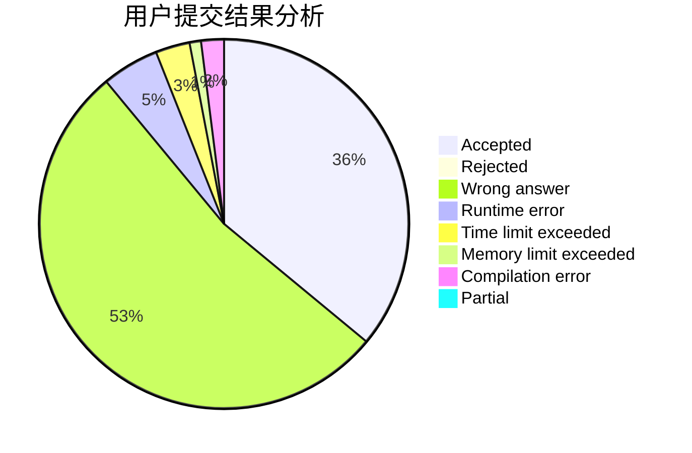
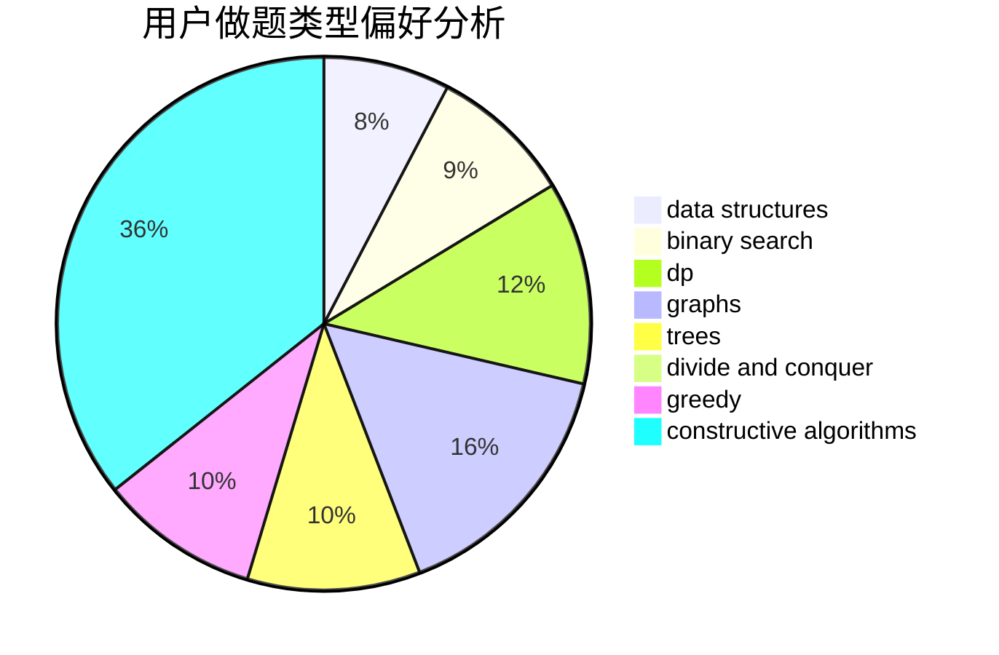
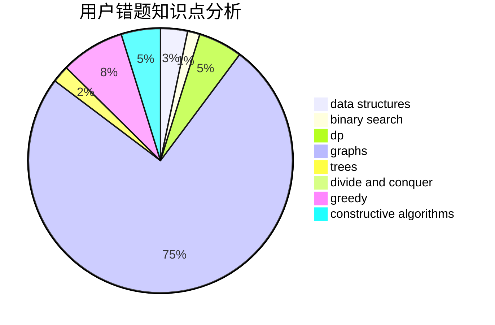

# KJGKMTZB

<!-- tabs:start -->

#### **用户提交结果分析**

#### **用户做题类型偏好分析**

#### **用户错题知识点分析**

<!-- tabs:end -->
# 推荐题目
[7D](https://codeforces.com/contest/7/problem/D)		hashing,
                        strings		  
[675C](https://codeforces.com/contest/675/problem/C)		constructive algorithms,
                        data structures,
                        greedy,
                        sortings		  
[372A](https://codeforces.com/contest/372/problem/A)		binary search,
                        greedy,
                        sortings,
                        two pointers		  
[1296F](https://codeforces.com/contest/1296/problem/F)		constructive algorithms,
                        dfs and similar,
                        greedy,
                        sortings,
                        trees		  
[1045E](https://codeforces.com/contest/1045/problem/E)		constructive algorithms,
                        geometry		  
[1278A](https://codeforces.com/contest/1278/problem/A)		brute force,
                        implementation,
                        strings		  
[1238G](https://codeforces.com/contest/1238/problem/G)		data structures,
                        greedy,
                        sortings		  
[1245D](https://codeforces.com/contest/1245/problem/D)		dsu,
                        graphs,
                        greedy,
                        shortest paths,
                        trees		  
[799D](https://codeforces.com/contest/799/problem/D)		brute force,
                        dp,
                        meet-in-the-middle		  
[755G](https://codeforces.com/contest/755/problem/G)		combinatorics,
                        divide and conquer,
                        dp,
                        fft,
                        math,
                        number theory		  
