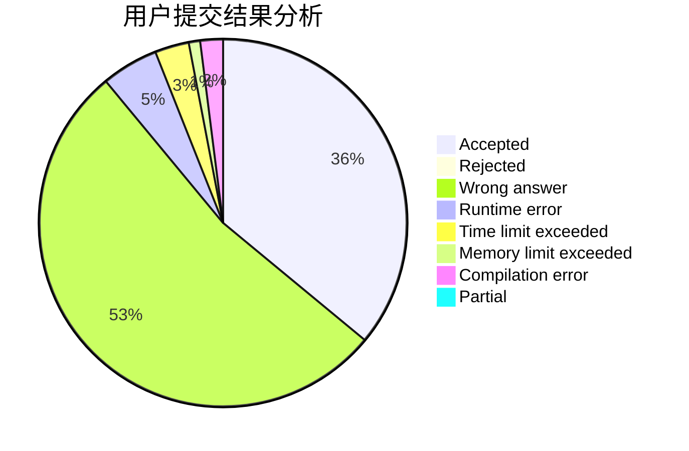
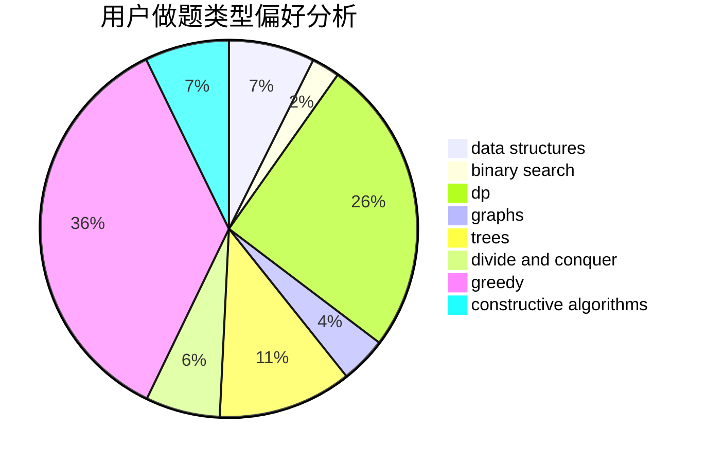
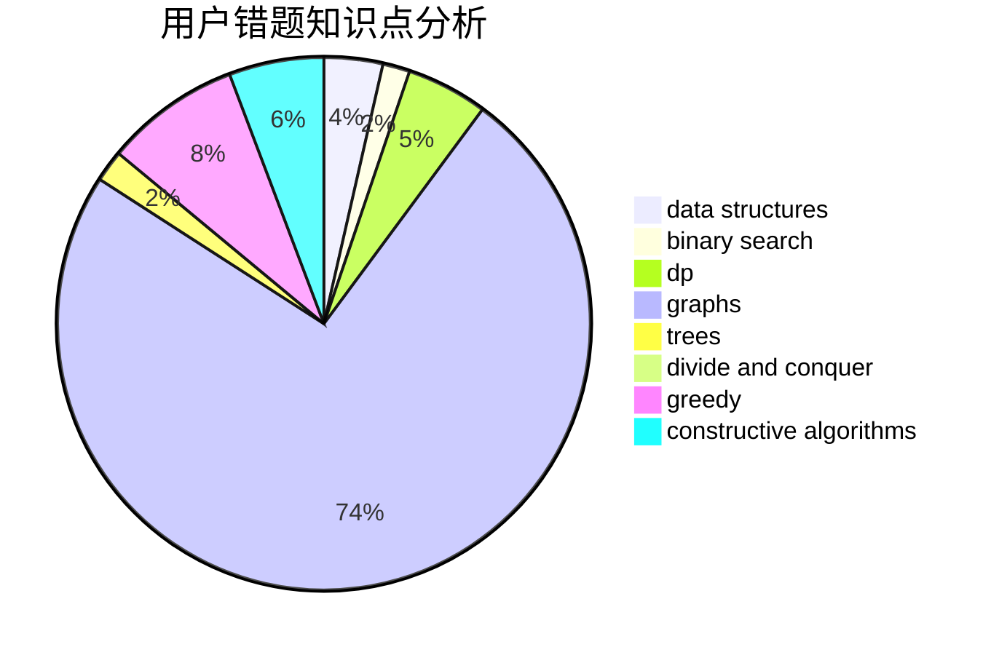

# KJGKMTZB

<!-- tabs:start -->

#### **用户提交结果分析**

#### **用户做题类型偏好分析**

#### **用户错题知识点分析**

<!-- tabs:end -->
# 推荐题目
[781F](https://codeforces.com/contest/781/problem/F)		dsu,graphs,sortings,trees		  
[651C](https://codeforces.com/contest/651/problem/C)		dsu,graphs,sortings,trees		  
[346D](https://codeforces.com/contest/346/problem/D)		dp,
                        graphs,
                        shortest paths		  
[1290C](https://codeforces.com/contest/1290/problem/C)		dfs and similar,
                        dsu,
                        graphs		  
[1044D](https://codeforces.com/contest/1044/problem/D)		data structures,
                        dsu		  
[1269A](https://codeforces.com/contest/1269/problem/A)		brute force,
                        math		  
[1230C](https://codeforces.com/contest/1230/problem/C)		dsu,graphs,sortings,trees		  
[1240A](https://codeforces.com/contest/1240/problem/A)		dsu,graphs,sortings,trees		  
[780E](https://codeforces.com/contest/780/problem/E)		constructive algorithms,
                        dfs and similar,
                        graphs		  
[735A](https://codeforces.com/contest/735/problem/A)		implementation,
                        strings		  
