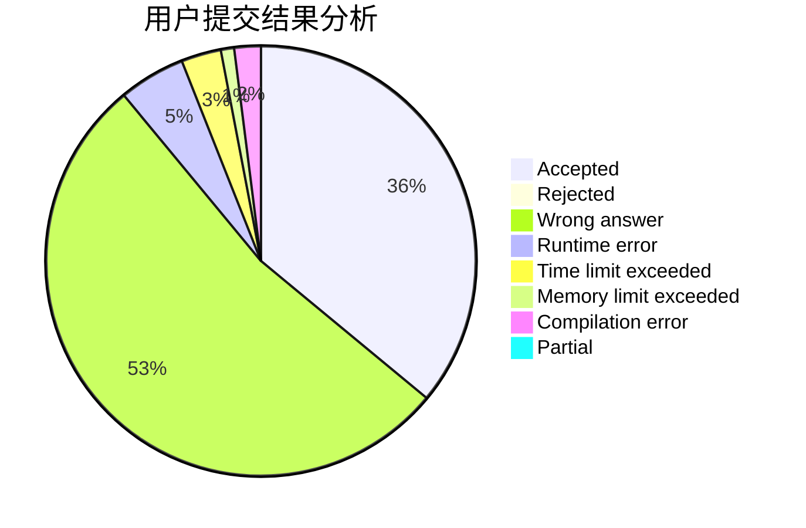
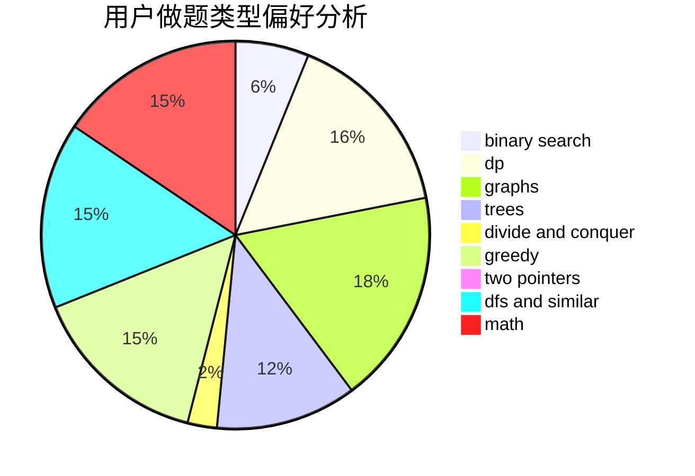

# KJGKMTZB

<!-- tabs:start -->

#### **用户提交结果分析**

#### **用户做题类型偏好分析**

<!-- tabs:end -->
# 推荐题目
[7D](https://codeforces.com/contest/7/problem/D)
[675C](https://codeforces.com/contest/675/problem/C)
[372A](https://codeforces.com/contest/372/problem/A)
[1296F](https://codeforces.com/contest/1296/problem/F)
[1045E](https://codeforces.com/contest/1045/problem/E)
[1278A](https://codeforces.com/contest/1278/problem/A)
[1238G](https://codeforces.com/contest/1238/problem/G)
[1245D](https://codeforces.com/contest/1245/problem/D)
[799D](https://codeforces.com/contest/799/problem/D)
[755G](https://codeforces.com/contest/755/problem/G)
