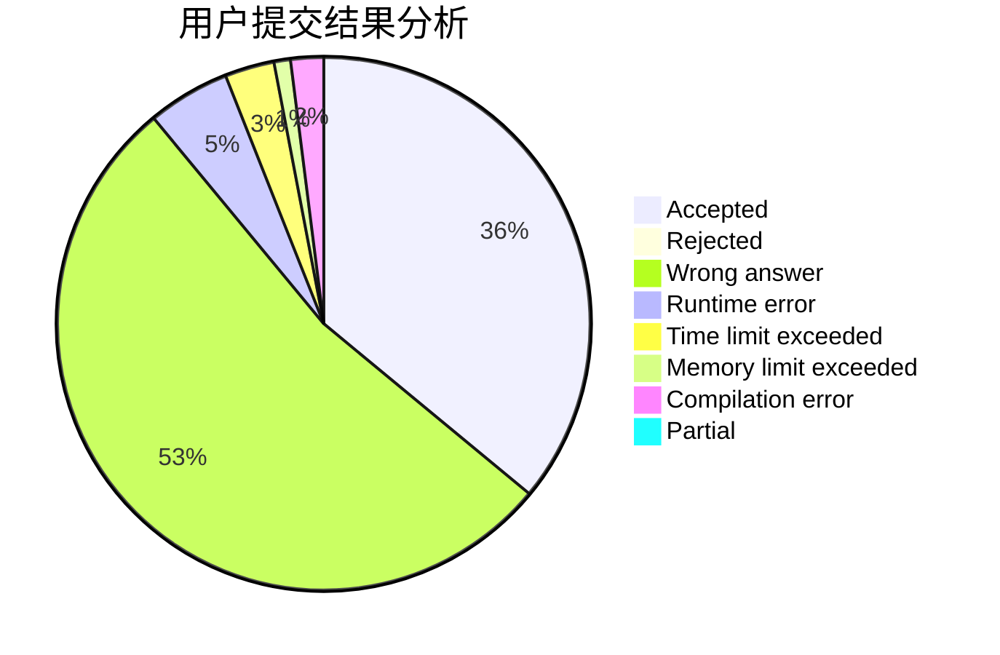
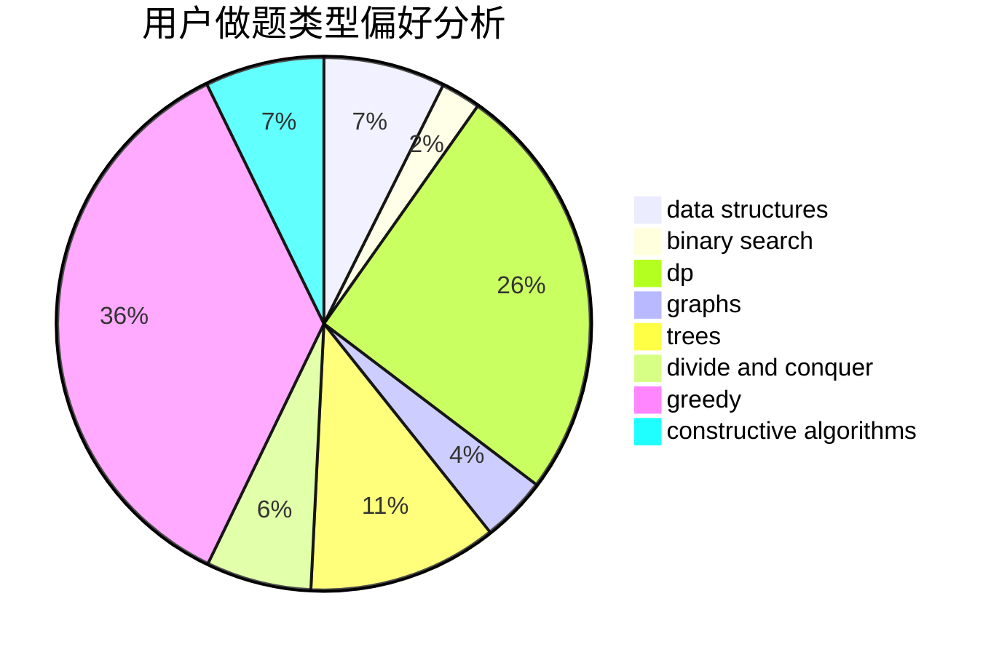
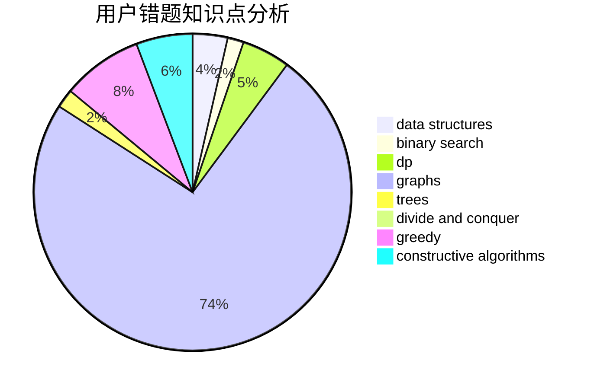

# KJGKMTZB
<!-- tabs:start -->
#### **用户提交结果分析**

#### **用户做题类型偏好分析**

#### **用户错题知识点分析**

<!-- tabs:end -->
# 推荐题目
[Maximum Distributed Tree](http://codeforces.com/problemset/problem/1401/D)		dfs and similar,
                        dp,
                        greedy,
                        implementation,
                        math,
                        number theory,
                        sortings,
                        trees		  
[Minimum Ties](http://codeforces.com/problemset/problem/1487/C)		brute force,
                        constructive algorithms,
                        dfs and similar,
                        graphs,
                        greedy,
                        implementation,
                        math		  
[Equation](http://codeforces.com/problemset/problem/1269/A)		brute force,
                        math		  
[Prefix Enlightenment](http://codeforces.com/problemset/problem/1290/C)		dfs and similar,
                        dsu,
                        graphs		  
[Chocolate Bar](http://codeforces.com/problemset/problem/598/E)		brute force,
                        dp		  
[PolandBall and Polygon](http://codeforces.com/problemset/problem/755/D)		data structures		  
[Beautiful League](http://codeforces.com/problemset/problem/1264/E)		constructive algorithms,
                        flows,
                        graph matchings		  
[Deduction Queries](http://codeforces.com/problemset/problem/1044/D)		data structures,
                        dsu		  
[Curiosity Has No Limits](https://codeforces.com/contest/1072/problem/B)		nan		  
[Jerry's Protest](http://codeforces.com/problemset/problem/626/D)		brute force,
                        combinatorics,
                        dp,
                        probabilities		  
<!-- tabs:start -->
#### **data structures**
[Maximum Distributed Tree](http://codeforces.com/problemset/problem/755/D)		data structures		  
[Minimum Ties](http://codeforces.com/problemset/problem/1044/D)		data structures,
                        dsu		  
[Equation](http://codeforces.com/problemset/problem/846/C)		brute force,
                        data structures,
                        dp		  
[Prefix Enlightenment](http://codeforces.com/problemset/problem/377/B)		binary search,
                        data structures,
                        greedy,
                        sortings		  
[Chocolate Bar](http://codeforces.com/problemset/problem/1039/A)		constructive algorithms,
                        data structures,
                        greedy,
                        math		  
[PolandBall and Polygon](https://codeforces.com/contest/651/problem/C)		data structures,
                        geometry,
                        math		  
[Beautiful League](https://codeforces.com/contest/879/problem/D)		data structures,
                        implementation		  
[Deduction Queries](http://codeforces.com/problemset/problem/1109/E)		data structures,
                        number theory		  
[Curiosity Has No Limits](http://codeforces.com/problemset/problem/568/E)		data structures,
                        dp		  
[Jerry's Protest](https://codeforces.com/contest/1293/problem/C)		data structures,
                        dsu,
                        implementation		  
#### **binary search**
[Maximum Distributed Tree](https://codeforces.com/contest/781/problem/F)		binary search,
                        geometry,
                        implementation,
                        two pointers		  
[Minimum Ties](http://codeforces.com/problemset/problem/377/B)		binary search,
                        data structures,
                        greedy,
                        sortings		  
[Equation](https://codeforces.com/contest/1240/problem/A)		binary search,
                        greedy		  
[Prefix Enlightenment](https://codeforces.com/contest/1261/problem/C)		binary search,
                        graphs,
                        graphs,
                        shortest paths		  
[Chocolate Bar](https://codeforces.com/contest/779/problem/D)		binary search,
                        greedy,
                        strings		  
[PolandBall and Polygon](http://codeforces.com/problemset/problem/1492/C)		binary search,
                        data structures,
                        dp,
                        greedy,
                        two pointers		  
[Beautiful League](http://codeforces.com/problemset/problem/1463/D)		binary search,
                        constructive algorithms,
                        greedy,
                        two pointers		  
[Deduction Queries](http://codeforces.com/problemset/problem/1490/G)		binary search,
                        data structures,
                        math		  
[Curiosity Has No Limits](http://codeforces.com/problemset/problem/1479/D)		binary search,
                        bitmasks,
                        brute force,
                        data structures,
                        probabilities,
                        trees		  
[Jerry's Protest](http://codeforces.com/problemset/problem/1436/E)		binary search,
                        data structures,
                        two pointers		  
#### **dp**
[Maximum Distributed Tree](http://codeforces.com/problemset/problem/1401/D)		dfs and similar,
                        dp,
                        greedy,
                        implementation,
                        math,
                        number theory,
                        sortings,
                        trees		  
[Minimum Ties](http://codeforces.com/problemset/problem/598/E)		brute force,
                        dp		  
[Equation](http://codeforces.com/problemset/problem/626/D)		brute force,
                        combinatorics,
                        dp,
                        probabilities		  
[Prefix Enlightenment](http://codeforces.com/problemset/problem/846/C)		brute force,
                        data structures,
                        dp		  
[Chocolate Bar](http://codeforces.com/problemset/problem/351/C)		dp,
                        matrices		  
[PolandBall and Polygon](http://codeforces.com/problemset/problem/1295/F)		combinatorics,
                        dp,
                        probabilities		  
[Beautiful League](http://codeforces.com/problemset/problem/346/D)		dp,
                        graphs,
                        shortest paths		  
[Deduction Queries](http://codeforces.com/problemset/problem/1000/D)		combinatorics,
                        dp		  
[Curiosity Has No Limits](http://codeforces.com/problemset/problem/568/E)		data structures,
                        dp		  
[Jerry's Protest](http://codeforces.com/problemset/problem/439/E)		combinatorics,
                        dp,
                        math		  
#### **graph**
[Maximum Distributed Tree](http://codeforces.com/problemset/problem/1487/C)		brute force,
                        constructive algorithms,
                        dfs and similar,
                        graphs,
                        greedy,
                        implementation,
                        math		  
[Minimum Ties](http://codeforces.com/problemset/problem/1290/C)		dfs and similar,
                        dsu,
                        graphs		  
[Equation](http://codeforces.com/problemset/problem/1264/E)		constructive algorithms,
                        flows,
                        graph matchings		  
[Prefix Enlightenment](http://codeforces.com/problemset/problem/1333/D)		brute force,
                        constructive algorithms,
                        games,
                        graphs,
                        greedy,
                        implementation,
                        sortings		  
[Chocolate Bar](https://codeforces.com/contest/1261/problem/C)		binary search,
                        graphs,
                        graphs,
                        shortest paths		  
[PolandBall and Polygon](http://codeforces.com/problemset/problem/1070/I)		flows,
                        graph matchings,
                        graphs		  
[Beautiful League](http://codeforces.com/problemset/problem/788/C)		dfs and similar,
                        graphs,
                        shortest paths		  
[Deduction Queries](http://codeforces.com/problemset/problem/346/D)		dp,
                        graphs,
                        shortest paths		  
[Curiosity Has No Limits](http://codeforces.com/problemset/problem/780/E)		constructive algorithms,
                        dfs and similar,
                        graphs		  
[Jerry's Protest](http://codeforces.com/problemset/problem/1322/C)		graphs,
                        hashing,
                        math,
                        number theory		  
#### **trees**
[Maximum Distributed Tree](http://codeforces.com/problemset/problem/1401/D)		dfs and similar,
                        dp,
                        greedy,
                        implementation,
                        math,
                        number theory,
                        sortings,
                        trees		  
[Minimum Ties](http://codeforces.com/problemset/problem/1479/D)		binary search,
                        bitmasks,
                        brute force,
                        data structures,
                        probabilities,
                        trees		  
[Equation](http://codeforces.com/problemset/problem/1511/C)		brute force,
                        data structures,
                        implementation,
                        trees		  
[Prefix Enlightenment](http://codeforces.com/problemset/problem/1499/F)		combinatorics,
                        dfs and similar,
                        dp,
                        trees		  
[Chocolate Bar](http://codeforces.com/problemset/problem/1491/E)		brute force,
                        dfs and similar,
                        divide and conquer,
                        number theory,
                        trees		  
[PolandBall and Polygon](http://codeforces.com/problemset/problem/1466/D)		data structures,
                        greedy,
                        sortings,
                        trees		  
[Beautiful League](http://codeforces.com/problemset/problem/1495/D)		combinatorics,
                        dfs and similar,
                        graphs,
                        math,
                        shortest paths,
                        trees		  
[Deduction Queries](http://codeforces.com/problemset/problem/1303/G)		data structures,
                        divide and conquer,
                        geometry,
                        trees		  
[Curiosity Has No Limits](http://codeforces.com/problemset/problem/1454/E)		combinatorics,
                        dfs and similar,
                        graphs,
                        trees		  
[Jerry's Protest](http://codeforces.com/problemset/problem/1494/D)		constructive algorithms,
                        data structures,
                        dfs and similar,
                        divide and conquer,
                        dsu,
                        greedy,
                        sortings,
                        trees		  
#### **divide and conquer**
[Maximum Distributed Tree](http://codeforces.com/problemset/problem/850/E)		bitmasks,
                        brute force,
                        divide and conquer,
                        fft,
                        math		  
[Minimum Ties](http://codeforces.com/problemset/problem/1461/D)		binary search,
                        brute force,
                        data structures,
                        divide and conquer,
                        implementation,
                        sortings		  
[Equation](http://codeforces.com/problemset/problem/1466/G)		combinatorics,
                        divide and conquer,
                        hashing,
                        math,
                        string suffix structures,
                        strings		  
[Prefix Enlightenment](http://codeforces.com/problemset/problem/1490/D)		dfs and similar,
                        divide and conquer,
                        implementation		  
[Chocolate Bar](https://codeforces.com/contest/1483/problem/C)		data structures,
                        divide and conquer,
                        dp		  
[PolandBall and Polygon](http://codeforces.com/problemset/problem/1491/E)		brute force,
                        dfs and similar,
                        divide and conquer,
                        number theory,
                        trees		  
[Beautiful League](http://codeforces.com/problemset/problem/1303/G)		data structures,
                        divide and conquer,
                        geometry,
                        trees		  
[Deduction Queries](http://codeforces.com/problemset/problem/1494/D)		constructive algorithms,
                        data structures,
                        dfs and similar,
                        divide and conquer,
                        dsu,
                        greedy,
                        sortings,
                        trees		  
[Curiosity Has No Limits](http://codeforces.com/problemset/problem/1482/E)		data structures,
                        divide and conquer,
                        dp		  
[Jerry's Protest](http://codeforces.com/problemset/problem/566/C)		dfs and similar,
                        divide and conquer,
                        trees		  
#### **greedy**
[Maximum Distributed Tree](http://codeforces.com/problemset/problem/1401/D)		dfs and similar,
                        dp,
                        greedy,
                        implementation,
                        math,
                        number theory,
                        sortings,
                        trees		  
[Minimum Ties](http://codeforces.com/problemset/problem/1487/C)		brute force,
                        constructive algorithms,
                        dfs and similar,
                        graphs,
                        greedy,
                        implementation,
                        math		  
[Equation](http://codeforces.com/problemset/problem/377/B)		binary search,
                        data structures,
                        greedy,
                        sortings		  
[Prefix Enlightenment](http://codeforces.com/problemset/problem/1333/D)		brute force,
                        constructive algorithms,
                        games,
                        graphs,
                        greedy,
                        implementation,
                        sortings		  
[Chocolate Bar](https://codeforces.com/contest/1240/problem/A)		binary search,
                        greedy		  
[PolandBall and Polygon](http://codeforces.com/problemset/problem/1292/E)		constructive algorithms,
                        greedy,
                        interactive,
                        math		  
[Beautiful League](http://codeforces.com/problemset/problem/1039/A)		constructive algorithms,
                        data structures,
                        greedy,
                        math		  
[Deduction Queries](https://codeforces.com/contest/779/problem/D)		binary search,
                        greedy,
                        strings		  
[Curiosity Has No Limits](http://codeforces.com/problemset/problem/902/B)		dfs and similar,
                        dsu,
                        greedy		  
[Jerry's Protest](http://codeforces.com/problemset/problem/1204/D1)		brute force,
                        greedy,
                        strings		  
#### **constructive algorithms**
[Maximum Distributed Tree](http://codeforces.com/problemset/problem/1487/C)		brute force,
                        constructive algorithms,
                        dfs and similar,
                        graphs,
                        greedy,
                        implementation,
                        math		  
[Minimum Ties](http://codeforces.com/problemset/problem/1264/E)		constructive algorithms,
                        flows,
                        graph matchings		  
[Equation](http://codeforces.com/problemset/problem/1333/D)		brute force,
                        constructive algorithms,
                        games,
                        graphs,
                        greedy,
                        implementation,
                        sortings		  
[Prefix Enlightenment](http://codeforces.com/problemset/problem/1292/E)		constructive algorithms,
                        greedy,
                        interactive,
                        math		  
[Chocolate Bar](http://codeforces.com/problemset/problem/727/C)		constructive algorithms,
                        interactive,
                        math		  
[PolandBall and Polygon](http://codeforces.com/problemset/problem/1039/A)		constructive algorithms,
                        data structures,
                        greedy,
                        math		  
[Beautiful League](http://codeforces.com/problemset/problem/780/E)		constructive algorithms,
                        dfs and similar,
                        graphs		  
[Deduction Queries](http://codeforces.com/problemset/problem/923/D)		constructive algorithms,
                        implementation,
                        strings		  
[Curiosity Has No Limits](http://codeforces.com/problemset/problem/1493/A)		constructive algorithms,
                        greedy		  
[Jerry's Protest](http://codeforces.com/problemset/problem/1463/D)		binary search,
                        constructive algorithms,
                        greedy,
                        two pointers		  
#### **sortings**
[Maximum Distributed Tree](http://codeforces.com/problemset/problem/1401/D)		dfs and similar,
                        dp,
                        greedy,
                        implementation,
                        math,
                        number theory,
                        sortings,
                        trees		  
[Minimum Ties](http://codeforces.com/problemset/problem/377/B)		binary search,
                        data structures,
                        greedy,
                        sortings		  
[Equation](http://codeforces.com/problemset/problem/1333/D)		brute force,
                        constructive algorithms,
                        games,
                        graphs,
                        greedy,
                        implementation,
                        sortings		  
[Prefix Enlightenment](http://codeforces.com/problemset/problem/27/A)		implementation,
                        sortings		  
[Chocolate Bar](http://codeforces.com/problemset/problem/1427/A)		math,
                        sortings		  
[PolandBall and Polygon](http://codeforces.com/problemset/problem/652/C)		combinatorics,
                        sortings,
                        two pointers		  
[Beautiful League](https://codeforces.com/contest/1496/problem/C)		geometry,
                        greedy,
                        math,
                        sortings		  
[Deduction Queries](http://codeforces.com/problemset/problem/1495/A)		geometry,
                        greedy,
                        math,
                        sortings		  
[Curiosity Has No Limits](http://codeforces.com/problemset/problem/1497/A)		brute force,
                        data structures,
                        greedy,
                        sortings		  
[Jerry's Protest](http://codeforces.com/problemset/problem/1427/A)		math,
                        sortings		  
<!-- tabs:end -->
