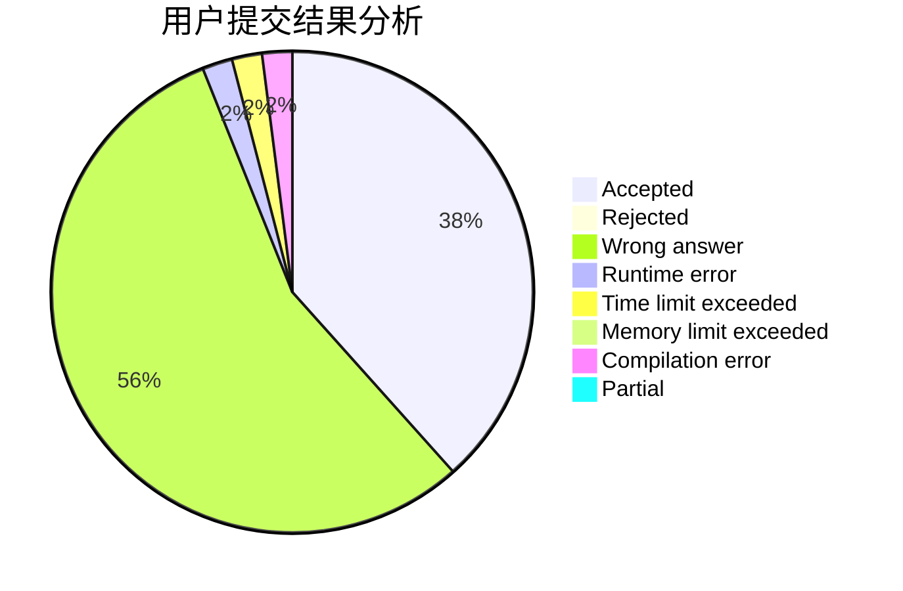
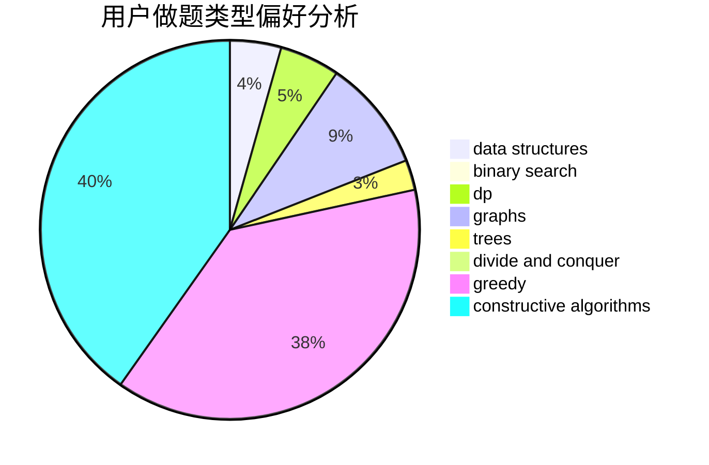
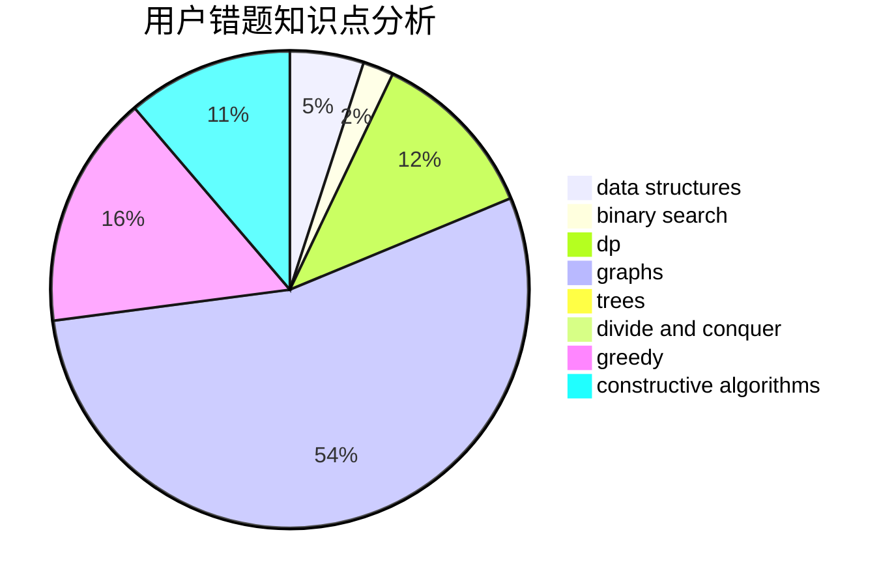

# KKKKG
<!-- tabs:start -->
#### **用户提交结果分析**

#### **用户做题类型偏好分析**

#### **用户错题知识点分析**

<!-- tabs:end -->
# 推荐题目
[Maximum GCD](http://codeforces.com/problemset/problem/1370/A)		greedy,
                        implementation,
                        math,
                        number theory		  
[Euler tour](http://codeforces.com/problemset/problem/1053/E)		constructive algorithms,
                        trees		  
[Party](http://codeforces.com/problemset/problem/23/B)		constructive algorithms,
                        graphs,
                        math		  
[Make Square](http://codeforces.com/problemset/problem/1028/H)		math		  
[Slime and Hats](http://codeforces.com/problemset/problem/1349/E)		constructive algorithms,
                        dp,
                        greedy		  
[Tasty Cookie](http://codeforces.com/problemset/problem/1358/F)		binary search,
                        constructive algorithms,
                        greedy,
                        implementation		  
[File List](http://codeforces.com/problemset/problem/174/B)		dp,
                        greedy,
                        implementation		  
[Xor Permutations](http://codeforces.com/problemset/problem/1168/E)		constructive algorithms,
                        math		  
[Upgrading Array](http://codeforces.com/problemset/problem/402/D)		dp,
                        greedy,
                        math,
                        number theory		  
[Fafa and Array](http://codeforces.com/problemset/problem/935/F)		data structures,
                        greedy		  
<!-- tabs:start -->
#### **data structures**
[Fafa and Array](http://codeforces.com/problemset/problem/935/F)		data structures,
                        greedy		  
[Cd and pwd commands](http://codeforces.com/problemset/problem/158/C)		*special problem,
                        data structures,
                        implementation		  
[Trains and Statistic](http://codeforces.com/problemset/problem/675/E)		data structures,
                        dp,
                        greedy		  
[Bamboo Partition](https://codeforces.com/contest/831/problem/F)		brute force,
                        data structures,
                        implementation,
                        math,
                        number theory,
                        sortings,
                        two pointers		  
[Eugene and an array](http://codeforces.com/problemset/problem/1333/C)		binary search,
                        data structures,
                        implementation,
                        two pointers		  
[Goodbye Souvenir](http://codeforces.com/problemset/problem/848/C)		data structures,
                        divide and conquer		  
[Interesting Array](http://codeforces.com/problemset/problem/482/B)		constructive algorithms,
                        data structures,
                        trees		  
[Social Network (hard version)](http://codeforces.com/problemset/problem/1234/B2)		data structures,
                        implementation		  
[Maximum width](http://codeforces.com/problemset/problem/1492/C)		binary search,
                        data structures,
                        dp,
                        greedy,
                        two pointers		  
[Old Floppy Drive](http://codeforces.com/problemset/problem/1490/G)		binary search,
                        data structures,
                        math		  
#### **binary search**
[Tasty Cookie](http://codeforces.com/problemset/problem/1358/F)		binary search,
                        constructive algorithms,
                        greedy,
                        implementation		  
[Eugene and an array](http://codeforces.com/problemset/problem/1333/C)		binary search,
                        data structures,
                        implementation,
                        two pointers		  
[Physics Practical](http://codeforces.com/problemset/problem/253/B)		binary search,
                        dp,
                        sortings,
                        two pointers		  
[Maximum width](http://codeforces.com/problemset/problem/1492/C)		binary search,
                        data structures,
                        dp,
                        greedy,
                        two pointers		  
[Pairs](http://codeforces.com/problemset/problem/1463/D)		binary search,
                        constructive algorithms,
                        greedy,
                        two pointers		  
[Old Floppy Drive](http://codeforces.com/problemset/problem/1490/G)		binary search,
                        data structures,
                        math		  
[Odd Mineral Resource](http://codeforces.com/problemset/problem/1479/D)		binary search,
                        bitmasks,
                        brute force,
                        data structures,
                        probabilities,
                        trees		  
[Complicated Computations](http://codeforces.com/problemset/problem/1436/E)		binary search,
                        data structures,
                        two pointers		  
[Divide and Summarize](http://codeforces.com/problemset/problem/1461/D)		binary search,
                        brute force,
                        data structures,
                        divide and conquer,
                        implementation,
                        sortings		  
[K-beautiful Strings](http://codeforces.com/problemset/problem/1493/C)		binary search,
                        brute force,
                        constructive algorithms,
                        greedy,
                        strings		  
#### **dp**
[Slime and Hats](http://codeforces.com/problemset/problem/1349/E)		constructive algorithms,
                        dp,
                        greedy		  
[File List](http://codeforces.com/problemset/problem/174/B)		dp,
                        greedy,
                        implementation		  
[Upgrading Array](http://codeforces.com/problemset/problem/402/D)		dp,
                        greedy,
                        math,
                        number theory		  
[Three Paths on a Tree](http://codeforces.com/problemset/problem/1294/F)		dfs and similar,
                        dp,
                        greedy,
                        trees		  
[Trains and Statistic](http://codeforces.com/problemset/problem/675/E)		data structures,
                        dp,
                        greedy		  
[Physics Practical](http://codeforces.com/problemset/problem/253/B)		binary search,
                        dp,
                        sortings,
                        two pointers		  
[Twilight and Ancient Scroll (easier version)](http://codeforces.com/problemset/problem/1393/E1)		dp,
                        hashing,
                        implementation,
                        string suffix structures,
                        strings		  
[Hyakugoku and Ladders](http://codeforces.com/problemset/problem/1245/E)		dp,
                        probabilities,
                        shortest paths		  
[New Year Parties](http://codeforces.com/problemset/problem/1283/E)		dp,
                        greedy		  
[Maximum width](http://codeforces.com/problemset/problem/1492/C)		binary search,
                        data structures,
                        dp,
                        greedy,
                        two pointers		  
#### **graph**
[Party](http://codeforces.com/problemset/problem/23/B)		constructive algorithms,
                        graphs,
                        math		  
[Looksery Party](http://codeforces.com/problemset/problem/549/B)		constructive algorithms,
                        dfs and similar,
                        graphs,
                        greedy		  
[Points, Lines and Ready-made Titles](https://codeforces.com/contest/871/problem/C)		dfs and similar,
                        dsu,
                        graphs,
                        trees		  
[Directing Edges](http://codeforces.com/problemset/problem/1385/E)		constructive algorithms,
                        dfs and similar,
                        graphs		  
[Cycle](http://codeforces.com/problemset/problem/117/C)		dfs and similar,
                        graphs		  
[Minimum Ties](http://codeforces.com/problemset/problem/1487/C)		brute force,
                        constructive algorithms,
                        dfs and similar,
                        graphs,
                        greedy,
                        implementation,
                        math		  
[Chef Monocarp](http://codeforces.com/problemset/problem/1437/C)		dp,
                        flows,
                        graph matchings,
                        greedy,
                        math,
                        sortings		  
[Strange Housing](http://codeforces.com/problemset/problem/1470/D)		constructive algorithms,
                        dfs and similar,
                        graph matchings,
                        graphs,
                        greedy		  
[Longest Simple Cycle](http://codeforces.com/problemset/problem/1476/C)		dp,
                        graphs,
                        greedy		  
[Shortest and Longest LIS](http://codeforces.com/problemset/problem/1304/D)		constructive algorithms,
                        graphs,
                        greedy,
                        two pointers		  
#### **trees**
[Euler tour](http://codeforces.com/problemset/problem/1053/E)		constructive algorithms,
                        trees		  
[Three Paths on a Tree](http://codeforces.com/problemset/problem/1294/F)		dfs and similar,
                        dp,
                        greedy,
                        trees		  
[Points, Lines and Ready-made Titles](https://codeforces.com/contest/871/problem/C)		dfs and similar,
                        dsu,
                        graphs,
                        trees		  
[Interesting Array](http://codeforces.com/problemset/problem/482/B)		constructive algorithms,
                        data structures,
                        trees		  
[Odd Mineral Resource](http://codeforces.com/problemset/problem/1479/D)		binary search,
                        bitmasks,
                        brute force,
                        data structures,
                        probabilities,
                        trees		  
[Yet Another Card Deck](http://codeforces.com/problemset/problem/1511/C)		brute force,
                        data structures,
                        implementation,
                        trees		  
[Diameter Cuts](http://codeforces.com/problemset/problem/1499/F)		combinatorics,
                        dfs and similar,
                        dp,
                        trees		  
[Fib-tree](http://codeforces.com/problemset/problem/1491/E)		brute force,
                        dfs and similar,
                        divide and conquer,
                        number theory,
                        trees		  
[13th Labour of Heracles](http://codeforces.com/problemset/problem/1466/D)		data structures,
                        greedy,
                        sortings,
                        trees		  
[BFS Trees](http://codeforces.com/problemset/problem/1495/D)		combinatorics,
                        dfs and similar,
                        graphs,
                        math,
                        shortest paths,
                        trees		  
#### **divide and conquer**
[Goodbye Souvenir](http://codeforces.com/problemset/problem/848/C)		data structures,
                        divide and conquer		  
[Divide and Summarize](http://codeforces.com/problemset/problem/1461/D)		binary search,
                        brute force,
                        data structures,
                        divide and conquer,
                        implementation,
                        sortings		  
[Song of the Sirens](http://codeforces.com/problemset/problem/1466/G)		combinatorics,
                        divide and conquer,
                        hashing,
                        math,
                        string suffix structures,
                        strings		  
[Permutation Transformation](http://codeforces.com/problemset/problem/1490/D)		dfs and similar,
                        divide and conquer,
                        implementation		  
[Skyline Photo](https://codeforces.com/contest/1483/problem/C)		data structures,
                        divide and conquer,
                        dp		  
[Fib-tree](http://codeforces.com/problemset/problem/1491/E)		brute force,
                        dfs and similar,
                        divide and conquer,
                        number theory,
                        trees		  
[Sum of Prefix Sums](http://codeforces.com/problemset/problem/1303/G)		data structures,
                        divide and conquer,
                        geometry,
                        trees		  
[Dogeforces](http://codeforces.com/problemset/problem/1494/D)		constructive algorithms,
                        data structures,
                        dfs and similar,
                        divide and conquer,
                        dsu,
                        greedy,
                        sortings,
                        trees		  
[Logistical Questions](http://codeforces.com/problemset/problem/566/C)		dfs and similar,
                        divide and conquer,
                        trees		  
[Fruit Sequences](http://codeforces.com/problemset/problem/1428/F)		binary search,
                        data structures,
                        divide and conquer,
                        dp,
                        two pointers		  
#### **greedy**
[Maximum GCD](http://codeforces.com/problemset/problem/1370/A)		greedy,
                        implementation,
                        math,
                        number theory		  
[Slime and Hats](http://codeforces.com/problemset/problem/1349/E)		constructive algorithms,
                        dp,
                        greedy		  
[Tasty Cookie](http://codeforces.com/problemset/problem/1358/F)		binary search,
                        constructive algorithms,
                        greedy,
                        implementation		  
[File List](http://codeforces.com/problemset/problem/174/B)		dp,
                        greedy,
                        implementation		  
[Upgrading Array](http://codeforces.com/problemset/problem/402/D)		dp,
                        greedy,
                        math,
                        number theory		  
[Fafa and Array](http://codeforces.com/problemset/problem/935/F)		data structures,
                        greedy		  
[Ticket Game](http://codeforces.com/problemset/problem/1215/D)		games,
                        greedy,
                        math		  
[Looksery Party](http://codeforces.com/problemset/problem/549/B)		constructive algorithms,
                        dfs and similar,
                        graphs,
                        greedy		  
[Three Paths on a Tree](http://codeforces.com/problemset/problem/1294/F)		dfs and similar,
                        dp,
                        greedy,
                        trees		  
[Trains and Statistic](http://codeforces.com/problemset/problem/675/E)		data structures,
                        dp,
                        greedy		  
#### **constructive algorithms**
[Euler tour](http://codeforces.com/problemset/problem/1053/E)		constructive algorithms,
                        trees		  
[Party](http://codeforces.com/problemset/problem/23/B)		constructive algorithms,
                        graphs,
                        math		  
[Slime and Hats](http://codeforces.com/problemset/problem/1349/E)		constructive algorithms,
                        dp,
                        greedy		  
[Tasty Cookie](http://codeforces.com/problemset/problem/1358/F)		binary search,
                        constructive algorithms,
                        greedy,
                        implementation		  
[Xor Permutations](http://codeforces.com/problemset/problem/1168/E)		constructive algorithms,
                        math		  
[Looksery Party](http://codeforces.com/problemset/problem/549/B)		constructive algorithms,
                        dfs and similar,
                        graphs,
                        greedy		  
[Directing Edges](http://codeforces.com/problemset/problem/1385/E)		constructive algorithms,
                        dfs and similar,
                        graphs		  
[Interesting Array](http://codeforces.com/problemset/problem/482/B)		constructive algorithms,
                        data structures,
                        trees		  
[Anti-knapsack](http://codeforces.com/problemset/problem/1493/A)		constructive algorithms,
                        greedy		  
[Pairs](http://codeforces.com/problemset/problem/1463/D)		binary search,
                        constructive algorithms,
                        greedy,
                        two pointers		  
#### **sortings**
[Bamboo Partition](https://codeforces.com/contest/831/problem/F)		brute force,
                        data structures,
                        implementation,
                        math,
                        number theory,
                        sortings,
                        two pointers		  
[Cinema](http://codeforces.com/problemset/problem/670/C)		implementation,
                        sortings		  
[Physics Practical](http://codeforces.com/problemset/problem/253/B)		binary search,
                        dp,
                        sortings,
                        two pointers		  
[Diamond Miner](https://codeforces.com/contest/1496/problem/C)		geometry,
                        greedy,
                        math,
                        sortings		  
[Meximization](http://codeforces.com/problemset/problem/1497/A)		brute force,
                        data structures,
                        greedy,
                        sortings		  
[Avoiding Zero](http://codeforces.com/problemset/problem/1427/A)		math,
                        sortings		  
[Divide and Summarize](http://codeforces.com/problemset/problem/1461/D)		binary search,
                        brute force,
                        data structures,
                        divide and conquer,
                        implementation,
                        sortings		  
[Chef Monocarp](http://codeforces.com/problemset/problem/1437/C)		dp,
                        flows,
                        graph matchings,
                        greedy,
                        math,
                        sortings		  
[Replacing Elements](http://codeforces.com/problemset/problem/1473/A)		greedy,
                        implementation,
                        math,
                        sortings		  
[Eastern Exhibition](http://codeforces.com/problemset/problem/1486/B)		binary search,
                        geometry,
                        shortest paths,
                        sortings		  
<!-- tabs:end -->
