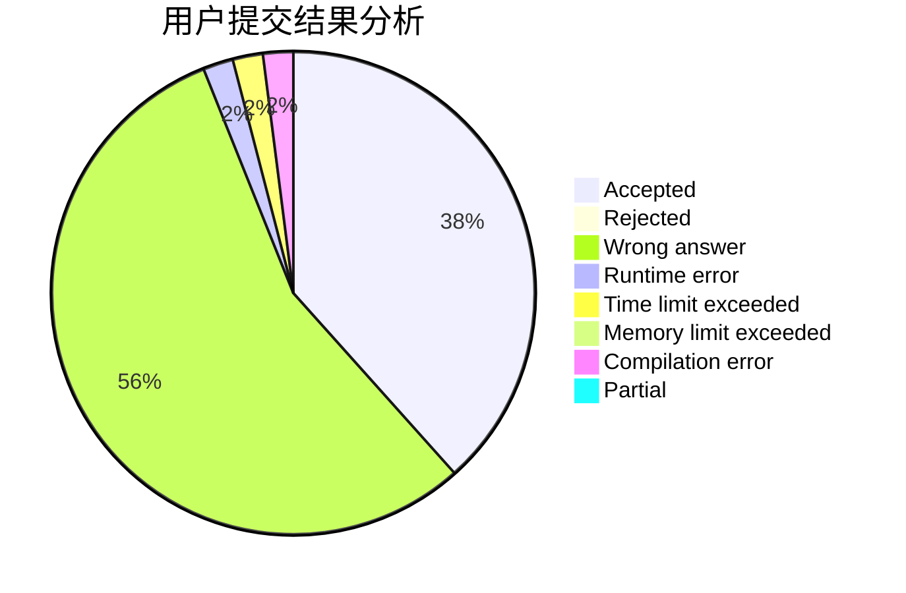
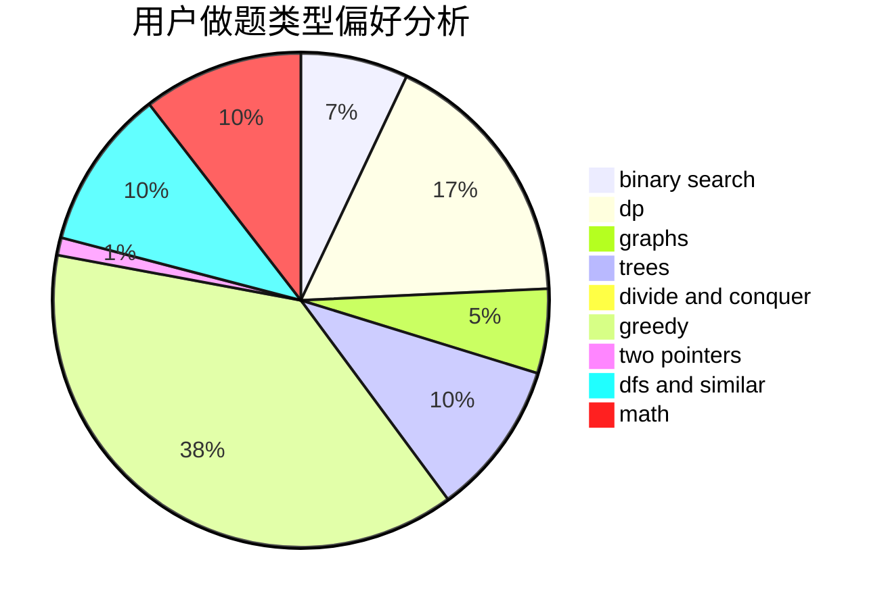

# KKKKG

<!-- tabs:start -->

#### **用户提交结果分析**

#### **用户做题类型偏好分析**

<!-- tabs:end -->
# 推荐题目
[1029C](https://codeforces.com/contest/1029/problem/C)
[1301C](https://codeforces.com/contest/1301/problem/C)
[13563](https://codeforces.com/contest/1356/problem/3)
[431A](https://codeforces.com/contest/431/problem/A)
[957E](https://codeforces.com/contest/957/problem/E)
[260D](https://codeforces.com/contest/260/problem/D)
[1054C](https://codeforces.com/contest/1054/problem/C)
[13671](https://codeforces.com/contest/1367/problem/1)
[1340B](https://codeforces.com/contest/1340/problem/B)
[1173A](https://codeforces.com/contest/1173/problem/A)
