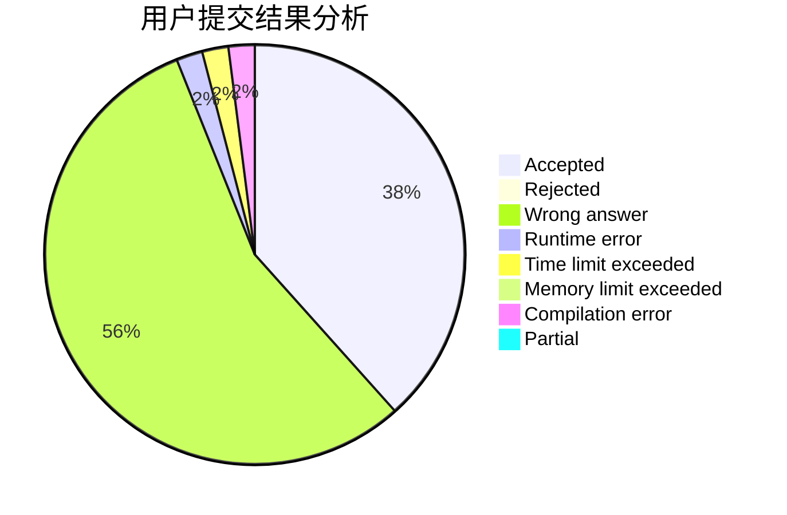
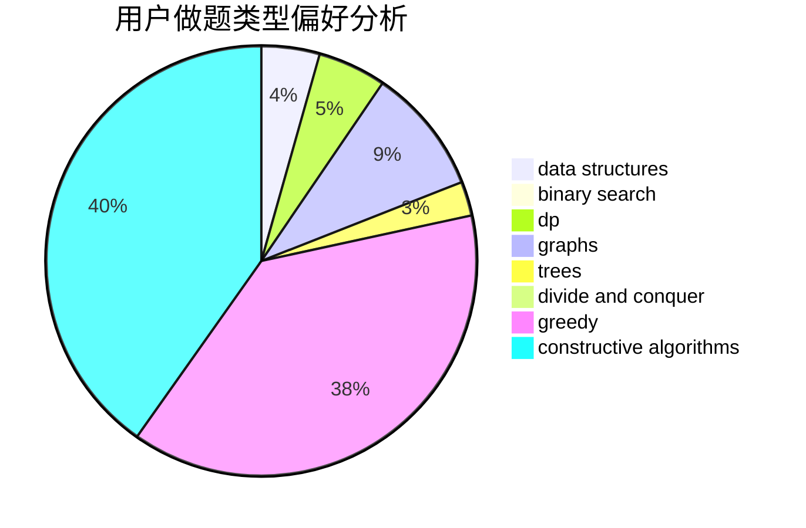
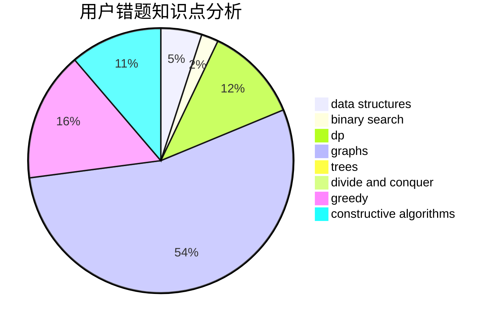

# KKKKG

<!-- tabs:start -->

#### **用户提交结果分析**

#### **用户做题类型偏好分析**

#### **用户错题知识点分析**

<!-- tabs:end -->
# 推荐题目
[1028H](https://codeforces.com/contest/1028/problem/H)		math		  
[1294F](https://codeforces.com/contest/1294/problem/F)		dfs and similar,
                        dp,
                        greedy,
                        trees		  
[1349E](https://codeforces.com/contest/1349/problem/E)		constructive algorithms,
                        dp,
                        greedy		  
[402D](https://codeforces.com/contest/402/problem/D)		dp,
                        greedy,
                        math,
                        number theory		  
[935F](https://codeforces.com/contest/935/problem/F)		data structures,
                        greedy		  
[23B](https://codeforces.com/contest/23/problem/B)		constructive algorithms,
                        graphs,
                        math		  
[1053E](https://codeforces.com/contest/1053/problem/E)		constructive algorithms,
                        trees		  
[1358F](https://codeforces.com/contest/1358/problem/F)		binary search,
                        constructive algorithms,
                        greedy,
                        implementation		  
[1333C](https://codeforces.com/contest/1333/problem/C)		binary search,
                        data structures,
                        implementation,
                        two pointers		  
[1168E](https://codeforces.com/contest/1168/problem/E)		constructive algorithms,
                        math		  
