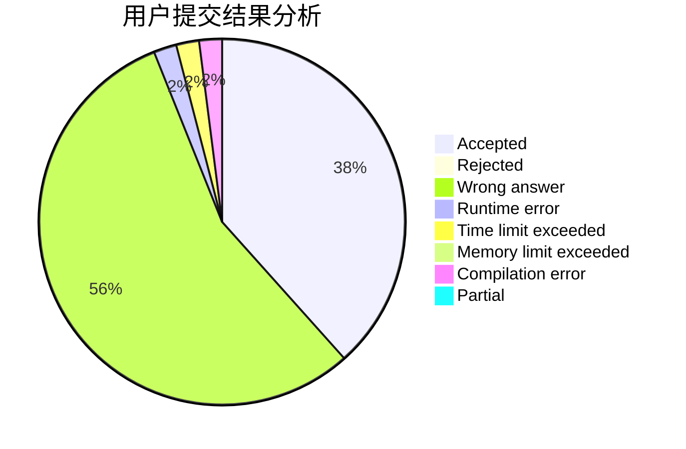
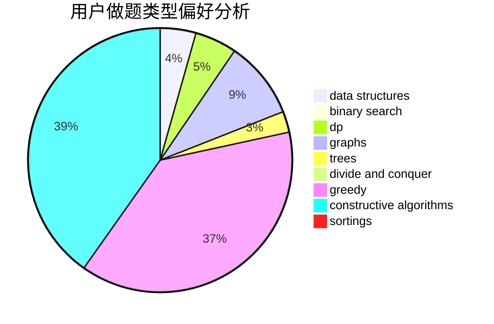
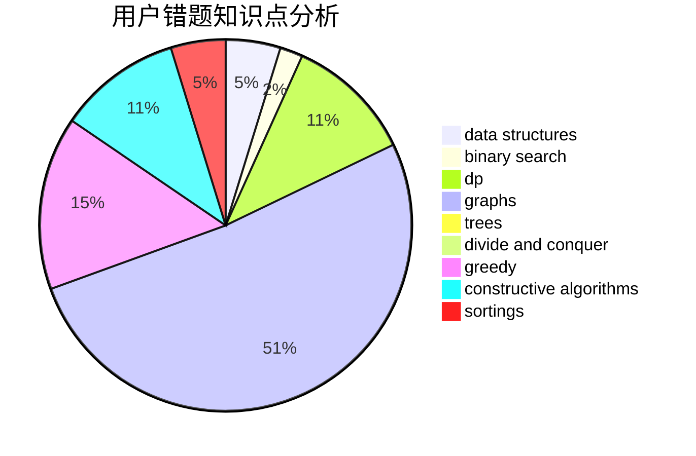

# KKKKG
<!-- tabs:start -->
#### **用户提交结果分析**

#### **用户做题类型偏好分析**

#### **用户错题知识点分析**

<!-- tabs:end -->
# 推荐题目
[1370A](http://codeforces.com/problemset/problem/1370/A)		greedy,
                        implementation,
                        math,
                        number theory		  
[1053E](http://codeforces.com/problemset/problem/1053/E)		constructive algorithms,
                        trees		  
[23B](http://codeforces.com/problemset/problem/23/B)		constructive algorithms,
                        graphs,
                        math		  
[1028H](http://codeforces.com/problemset/problem/1028/H)		math		  
[1349E](http://codeforces.com/problemset/problem/1349/E)		constructive algorithms,
                        dp,
                        greedy		  
[1358F](http://codeforces.com/problemset/problem/1358/F)		binary search,
                        constructive algorithms,
                        greedy,
                        implementation		  
[174B](http://codeforces.com/problemset/problem/174/B)		dp,
                        greedy,
                        implementation		  
[1168E](http://codeforces.com/problemset/problem/1168/E)		constructive algorithms,
                        math		  
[402D](http://codeforces.com/problemset/problem/402/D)		dp,
                        greedy,
                        math,
                        number theory		  
[935F](http://codeforces.com/problemset/problem/935/F)		data structures,
                        greedy		  
<!-- tabs:start -->
#### **data structures**
[935F](http://codeforces.com/problemset/problem/935/F)		data structures,
                        greedy		  
[158C](http://codeforces.com/problemset/problem/158/C)		*special problem,
                        data structures,
                        implementation		  
[675E](http://codeforces.com/problemset/problem/675/E)		data structures,
                        dp,
                        greedy		  
[831F](https://codeforces.com/contest/831/problem/F)		brute force,
                        data structures,
                        implementation,
                        math,
                        number theory,
                        sortings,
                        two pointers		  
[1333C](http://codeforces.com/problemset/problem/1333/C)		binary search,
                        data structures,
                        implementation,
                        two pointers		  
[848C](http://codeforces.com/problemset/problem/848/C)		data structures,
                        divide and conquer		  
[482B](http://codeforces.com/problemset/problem/482/B)		constructive algorithms,
                        data structures,
                        trees		  
[1234B2](http://codeforces.com/problemset/problem/1234/B2)		data structures,
                        implementation		  
[1492C](http://codeforces.com/problemset/problem/1492/C)		binary search,
                        data structures,
                        dp,
                        greedy,
                        two pointers		  
[1490G](http://codeforces.com/problemset/problem/1490/G)		binary search,
                        data structures,
                        math		  
#### **binary search**
[1358F](http://codeforces.com/problemset/problem/1358/F)		binary search,
                        constructive algorithms,
                        greedy,
                        implementation		  
[1333C](http://codeforces.com/problemset/problem/1333/C)		binary search,
                        data structures,
                        implementation,
                        two pointers		  
[253B](http://codeforces.com/problemset/problem/253/B)		binary search,
                        dp,
                        sortings,
                        two pointers		  
[1492C](http://codeforces.com/problemset/problem/1492/C)		binary search,
                        data structures,
                        dp,
                        greedy,
                        two pointers		  
[1463D](http://codeforces.com/problemset/problem/1463/D)		binary search,
                        constructive algorithms,
                        greedy,
                        two pointers		  
[1490G](http://codeforces.com/problemset/problem/1490/G)		binary search,
                        data structures,
                        math		  
[1479D](http://codeforces.com/problemset/problem/1479/D)		binary search,
                        bitmasks,
                        brute force,
                        data structures,
                        probabilities,
                        trees		  
[1436E](http://codeforces.com/problemset/problem/1436/E)		binary search,
                        data structures,
                        two pointers		  
[1461D](http://codeforces.com/problemset/problem/1461/D)		binary search,
                        brute force,
                        data structures,
                        divide and conquer,
                        implementation,
                        sortings		  
[1493C](http://codeforces.com/problemset/problem/1493/C)		binary search,
                        brute force,
                        constructive algorithms,
                        greedy,
                        strings		  
#### **dp**
[1349E](http://codeforces.com/problemset/problem/1349/E)		constructive algorithms,
                        dp,
                        greedy		  
[174B](http://codeforces.com/problemset/problem/174/B)		dp,
                        greedy,
                        implementation		  
[402D](http://codeforces.com/problemset/problem/402/D)		dp,
                        greedy,
                        math,
                        number theory		  
[1294F](http://codeforces.com/problemset/problem/1294/F)		dfs and similar,
                        dp,
                        greedy,
                        trees		  
[675E](http://codeforces.com/problemset/problem/675/E)		data structures,
                        dp,
                        greedy		  
[253B](http://codeforces.com/problemset/problem/253/B)		binary search,
                        dp,
                        sortings,
                        two pointers		  
[1393E1](http://codeforces.com/problemset/problem/1393/E1)		dp,
                        hashing,
                        implementation,
                        string suffix structures,
                        strings		  
[1245E](http://codeforces.com/problemset/problem/1245/E)		dp,
                        probabilities,
                        shortest paths		  
[1283E](http://codeforces.com/problemset/problem/1283/E)		dp,
                        greedy		  
[1492C](http://codeforces.com/problemset/problem/1492/C)		binary search,
                        data structures,
                        dp,
                        greedy,
                        two pointers		  
#### **graph**
[23B](http://codeforces.com/problemset/problem/23/B)		constructive algorithms,
                        graphs,
                        math		  
[549B](http://codeforces.com/problemset/problem/549/B)		constructive algorithms,
                        dfs and similar,
                        graphs,
                        greedy		  
[871C](https://codeforces.com/contest/871/problem/C)		dfs and similar,
                        dsu,
                        graphs,
                        trees		  
[1385E](http://codeforces.com/problemset/problem/1385/E)		constructive algorithms,
                        dfs and similar,
                        graphs		  
[117C](http://codeforces.com/problemset/problem/117/C)		dfs and similar,
                        graphs		  
[1487C](http://codeforces.com/problemset/problem/1487/C)		brute force,
                        constructive algorithms,
                        dfs and similar,
                        graphs,
                        greedy,
                        implementation,
                        math		  
[1437C](http://codeforces.com/problemset/problem/1437/C)		dp,
                        flows,
                        graph matchings,
                        greedy,
                        math,
                        sortings		  
[1470D](http://codeforces.com/problemset/problem/1470/D)		constructive algorithms,
                        dfs and similar,
                        graph matchings,
                        graphs,
                        greedy		  
[1476C](http://codeforces.com/problemset/problem/1476/C)		dp,
                        graphs,
                        greedy		  
[1304D](http://codeforces.com/problemset/problem/1304/D)		constructive algorithms,
                        graphs,
                        greedy,
                        two pointers		  
#### **trees**
[1053E](http://codeforces.com/problemset/problem/1053/E)		constructive algorithms,
                        trees		  
[1294F](http://codeforces.com/problemset/problem/1294/F)		dfs and similar,
                        dp,
                        greedy,
                        trees		  
[871C](https://codeforces.com/contest/871/problem/C)		dfs and similar,
                        dsu,
                        graphs,
                        trees		  
[482B](http://codeforces.com/problemset/problem/482/B)		constructive algorithms,
                        data structures,
                        trees		  
[1479D](http://codeforces.com/problemset/problem/1479/D)		binary search,
                        bitmasks,
                        brute force,
                        data structures,
                        probabilities,
                        trees		  
[1511C](http://codeforces.com/problemset/problem/1511/C)		brute force,
                        data structures,
                        implementation,
                        trees		  
[1499F](http://codeforces.com/problemset/problem/1499/F)		combinatorics,
                        dfs and similar,
                        dp,
                        trees		  
[1491E](http://codeforces.com/problemset/problem/1491/E)		brute force,
                        dfs and similar,
                        divide and conquer,
                        number theory,
                        trees		  
[1466D](http://codeforces.com/problemset/problem/1466/D)		data structures,
                        greedy,
                        sortings,
                        trees		  
[1495D](http://codeforces.com/problemset/problem/1495/D)		combinatorics,
                        dfs and similar,
                        graphs,
                        math,
                        shortest paths,
                        trees		  
#### **divide and conquer**
[848C](http://codeforces.com/problemset/problem/848/C)		data structures,
                        divide and conquer		  
[1461D](http://codeforces.com/problemset/problem/1461/D)		binary search,
                        brute force,
                        data structures,
                        divide and conquer,
                        implementation,
                        sortings		  
[1466G](http://codeforces.com/problemset/problem/1466/G)		combinatorics,
                        divide and conquer,
                        hashing,
                        math,
                        string suffix structures,
                        strings		  
[1490D](http://codeforces.com/problemset/problem/1490/D)		dfs and similar,
                        divide and conquer,
                        implementation		  
[1483C](https://codeforces.com/contest/1483/problem/C)		data structures,
                        divide and conquer,
                        dp		  
[1491E](http://codeforces.com/problemset/problem/1491/E)		brute force,
                        dfs and similar,
                        divide and conquer,
                        number theory,
                        trees		  
[1303G](http://codeforces.com/problemset/problem/1303/G)		data structures,
                        divide and conquer,
                        geometry,
                        trees		  
[1494D](http://codeforces.com/problemset/problem/1494/D)		constructive algorithms,
                        data structures,
                        dfs and similar,
                        divide and conquer,
                        dsu,
                        greedy,
                        sortings,
                        trees		  
[1482E](http://codeforces.com/problemset/problem/1482/E)		data structures,
                        divide and conquer,
                        dp		  
[566C](http://codeforces.com/problemset/problem/566/C)		dfs and similar,
                        divide and conquer,
                        trees		  
#### **greedy**
[1370A](http://codeforces.com/problemset/problem/1370/A)		greedy,
                        implementation,
                        math,
                        number theory		  
[1349E](http://codeforces.com/problemset/problem/1349/E)		constructive algorithms,
                        dp,
                        greedy		  
[1358F](http://codeforces.com/problemset/problem/1358/F)		binary search,
                        constructive algorithms,
                        greedy,
                        implementation		  
[174B](http://codeforces.com/problemset/problem/174/B)		dp,
                        greedy,
                        implementation		  
[402D](http://codeforces.com/problemset/problem/402/D)		dp,
                        greedy,
                        math,
                        number theory		  
[935F](http://codeforces.com/problemset/problem/935/F)		data structures,
                        greedy		  
[1215D](http://codeforces.com/problemset/problem/1215/D)		games,
                        greedy,
                        math		  
[549B](http://codeforces.com/problemset/problem/549/B)		constructive algorithms,
                        dfs and similar,
                        graphs,
                        greedy		  
[1294F](http://codeforces.com/problemset/problem/1294/F)		dfs and similar,
                        dp,
                        greedy,
                        trees		  
[675E](http://codeforces.com/problemset/problem/675/E)		data structures,
                        dp,
                        greedy		  
#### **constructive algorithms**
[1053E](http://codeforces.com/problemset/problem/1053/E)		constructive algorithms,
                        trees		  
[23B](http://codeforces.com/problemset/problem/23/B)		constructive algorithms,
                        graphs,
                        math		  
[1349E](http://codeforces.com/problemset/problem/1349/E)		constructive algorithms,
                        dp,
                        greedy		  
[1358F](http://codeforces.com/problemset/problem/1358/F)		binary search,
                        constructive algorithms,
                        greedy,
                        implementation		  
[1168E](http://codeforces.com/problemset/problem/1168/E)		constructive algorithms,
                        math		  
[549B](http://codeforces.com/problemset/problem/549/B)		constructive algorithms,
                        dfs and similar,
                        graphs,
                        greedy		  
[1385E](http://codeforces.com/problemset/problem/1385/E)		constructive algorithms,
                        dfs and similar,
                        graphs		  
[482B](http://codeforces.com/problemset/problem/482/B)		constructive algorithms,
                        data structures,
                        trees		  
[1493A](http://codeforces.com/problemset/problem/1493/A)		constructive algorithms,
                        greedy		  
[1463D](http://codeforces.com/problemset/problem/1463/D)		binary search,
                        constructive algorithms,
                        greedy,
                        two pointers		  
#### **sortings**
[831F](https://codeforces.com/contest/831/problem/F)		brute force,
                        data structures,
                        implementation,
                        math,
                        number theory,
                        sortings,
                        two pointers		  
[670C](http://codeforces.com/problemset/problem/670/C)		implementation,
                        sortings		  
[253B](http://codeforces.com/problemset/problem/253/B)		binary search,
                        dp,
                        sortings,
                        two pointers		  
[1496C](https://codeforces.com/contest/1496/problem/C)		geometry,
                        greedy,
                        math,
                        sortings		  
[1495A](http://codeforces.com/problemset/problem/1495/A)		geometry,
                        greedy,
                        math,
                        sortings		  
[1497A](http://codeforces.com/problemset/problem/1497/A)		brute force,
                        data structures,
                        greedy,
                        sortings		  
[1427A](http://codeforces.com/problemset/problem/1427/A)		math,
                        sortings		  
[1461D](http://codeforces.com/problemset/problem/1461/D)		binary search,
                        brute force,
                        data structures,
                        divide and conquer,
                        implementation,
                        sortings		  
[1437C](http://codeforces.com/problemset/problem/1437/C)		dp,
                        flows,
                        graph matchings,
                        greedy,
                        math,
                        sortings		  
[1473A](http://codeforces.com/problemset/problem/1473/A)		greedy,
                        implementation,
                        math,
                        sortings		  
<!-- tabs:end -->
