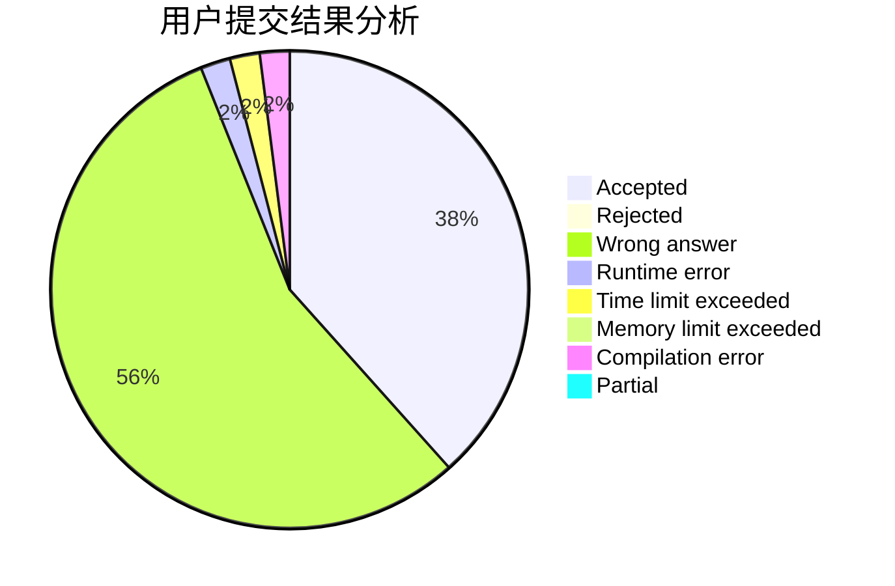
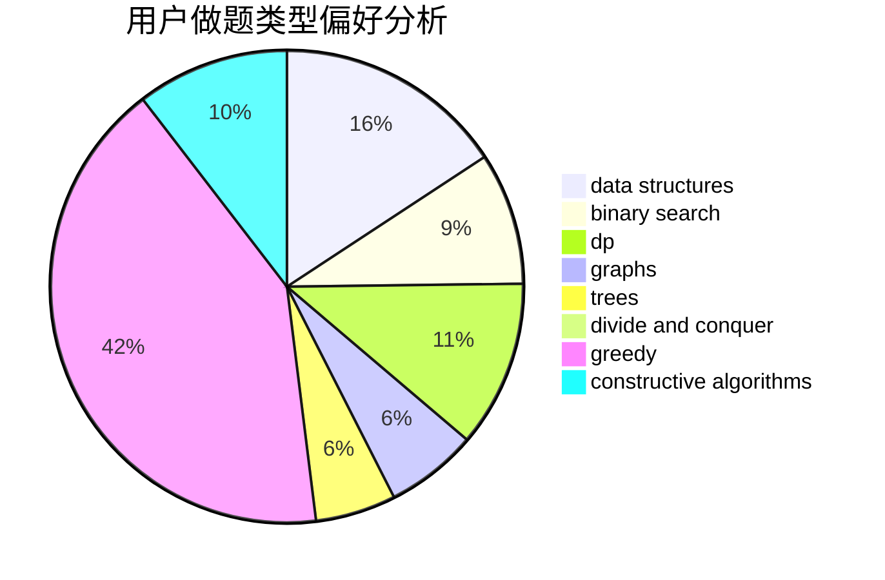
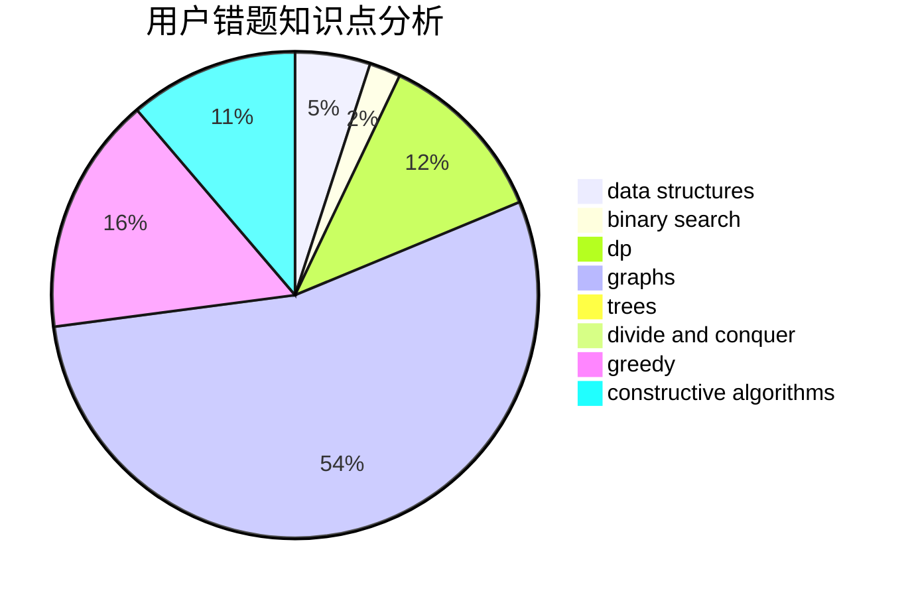

# KKKKG

<!-- tabs:start -->

#### **用户提交结果分析**

#### **用户做题类型偏好分析**

#### **用户错题知识点分析**

<!-- tabs:end -->
# 推荐题目
[1029C](https://codeforces.com/contest/1029/problem/C)		greedy,
                        math,
                        sortings		  
[1301C](https://codeforces.com/contest/1301/problem/C)		binary search,
                        combinatorics,
                        greedy,
                        math,
                        strings		  
[13563](https://codeforces.com/contest/1356/problem/3)		dsu,graphs,sortings,trees		  
[431A](https://codeforces.com/contest/431/problem/A)		implementation		  
[957E](https://codeforces.com/contest/957/problem/E)		dsu,graphs,sortings,trees		  
[260D](https://codeforces.com/contest/260/problem/D)		constructive algorithms,
                        dsu,
                        graphs,
                        greedy,
                        trees		  
[1054C](https://codeforces.com/contest/1054/problem/C)		constructive algorithms,
                        implementation		  
[13671](https://codeforces.com/contest/1367/problem/1)		dsu,graphs,sortings,trees		  
[1340B](https://codeforces.com/contest/1340/problem/B)		bitmasks,
                        dp,
                        graphs,
                        greedy		  
[1173A](https://codeforces.com/contest/1173/problem/A)		greedy		  
