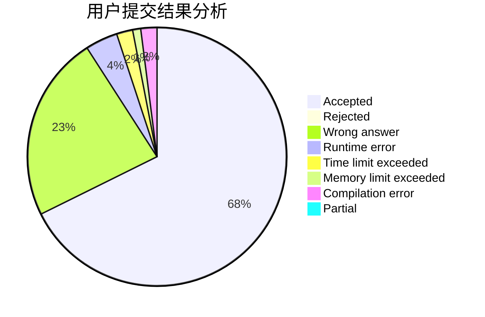
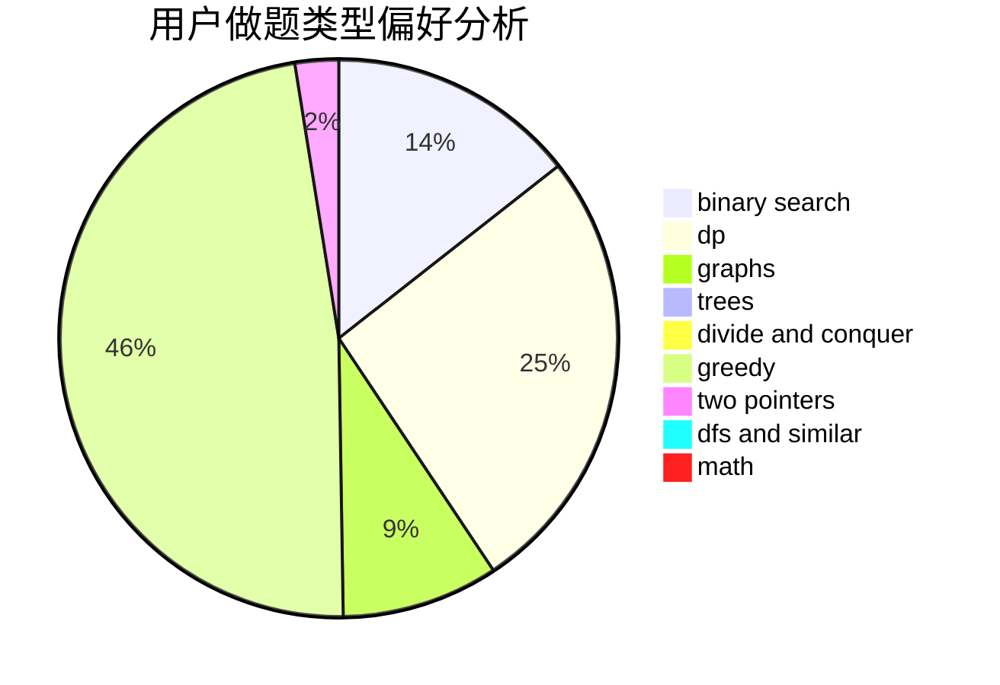

# KKiYeer

<!-- tabs:start -->

#### **用户提交结果分析**

#### **用户做题类型偏好分析**

<!-- tabs:end -->
# 推荐题目
[455A](https://codeforces.com/contest/455/problem/A)
[652D](https://codeforces.com/contest/652/problem/D)
[1087B](https://codeforces.com/contest/1087/problem/B)
[1145C](https://codeforces.com/contest/1145/problem/C)
[404C](https://codeforces.com/contest/404/problem/C)
[851D](https://codeforces.com/contest/851/problem/D)
[257D](https://codeforces.com/contest/257/problem/D)
[870E](https://codeforces.com/contest/870/problem/E)
[1079C](https://codeforces.com/contest/1079/problem/C)
[18E](https://codeforces.com/contest/18/problem/E)
