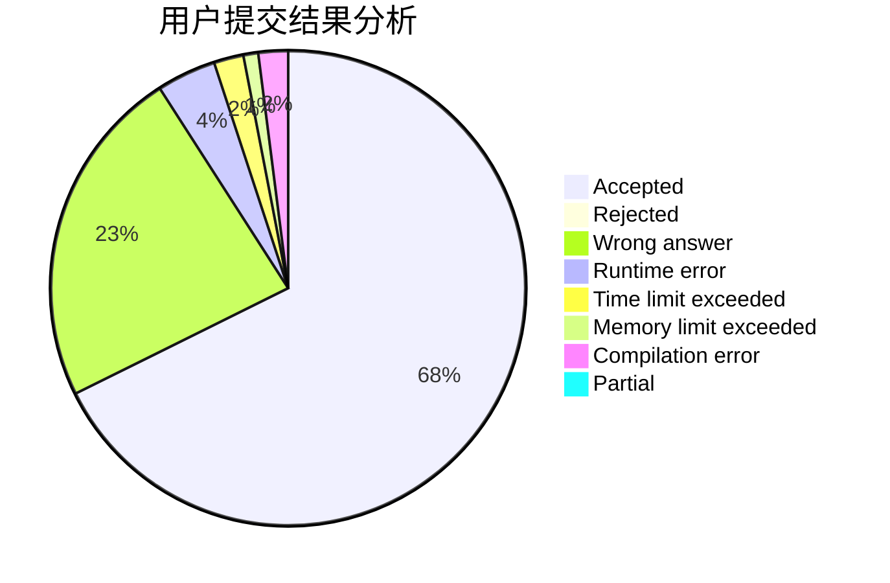
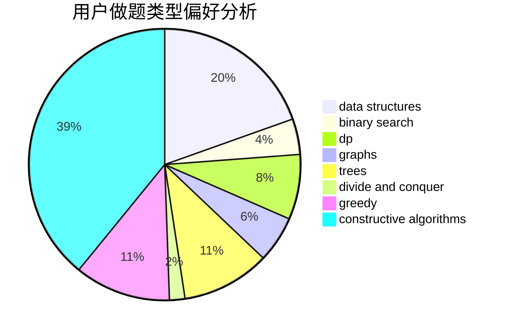
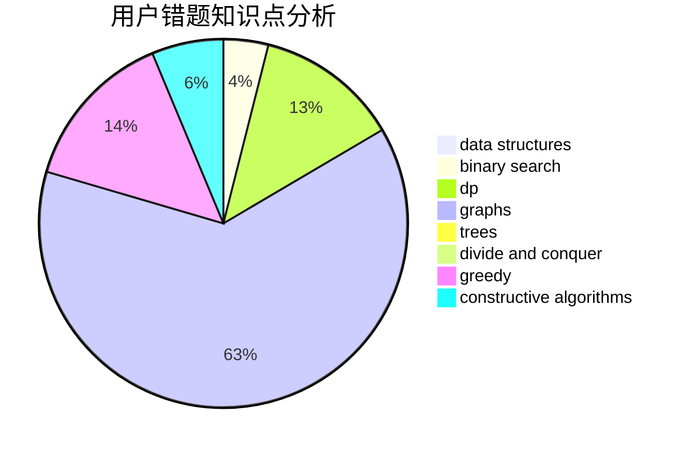

# KKiYeer

<!-- tabs:start -->

#### **用户提交结果分析**

#### **用户做题类型偏好分析**

#### **用户错题知识点分析**

<!-- tabs:end -->
# 推荐题目
[434B](https://codeforces.com/contest/434/problem/B)		dsu,graphs,sortings,trees		  
[625E](https://codeforces.com/contest/625/problem/E)		data structures,
                        greedy		  
[1086D](https://codeforces.com/contest/1086/problem/D)		dsu,graphs,sortings,trees		  
[1143C](https://codeforces.com/contest/1143/problem/C)		dfs and similar,
                        trees		  
[376A](https://codeforces.com/contest/376/problem/A)		implementation,
                        math		  
[833D](https://codeforces.com/contest/833/problem/D)		data structures,
                        divide and conquer,
                        implementation,
                        trees		  
[235A](https://codeforces.com/contest/235/problem/A)		number theory		  
[852E](https://codeforces.com/contest/852/problem/E)		dp		  
[1078E](https://codeforces.com/contest/1078/problem/E)		constructive algorithms		  
[165C](https://codeforces.com/contest/165/problem/C)		binary search,
                        brute force,
                        dp,
                        math,
                        strings,
                        two pointers		  
