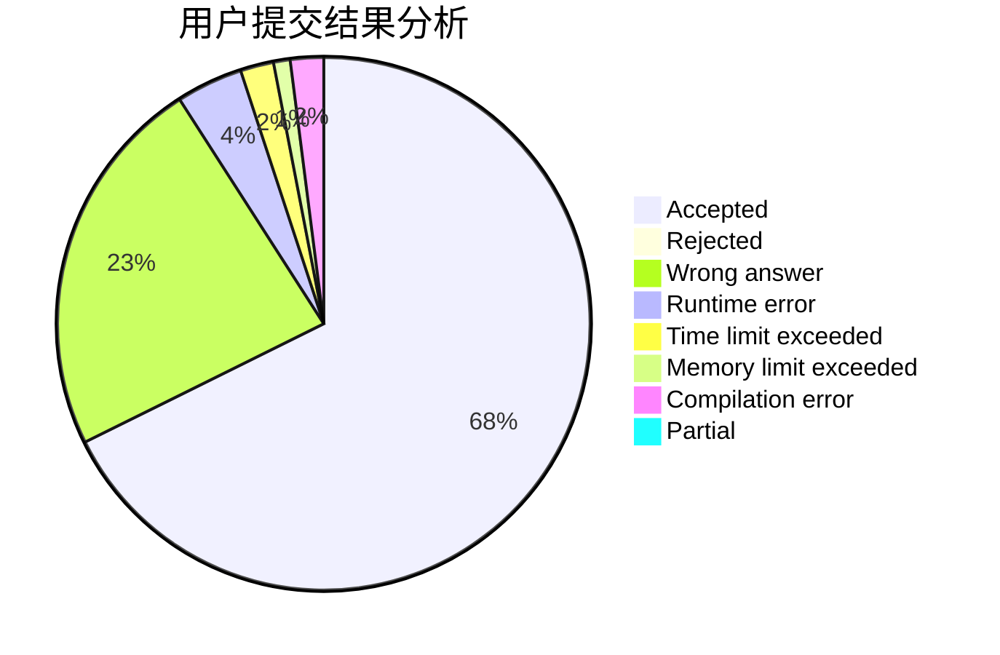
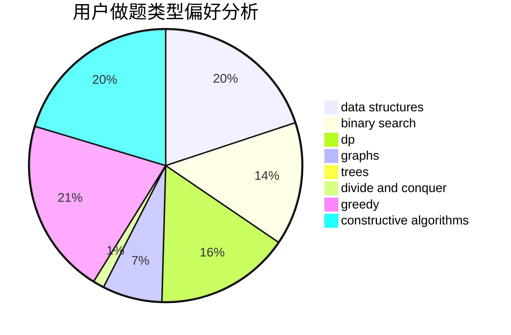
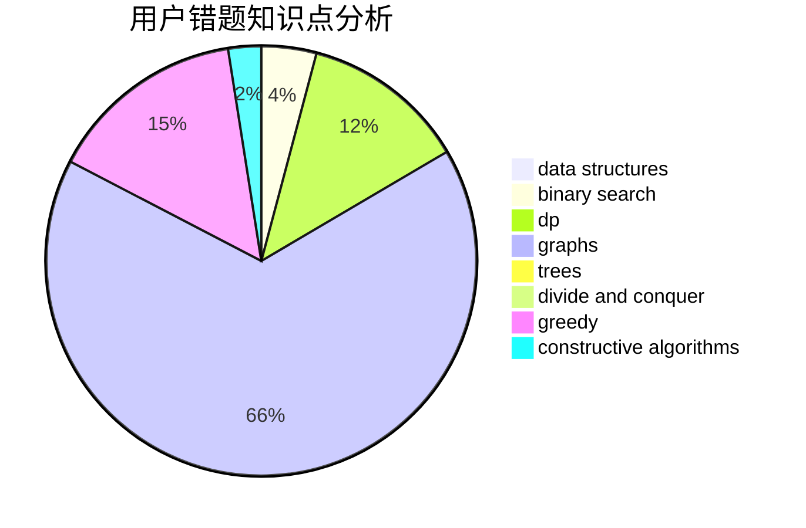

# KKiYeer

<!-- tabs:start -->

#### **用户提交结果分析**

#### **用户做题类型偏好分析**

#### **用户错题知识点分析**

<!-- tabs:end -->
# 推荐题目
[455A](https://codeforces.com/contest/455/problem/A)		dp		  
[652D](https://codeforces.com/contest/652/problem/D)		data structures,
                        sortings		  
[1087B](https://codeforces.com/contest/1087/problem/B)		dsu,graphs,sortings,trees		  
[1145C](https://codeforces.com/contest/1145/problem/C)		bitmasks,
                        brute force		  
[404C](https://codeforces.com/contest/404/problem/C)		dfs and similar,
                        graphs,
                        sortings		  
[851D](https://codeforces.com/contest/851/problem/D)		dsu,graphs,sortings,trees		  
[257D](https://codeforces.com/contest/257/problem/D)		greedy,
                        math		  
[870E](https://codeforces.com/contest/870/problem/E)		dfs and similar,
                        dsu,
                        graphs,
                        trees		  
[1079C](https://codeforces.com/contest/1079/problem/C)		dsu,graphs,sortings,trees		  
[18E](https://codeforces.com/contest/18/problem/E)		dp		  
