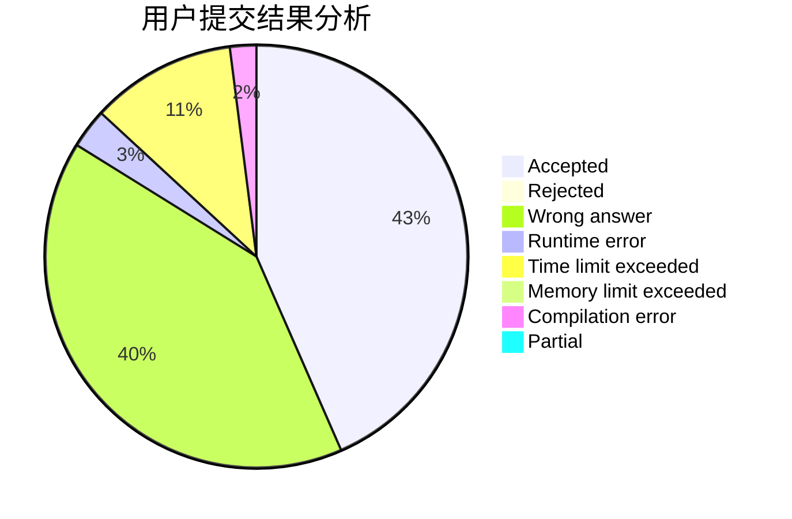
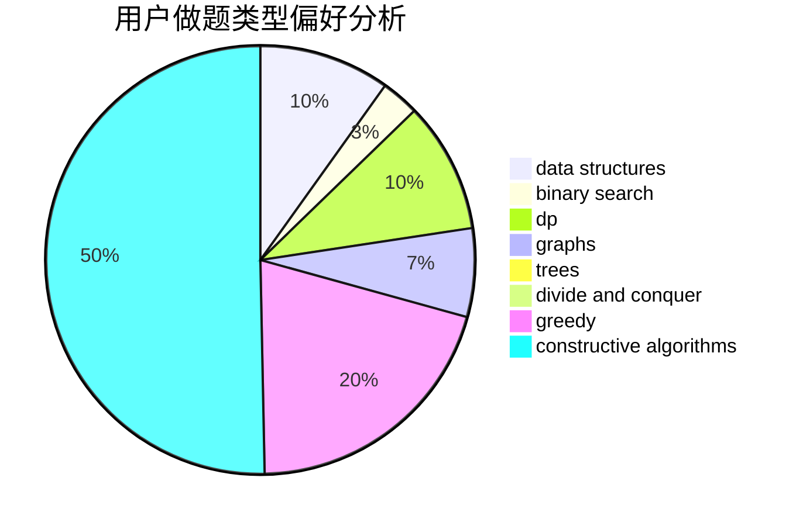
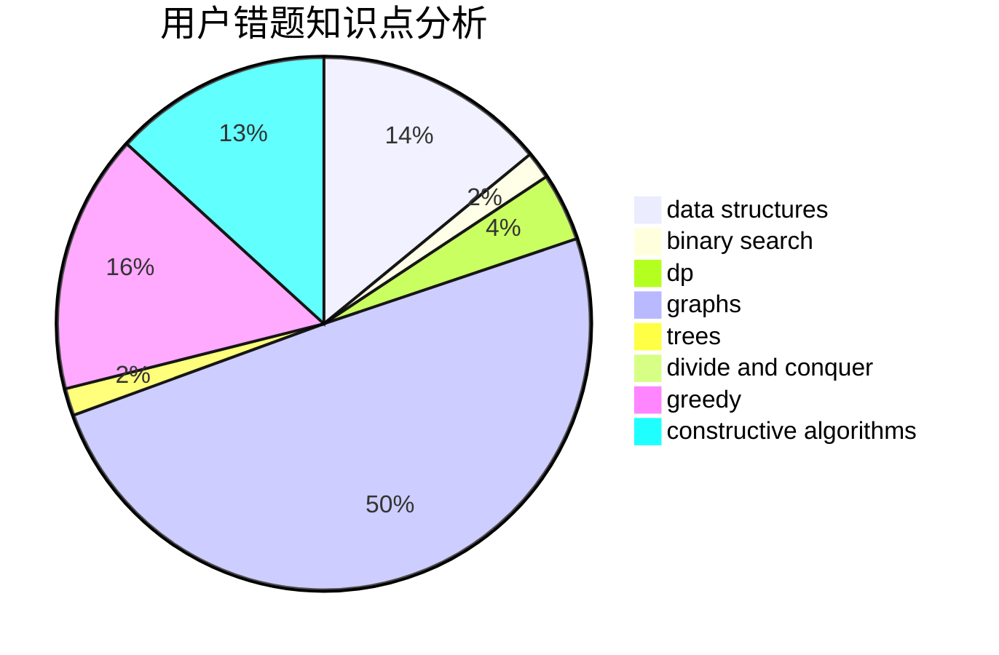

# KKpoker

<!-- tabs:start -->

#### **用户提交结果分析**

#### **用户做题类型偏好分析**

#### **用户错题知识点分析**

<!-- tabs:end -->
# 推荐题目
[1352D](https://codeforces.com/contest/1352/problem/D)		implementation		  
[1037E](https://codeforces.com/contest/1037/problem/E)		graphs		  
[9581](https://codeforces.com/contest/958/problem/1)		dsu,graphs,sortings,trees		  
[1189A](https://codeforces.com/contest/1189/problem/A)		strings		  
[1294F](https://codeforces.com/contest/1294/problem/F)		dfs and similar,
                        dp,
                        greedy,
                        trees		  
[1302F](https://codeforces.com/contest/1302/problem/F)		bitmasks,
                        brute force,
                        expression parsing		  
[1419F](https://codeforces.com/contest/1419/problem/F)		binary search,
                        data structures,
                        dfs and similar,
                        dsu,
                        graphs,
                        implementation		  
[425E](https://codeforces.com/contest/425/problem/E)		dp		  
[1147A](https://codeforces.com/contest/1147/problem/A)		graphs		  
[1208C](https://codeforces.com/contest/1208/problem/C)		constructive algorithms		  
