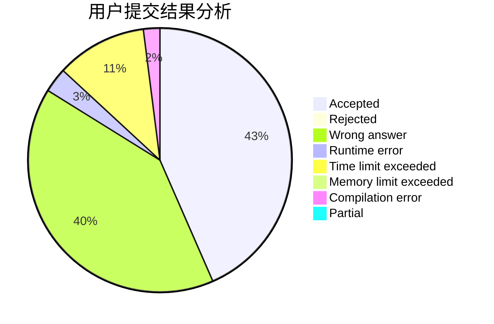
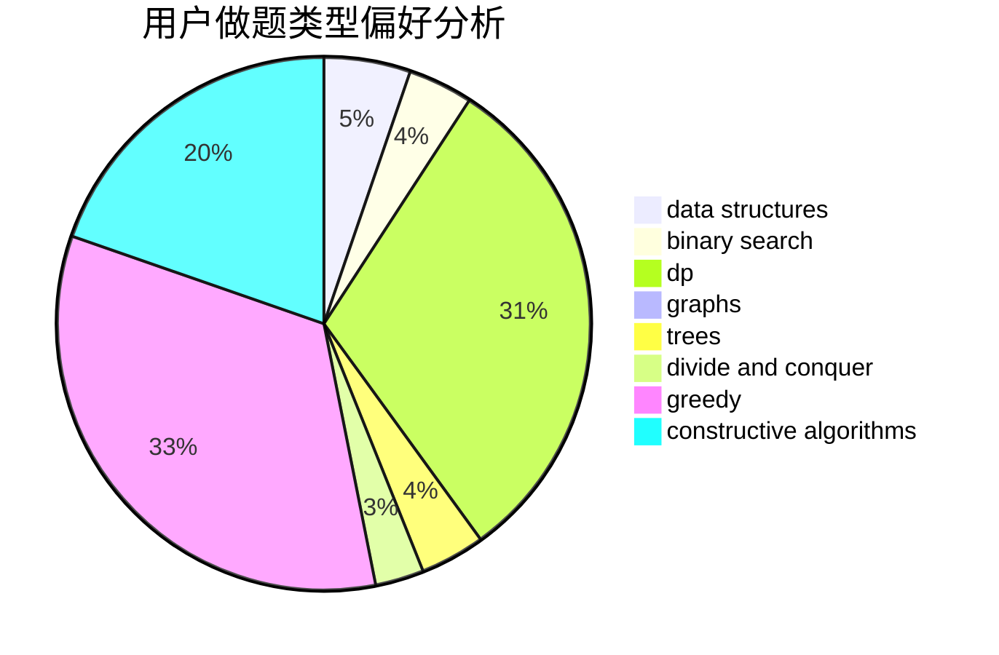
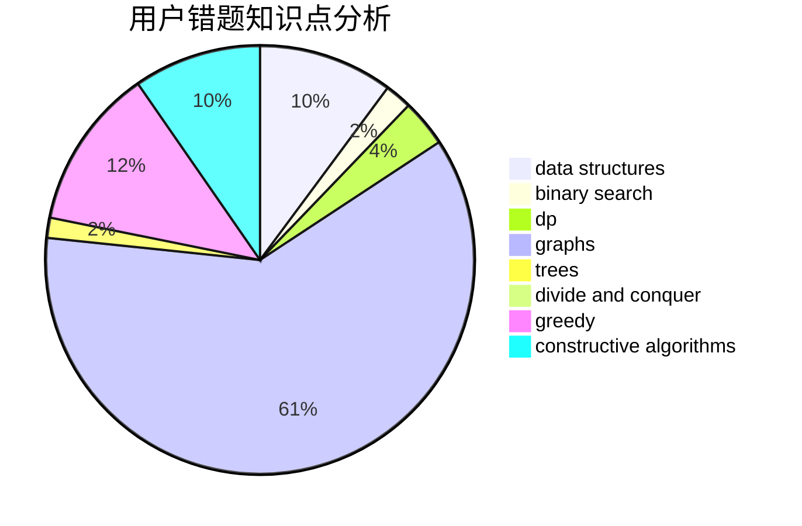

# KKpoker

<!-- tabs:start -->

#### **用户提交结果分析**

#### **用户做题类型偏好分析**

#### **用户错题知识点分析**

<!-- tabs:end -->
# 推荐题目
[1345B](https://codeforces.com/contest/1345/problem/B)		binary search,
                        brute force,
                        dp,
                        math		  
[1037B](https://codeforces.com/contest/1037/problem/B)		greedy		  
[936A](https://codeforces.com/contest/936/problem/A)		binary search,
                        implementation,
                        math		  
[1185C1](https://codeforces.com/contest/1185C/problem/1)		greedy,
                        sortings		  
[1287C](https://codeforces.com/contest/1287/problem/C)		dsu,graphs,sortings,trees		  
[1295D](https://codeforces.com/contest/1295/problem/D)		math,
                        number theory		  
[1409A](https://codeforces.com/contest/1409/problem/A)		greedy,
                        math		  
[39C](https://codeforces.com/contest/39/problem/C)		dp,
                        sortings		  
[1144G](https://codeforces.com/contest/1144/problem/G)		dp,
                        greedy		  
[1203E](https://codeforces.com/contest/1203/problem/E)		greedy,
                        sortings		  
