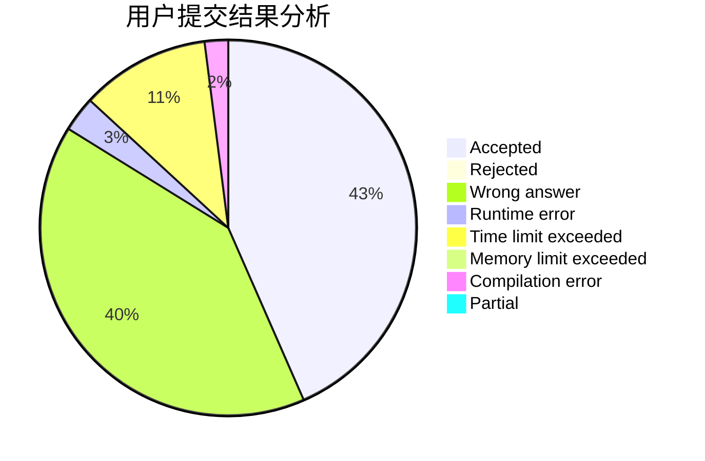
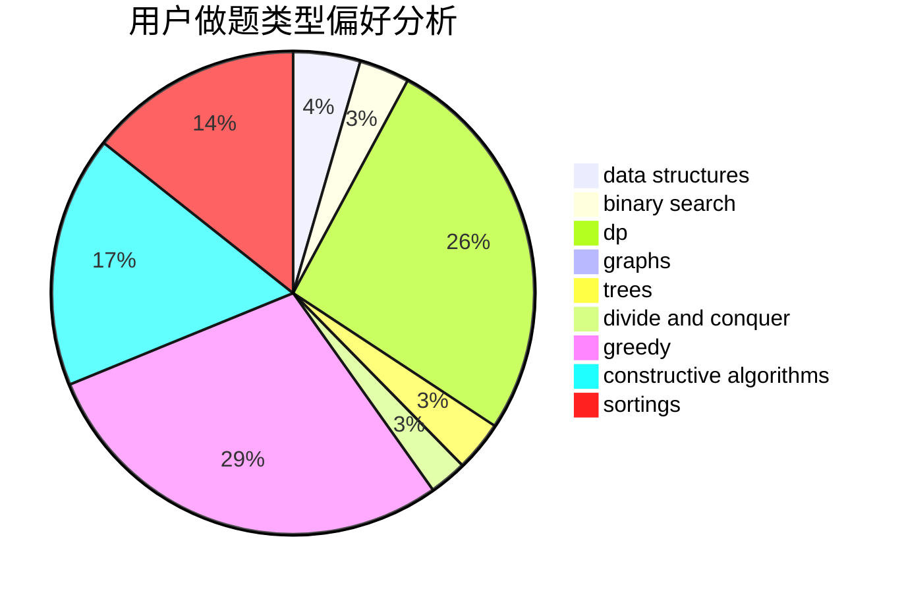
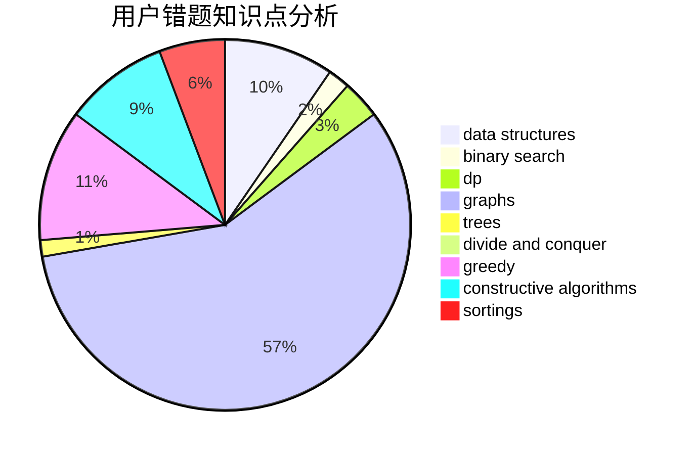

# KKpoker
<!-- tabs:start -->
#### **用户提交结果分析**

#### **用户做题类型偏好分析**

#### **用户错题知识点分析**

<!-- tabs:end -->
# 推荐题目
[1011E](https://codeforces.com/contest/1011/problem/E)		number theory		  
[936A](http://codeforces.com/problemset/problem/936/A)		binary search,
                        implementation,
                        math		  
[278C](https://codeforces.com/contest/278/problem/C)		dfs and similar,
                        dsu		  
[39C](http://codeforces.com/problemset/problem/39/C)		dp,
                        sortings		  
[1368F](http://codeforces.com/problemset/problem/1368/F)		games,
                        implementation,
                        interactive,
                        math		  
[187D](http://codeforces.com/problemset/problem/187/D)		data structures		  
[794A](http://codeforces.com/problemset/problem/794/A)		brute force,
                        implementation		  
[1366A](http://codeforces.com/problemset/problem/1366/A)		binary search,
                        greedy,
                        math		  
[1345B](http://codeforces.com/problemset/problem/1345/B)		binary search,
                        brute force,
                        dp,
                        math		  
[1346E](http://codeforces.com/problemset/problem/1346/E)		*special problem,
                        dp,
                        graphs		  
<!-- tabs:start -->
#### **data structures**
[187D](http://codeforces.com/problemset/problem/187/D)		data structures		  
[862E](http://codeforces.com/problemset/problem/862/E)		binary search,
                        data structures,
                        sortings		  
[1417E](https://codeforces.com/contest/1417/problem/E)		bitmasks,
                        data structures,
                        divide and conquer,
                        dp,
                        greedy,
                        math,
                        sortings,
                        strings,
                        trees		  
[731D](http://codeforces.com/problemset/problem/731/D)		brute force,
                        data structures,
                        greedy,
                        sortings		  
[1498C](http://codeforces.com/problemset/problem/1498/C)		brute force,
                        data structures,
                        dp		  
[1492C](http://codeforces.com/problemset/problem/1492/C)		binary search,
                        data structures,
                        dp,
                        greedy,
                        two pointers		  
[1490G](http://codeforces.com/problemset/problem/1490/G)		binary search,
                        data structures,
                        math		  
[1479D](http://codeforces.com/problemset/problem/1479/D)		binary search,
                        bitmasks,
                        brute force,
                        data structures,
                        probabilities,
                        trees		  
[1497A](http://codeforces.com/problemset/problem/1497/A)		brute force,
                        data structures,
                        greedy,
                        sortings		  
[1491C](http://codeforces.com/problemset/problem/1491/C)		brute force,
                        data structures,
                        dp,
                        greedy,
                        implementation		  
#### **binary search**
[936A](http://codeforces.com/problemset/problem/936/A)		binary search,
                        implementation,
                        math		  
[1366A](http://codeforces.com/problemset/problem/1366/A)		binary search,
                        greedy,
                        math		  
[1345B](http://codeforces.com/problemset/problem/1345/B)		binary search,
                        brute force,
                        dp,
                        math		  
[862E](http://codeforces.com/problemset/problem/862/E)		binary search,
                        data structures,
                        sortings		  
[1423K](http://codeforces.com/problemset/problem/1423/K)		binary search,
                        math,
                        number theory,
                        two pointers		  
[1492C](http://codeforces.com/problemset/problem/1492/C)		binary search,
                        data structures,
                        dp,
                        greedy,
                        two pointers		  
[1463D](http://codeforces.com/problemset/problem/1463/D)		binary search,
                        constructive algorithms,
                        greedy,
                        two pointers		  
[1490G](http://codeforces.com/problemset/problem/1490/G)		binary search,
                        data structures,
                        math		  
[1479D](http://codeforces.com/problemset/problem/1479/D)		binary search,
                        bitmasks,
                        brute force,
                        data structures,
                        probabilities,
                        trees		  
[1436E](http://codeforces.com/problemset/problem/1436/E)		binary search,
                        data structures,
                        two pointers		  
#### **dp**
[39C](http://codeforces.com/problemset/problem/39/C)		dp,
                        sortings		  
[1345B](http://codeforces.com/problemset/problem/1345/B)		binary search,
                        brute force,
                        dp,
                        math		  
[1346E](http://codeforces.com/problemset/problem/1346/E)		*special problem,
                        dp,
                        graphs		  
[398B](http://codeforces.com/problemset/problem/398/B)		dp,
                        probabilities		  
[1144G](http://codeforces.com/problemset/problem/1144/G)		dp,
                        greedy		  
[936B](http://codeforces.com/problemset/problem/936/B)		dfs and similar,
                        dp,
                        games,
                        graphs		  
[633D](http://codeforces.com/problemset/problem/633/D)		brute force,
                        dp,
                        hashing,
                        implementation,
                        math		  
[1417E](https://codeforces.com/contest/1417/problem/E)		bitmasks,
                        data structures,
                        divide and conquer,
                        dp,
                        greedy,
                        math,
                        sortings,
                        strings,
                        trees		  
[1420C1](http://codeforces.com/problemset/problem/1420/C1)		constructive algorithms,
                        dp,
                        greedy		  
[1287C](https://codeforces.com/contest/1287/problem/C)		dp,
                        greedy,
                        sortings		  
#### **graph**
[1346E](http://codeforces.com/problemset/problem/1346/E)		*special problem,
                        dp,
                        graphs		  
[936B](http://codeforces.com/problemset/problem/936/B)		dfs and similar,
                        dp,
                        games,
                        graphs		  
[1487C](http://codeforces.com/problemset/problem/1487/C)		brute force,
                        constructive algorithms,
                        dfs and similar,
                        graphs,
                        greedy,
                        implementation,
                        math		  
[1437C](http://codeforces.com/problemset/problem/1437/C)		dp,
                        flows,
                        graph matchings,
                        greedy,
                        math,
                        sortings		  
[1470D](http://codeforces.com/problemset/problem/1470/D)		constructive algorithms,
                        dfs and similar,
                        graph matchings,
                        graphs,
                        greedy		  
[1476C](http://codeforces.com/problemset/problem/1476/C)		dp,
                        graphs,
                        greedy		  
[1304D](http://codeforces.com/problemset/problem/1304/D)		constructive algorithms,
                        graphs,
                        greedy,
                        two pointers		  
[1475C](http://codeforces.com/problemset/problem/1475/C)		combinatorics,
                        graphs,
                        math		  
[553E](http://codeforces.com/problemset/problem/553/E)		dp,
                        fft,
                        graphs,
                        math,
                        probabilities		  
[1495C](http://codeforces.com/problemset/problem/1495/C)		constructive algorithms,
                        graphs		  
#### **trees**
[1417E](https://codeforces.com/contest/1417/problem/E)		bitmasks,
                        data structures,
                        divide and conquer,
                        dp,
                        greedy,
                        math,
                        sortings,
                        strings,
                        trees		  
[1479D](http://codeforces.com/problemset/problem/1479/D)		binary search,
                        bitmasks,
                        brute force,
                        data structures,
                        probabilities,
                        trees		  
[1511C](http://codeforces.com/problemset/problem/1511/C)		brute force,
                        data structures,
                        implementation,
                        trees		  
[1499F](http://codeforces.com/problemset/problem/1499/F)		combinatorics,
                        dfs and similar,
                        dp,
                        trees		  
[1491E](http://codeforces.com/problemset/problem/1491/E)		brute force,
                        dfs and similar,
                        divide and conquer,
                        number theory,
                        trees		  
[1466D](http://codeforces.com/problemset/problem/1466/D)		data structures,
                        greedy,
                        sortings,
                        trees		  
[1495D](http://codeforces.com/problemset/problem/1495/D)		combinatorics,
                        dfs and similar,
                        graphs,
                        math,
                        shortest paths,
                        trees		  
[1303G](http://codeforces.com/problemset/problem/1303/G)		data structures,
                        divide and conquer,
                        geometry,
                        trees		  
[1454E](http://codeforces.com/problemset/problem/1454/E)		combinatorics,
                        dfs and similar,
                        graphs,
                        trees		  
[1494D](http://codeforces.com/problemset/problem/1494/D)		constructive algorithms,
                        data structures,
                        dfs and similar,
                        divide and conquer,
                        dsu,
                        greedy,
                        sortings,
                        trees		  
#### **divide and conquer**
[1417E](https://codeforces.com/contest/1417/problem/E)		bitmasks,
                        data structures,
                        divide and conquer,
                        dp,
                        greedy,
                        math,
                        sortings,
                        strings,
                        trees		  
[1461D](http://codeforces.com/problemset/problem/1461/D)		binary search,
                        brute force,
                        data structures,
                        divide and conquer,
                        implementation,
                        sortings		  
[1466G](http://codeforces.com/problemset/problem/1466/G)		combinatorics,
                        divide and conquer,
                        hashing,
                        math,
                        string suffix structures,
                        strings		  
[1490D](http://codeforces.com/problemset/problem/1490/D)		dfs and similar,
                        divide and conquer,
                        implementation		  
[1483C](https://codeforces.com/contest/1483/problem/C)		data structures,
                        divide and conquer,
                        dp		  
[1491E](http://codeforces.com/problemset/problem/1491/E)		brute force,
                        dfs and similar,
                        divide and conquer,
                        number theory,
                        trees		  
[1303G](http://codeforces.com/problemset/problem/1303/G)		data structures,
                        divide and conquer,
                        geometry,
                        trees		  
[1494D](http://codeforces.com/problemset/problem/1494/D)		constructive algorithms,
                        data structures,
                        dfs and similar,
                        divide and conquer,
                        dsu,
                        greedy,
                        sortings,
                        trees		  
[1482E](http://codeforces.com/problemset/problem/1482/E)		data structures,
                        divide and conquer,
                        dp		  
[566C](http://codeforces.com/problemset/problem/566/C)		dfs and similar,
                        divide and conquer,
                        trees		  
#### **greedy**
[1366A](http://codeforces.com/problemset/problem/1366/A)		binary search,
                        greedy,
                        math		  
[33C](http://codeforces.com/problemset/problem/33/C)		greedy		  
[1037B](http://codeforces.com/problemset/problem/1037/B)		greedy		  
[1144G](http://codeforces.com/problemset/problem/1144/G)		dp,
                        greedy		  
[1417E](https://codeforces.com/contest/1417/problem/E)		bitmasks,
                        data structures,
                        divide and conquer,
                        dp,
                        greedy,
                        math,
                        sortings,
                        strings,
                        trees		  
[731D](http://codeforces.com/problemset/problem/731/D)		brute force,
                        data structures,
                        greedy,
                        sortings		  
[351E](http://codeforces.com/problemset/problem/351/E)		greedy		  
[1420C1](http://codeforces.com/problemset/problem/1420/C1)		constructive algorithms,
                        dp,
                        greedy		  
[1287C](https://codeforces.com/contest/1287/problem/C)		dp,
                        greedy,
                        sortings		  
[1185C1](http://codeforces.com/problemset/problem/1185/C1)		greedy,
                        sortings		  
#### **constructive algorithms**
[644A](http://codeforces.com/problemset/problem/644/A)		*special problem,
                        constructive algorithms		  
[1420C1](http://codeforces.com/problemset/problem/1420/C1)		constructive algorithms,
                        dp,
                        greedy		  
[1395B](http://codeforces.com/problemset/problem/1395/B)		constructive algorithms		  
[1493A](http://codeforces.com/problemset/problem/1493/A)		constructive algorithms,
                        greedy		  
[1463D](http://codeforces.com/problemset/problem/1463/D)		binary search,
                        constructive algorithms,
                        greedy,
                        two pointers		  
[1456B](https://codeforces.com/contest/1456/problem/B)		bitmasks,
                        brute force,
                        constructive algorithms		  
[1492D](http://codeforces.com/problemset/problem/1492/D)		bitmasks,
                        constructive algorithms,
                        greedy,
                        math		  
[1504D](https://codeforces.com/contest/1504/problem/D)		constructive algorithms,
                        games,
                        interactive		  
[1483A](https://codeforces.com/contest/1483/problem/A)		brute force,
                        constructive algorithms,
                        greedy,
                        implementation		  
[1457D](https://codeforces.com/contest/1457/problem/D)		bitmasks,
                        brute force,
                        constructive algorithms		  
#### **sortings**
[39C](http://codeforces.com/problemset/problem/39/C)		dp,
                        sortings		  
[862E](http://codeforces.com/problemset/problem/862/E)		binary search,
                        data structures,
                        sortings		  
[1417E](https://codeforces.com/contest/1417/problem/E)		bitmasks,
                        data structures,
                        divide and conquer,
                        dp,
                        greedy,
                        math,
                        sortings,
                        strings,
                        trees		  
[731D](http://codeforces.com/problemset/problem/731/D)		brute force,
                        data structures,
                        greedy,
                        sortings		  
[1287C](https://codeforces.com/contest/1287/problem/C)		dp,
                        greedy,
                        sortings		  
[1185C1](http://codeforces.com/problemset/problem/1185/C1)		greedy,
                        sortings		  
[1203E](http://codeforces.com/problemset/problem/1203/E)		greedy,
                        sortings		  
[1496C](https://codeforces.com/contest/1496/problem/C)		geometry,
                        greedy,
                        math,
                        sortings		  
[1495A](http://codeforces.com/problemset/problem/1495/A)		geometry,
                        greedy,
                        math,
                        sortings		  
[1497A](http://codeforces.com/problemset/problem/1497/A)		brute force,
                        data structures,
                        greedy,
                        sortings		  
<!-- tabs:end -->
