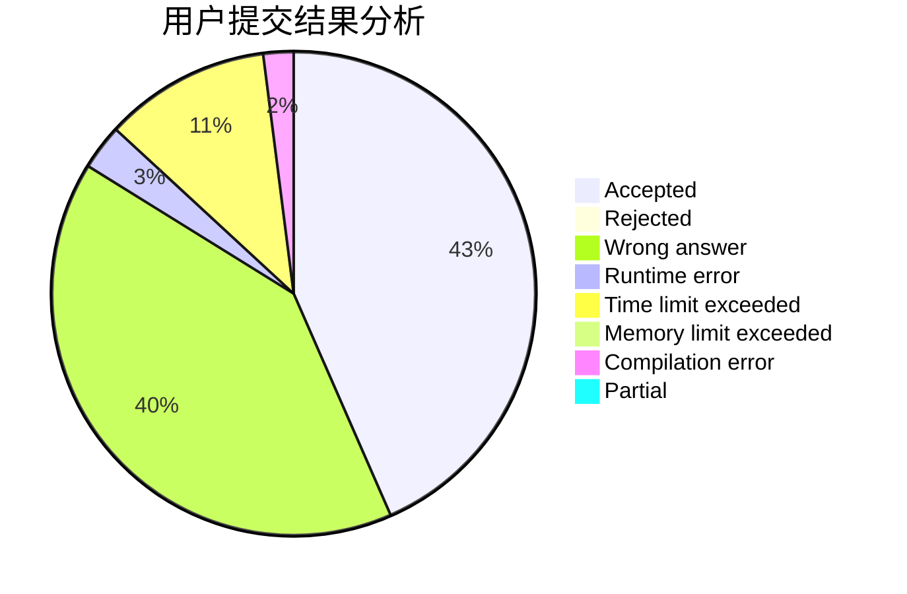
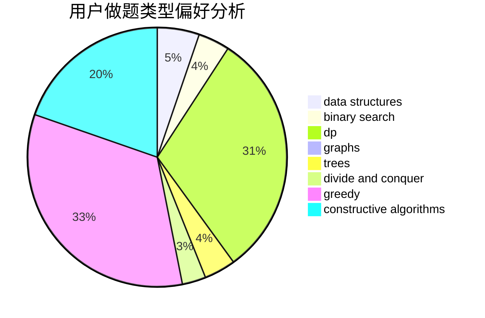
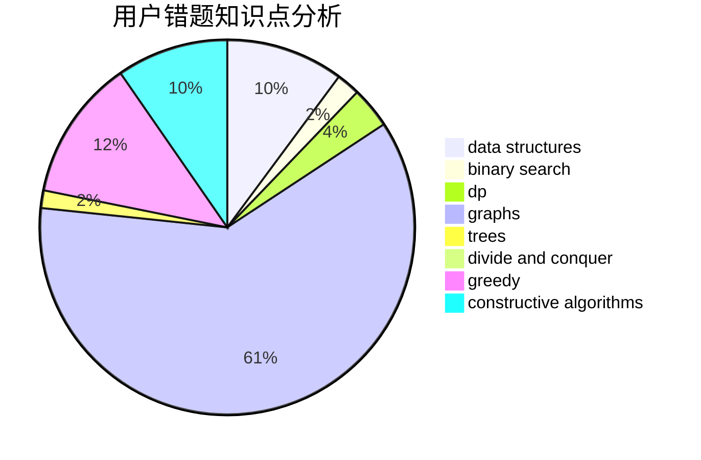

# KKpoker
<!-- tabs:start -->
#### **用户提交结果分析**

#### **用户做题类型偏好分析**

#### **用户错题知识点分析**

<!-- tabs:end -->
# 推荐题目
[Border](https://codeforces.com/contest/1011/problem/E)		number theory		  
[Save Energy!](http://codeforces.com/problemset/problem/936/A)		binary search,
                        implementation,
                        math		  
[Learning Languages](https://codeforces.com/contest/278/problem/C)		dfs and similar,
                        dsu		  
[Moon Craters](http://codeforces.com/problemset/problem/39/C)		dp,
                        sortings		  
[Lamps on a Circle](http://codeforces.com/problemset/problem/1368/F)		games,
                        implementation,
                        interactive,
                        math		  
[BRT Contract](http://codeforces.com/problemset/problem/187/D)		data structures		  
[Bank Robbery](http://codeforces.com/problemset/problem/794/A)		brute force,
                        implementation		  
[Shovels and Swords](http://codeforces.com/problemset/problem/1366/A)		binary search,
                        greedy,
                        math		  
[Card Constructions](http://codeforces.com/problemset/problem/1345/B)		binary search,
                        brute force,
                        dp,
                        math		  
[Magic Tricks](http://codeforces.com/problemset/problem/1346/E)		*special problem,
                        dp,
                        graphs		  
<!-- tabs:start -->
#### **data structures**
[BRT Contract](http://codeforces.com/problemset/problem/187/D)		data structures		  
[Mahmoud and Ehab and the function](http://codeforces.com/problemset/problem/862/E)		binary search,
                        data structures,
                        sortings		  
[XOR Inverse](https://codeforces.com/contest/1417/problem/E)		bitmasks,
                        data structures,
                        divide and conquer,
                        dp,
                        greedy,
                        math,
                        sortings,
                        strings,
                        trees		  
[80-th Level Archeology](http://codeforces.com/problemset/problem/731/D)		brute force,
                        data structures,
                        greedy,
                        sortings		  
[Planar Reflections](http://codeforces.com/problemset/problem/1498/C)		brute force,
                        data structures,
                        dp		  
[Maximum width](http://codeforces.com/problemset/problem/1492/C)		binary search,
                        data structures,
                        dp,
                        greedy,
                        two pointers		  
[Old Floppy Drive](http://codeforces.com/problemset/problem/1490/G)		binary search,
                        data structures,
                        math		  
[Odd Mineral Resource](http://codeforces.com/problemset/problem/1479/D)		binary search,
                        bitmasks,
                        brute force,
                        data structures,
                        probabilities,
                        trees		  
[Meximization](http://codeforces.com/problemset/problem/1497/A)		brute force,
                        data structures,
                        greedy,
                        sortings		  
[Pekora and Trampoline](http://codeforces.com/problemset/problem/1491/C)		brute force,
                        data structures,
                        dp,
                        greedy,
                        implementation		  
#### **binary search**
[Save Energy!](http://codeforces.com/problemset/problem/936/A)		binary search,
                        implementation,
                        math		  
[Shovels and Swords](http://codeforces.com/problemset/problem/1366/A)		binary search,
                        greedy,
                        math		  
[Card Constructions](http://codeforces.com/problemset/problem/1345/B)		binary search,
                        brute force,
                        dp,
                        math		  
[Mahmoud and Ehab and the function](http://codeforces.com/problemset/problem/862/E)		binary search,
                        data structures,
                        sortings		  
[Lonely Numbers](http://codeforces.com/problemset/problem/1423/K)		binary search,
                        math,
                        number theory,
                        two pointers		  
[Maximum width](http://codeforces.com/problemset/problem/1492/C)		binary search,
                        data structures,
                        dp,
                        greedy,
                        two pointers		  
[Pairs](http://codeforces.com/problemset/problem/1463/D)		binary search,
                        constructive algorithms,
                        greedy,
                        two pointers		  
[Old Floppy Drive](http://codeforces.com/problemset/problem/1490/G)		binary search,
                        data structures,
                        math		  
[Odd Mineral Resource](http://codeforces.com/problemset/problem/1479/D)		binary search,
                        bitmasks,
                        brute force,
                        data structures,
                        probabilities,
                        trees		  
[Complicated Computations](http://codeforces.com/problemset/problem/1436/E)		binary search,
                        data structures,
                        two pointers		  
#### **dp**
[Moon Craters](http://codeforces.com/problemset/problem/39/C)		dp,
                        sortings		  
[Card Constructions](http://codeforces.com/problemset/problem/1345/B)		binary search,
                        brute force,
                        dp,
                        math		  
[Magic Tricks](http://codeforces.com/problemset/problem/1346/E)		*special problem,
                        dp,
                        graphs		  
[Painting The Wall](http://codeforces.com/problemset/problem/398/B)		dp,
                        probabilities		  
[Two Merged Sequences](http://codeforces.com/problemset/problem/1144/G)		dp,
                        greedy		  
[Sleepy Game](http://codeforces.com/problemset/problem/936/B)		dfs and similar,
                        dp,
                        games,
                        graphs		  
[Fibonacci-ish](http://codeforces.com/problemset/problem/633/D)		brute force,
                        dp,
                        hashing,
                        implementation,
                        math		  
[XOR Inverse](https://codeforces.com/contest/1417/problem/E)		bitmasks,
                        data structures,
                        divide and conquer,
                        dp,
                        greedy,
                        math,
                        sortings,
                        strings,
                        trees		  
[Pokémon Army (easy version)](http://codeforces.com/problemset/problem/1420/C1)		constructive algorithms,
                        dp,
                        greedy		  
[Garland](https://codeforces.com/contest/1287/problem/C)		dp,
                        greedy,
                        sortings		  
#### **graph**
[Magic Tricks](http://codeforces.com/problemset/problem/1346/E)		*special problem,
                        dp,
                        graphs		  
[Sleepy Game](http://codeforces.com/problemset/problem/936/B)		dfs and similar,
                        dp,
                        games,
                        graphs		  
[Minimum Ties](http://codeforces.com/problemset/problem/1487/C)		brute force,
                        constructive algorithms,
                        dfs and similar,
                        graphs,
                        greedy,
                        implementation,
                        math		  
[Chef Monocarp](http://codeforces.com/problemset/problem/1437/C)		dp,
                        flows,
                        graph matchings,
                        greedy,
                        math,
                        sortings		  
[Strange Housing](http://codeforces.com/problemset/problem/1470/D)		constructive algorithms,
                        dfs and similar,
                        graph matchings,
                        graphs,
                        greedy		  
[Longest Simple Cycle](http://codeforces.com/problemset/problem/1476/C)		dp,
                        graphs,
                        greedy		  
[Shortest and Longest LIS](http://codeforces.com/problemset/problem/1304/D)		constructive algorithms,
                        graphs,
                        greedy,
                        two pointers		  
[Ball in Berland](http://codeforces.com/problemset/problem/1475/C)		combinatorics,
                        graphs,
                        math		  
[Kyoya and Train](http://codeforces.com/problemset/problem/553/E)		dp,
                        fft,
                        graphs,
                        math,
                        probabilities		  
[Garden of the Sun](http://codeforces.com/problemset/problem/1495/C)		constructive algorithms,
                        graphs		  
#### **trees**
[XOR Inverse](https://codeforces.com/contest/1417/problem/E)		bitmasks,
                        data structures,
                        divide and conquer,
                        dp,
                        greedy,
                        math,
                        sortings,
                        strings,
                        trees		  
[Odd Mineral Resource](http://codeforces.com/problemset/problem/1479/D)		binary search,
                        bitmasks,
                        brute force,
                        data structures,
                        probabilities,
                        trees		  
[Yet Another Card Deck](http://codeforces.com/problemset/problem/1511/C)		brute force,
                        data structures,
                        implementation,
                        trees		  
[Diameter Cuts](http://codeforces.com/problemset/problem/1499/F)		combinatorics,
                        dfs and similar,
                        dp,
                        trees		  
[Fib-tree](http://codeforces.com/problemset/problem/1491/E)		brute force,
                        dfs and similar,
                        divide and conquer,
                        number theory,
                        trees		  
[13th Labour of Heracles](http://codeforces.com/problemset/problem/1466/D)		data structures,
                        greedy,
                        sortings,
                        trees		  
[BFS Trees](http://codeforces.com/problemset/problem/1495/D)		combinatorics,
                        dfs and similar,
                        graphs,
                        math,
                        shortest paths,
                        trees		  
[Sum of Prefix Sums](http://codeforces.com/problemset/problem/1303/G)		data structures,
                        divide and conquer,
                        geometry,
                        trees		  
[Number of Simple Paths](http://codeforces.com/problemset/problem/1454/E)		combinatorics,
                        dfs and similar,
                        graphs,
                        trees		  
[Dogeforces](http://codeforces.com/problemset/problem/1494/D)		constructive algorithms,
                        data structures,
                        dfs and similar,
                        divide and conquer,
                        dsu,
                        greedy,
                        sortings,
                        trees		  
#### **divide and conquer**
[XOR Inverse](https://codeforces.com/contest/1417/problem/E)		bitmasks,
                        data structures,
                        divide and conquer,
                        dp,
                        greedy,
                        math,
                        sortings,
                        strings,
                        trees		  
[Divide and Summarize](http://codeforces.com/problemset/problem/1461/D)		binary search,
                        brute force,
                        data structures,
                        divide and conquer,
                        implementation,
                        sortings		  
[Song of the Sirens](http://codeforces.com/problemset/problem/1466/G)		combinatorics,
                        divide and conquer,
                        hashing,
                        math,
                        string suffix structures,
                        strings		  
[Permutation Transformation](http://codeforces.com/problemset/problem/1490/D)		dfs and similar,
                        divide and conquer,
                        implementation		  
[Skyline Photo](https://codeforces.com/contest/1483/problem/C)		data structures,
                        divide and conquer,
                        dp		  
[Fib-tree](http://codeforces.com/problemset/problem/1491/E)		brute force,
                        dfs and similar,
                        divide and conquer,
                        number theory,
                        trees		  
[Sum of Prefix Sums](http://codeforces.com/problemset/problem/1303/G)		data structures,
                        divide and conquer,
                        geometry,
                        trees		  
[Dogeforces](http://codeforces.com/problemset/problem/1494/D)		constructive algorithms,
                        data structures,
                        dfs and similar,
                        divide and conquer,
                        dsu,
                        greedy,
                        sortings,
                        trees		  
[Logistical Questions](http://codeforces.com/problemset/problem/566/C)		dfs and similar,
                        divide and conquer,
                        trees		  
[Fruit Sequences](http://codeforces.com/problemset/problem/1428/F)		binary search,
                        data structures,
                        divide and conquer,
                        dp,
                        two pointers		  
#### **greedy**
[Shovels and Swords](http://codeforces.com/problemset/problem/1366/A)		binary search,
                        greedy,
                        math		  
[Wonderful Randomized Sum](http://codeforces.com/problemset/problem/33/C)		greedy		  
[Reach Median](http://codeforces.com/problemset/problem/1037/B)		greedy		  
[Two Merged Sequences](http://codeforces.com/problemset/problem/1144/G)		dp,
                        greedy		  
[XOR Inverse](https://codeforces.com/contest/1417/problem/E)		bitmasks,
                        data structures,
                        divide and conquer,
                        dp,
                        greedy,
                        math,
                        sortings,
                        strings,
                        trees		  
[80-th Level Archeology](http://codeforces.com/problemset/problem/731/D)		brute force,
                        data structures,
                        greedy,
                        sortings		  
[Jeff and Permutation](http://codeforces.com/problemset/problem/351/E)		greedy		  
[Pokémon Army (easy version)](http://codeforces.com/problemset/problem/1420/C1)		constructive algorithms,
                        dp,
                        greedy		  
[Garland](https://codeforces.com/contest/1287/problem/C)		dp,
                        greedy,
                        sortings		  
[Exam in BerSU (easy version)](http://codeforces.com/problemset/problem/1185/C1)		greedy,
                        sortings		  
#### **constructive algorithms**
[Parliament of Berland](http://codeforces.com/problemset/problem/644/A)		*special problem,
                        constructive algorithms		  
[Pokémon Army (easy version)](http://codeforces.com/problemset/problem/1420/C1)		constructive algorithms,
                        dp,
                        greedy		  
[Boboniu Plays Chess](http://codeforces.com/problemset/problem/1395/B)		constructive algorithms		  
[Anti-knapsack](http://codeforces.com/problemset/problem/1493/A)		constructive algorithms,
                        greedy		  
[Pairs](http://codeforces.com/problemset/problem/1463/D)		binary search,
                        constructive algorithms,
                        greedy,
                        two pointers		  
[XOR-gun](https://codeforces.com/contest/1456/problem/B)		bitmasks,
                        brute force,
                        constructive algorithms		  
[Genius's Gambit](http://codeforces.com/problemset/problem/1492/D)		bitmasks,
                        constructive algorithms,
                        greedy,
                        math		  
[3-Coloring](https://codeforces.com/contest/1504/problem/D)		constructive algorithms,
                        games,
                        interactive		  
[Basic Diplomacy](https://codeforces.com/contest/1483/problem/A)		brute force,
                        constructive algorithms,
                        greedy,
                        implementation		  
[Array and Peaks](http://codeforces.com/problemset/problem/1513/A)		constructive algorithms,
                        implementation		  
#### **sortings**
[Moon Craters](http://codeforces.com/problemset/problem/39/C)		dp,
                        sortings		  
[Mahmoud and Ehab and the function](http://codeforces.com/problemset/problem/862/E)		binary search,
                        data structures,
                        sortings		  
[XOR Inverse](https://codeforces.com/contest/1417/problem/E)		bitmasks,
                        data structures,
                        divide and conquer,
                        dp,
                        greedy,
                        math,
                        sortings,
                        strings,
                        trees		  
[80-th Level Archeology](http://codeforces.com/problemset/problem/731/D)		brute force,
                        data structures,
                        greedy,
                        sortings		  
[Garland](https://codeforces.com/contest/1287/problem/C)		dp,
                        greedy,
                        sortings		  
[Exam in BerSU (easy version)](http://codeforces.com/problemset/problem/1185/C1)		greedy,
                        sortings		  
[Boxers](http://codeforces.com/problemset/problem/1203/E)		greedy,
                        sortings		  
[Diamond Miner](https://codeforces.com/contest/1496/problem/C)		geometry,
                        greedy,
                        math,
                        sortings		  
[Meximization](http://codeforces.com/problemset/problem/1497/A)		brute force,
                        data structures,
                        greedy,
                        sortings		  
[Avoiding Zero](http://codeforces.com/problemset/problem/1427/A)		math,
                        sortings		  
<!-- tabs:end -->
