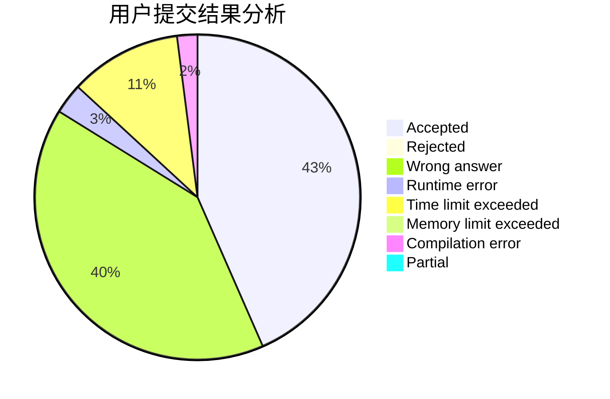
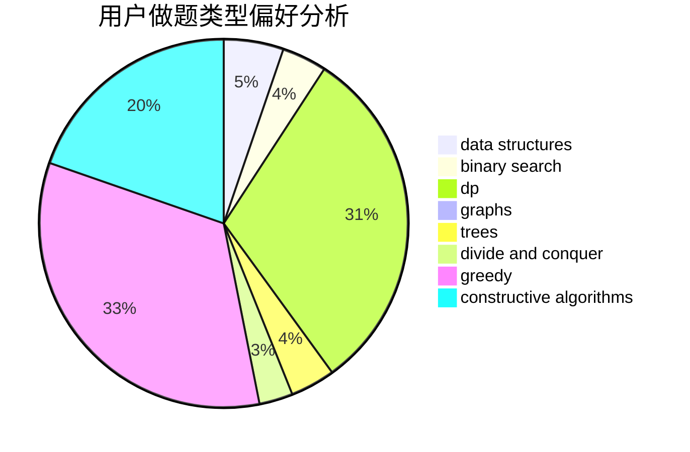
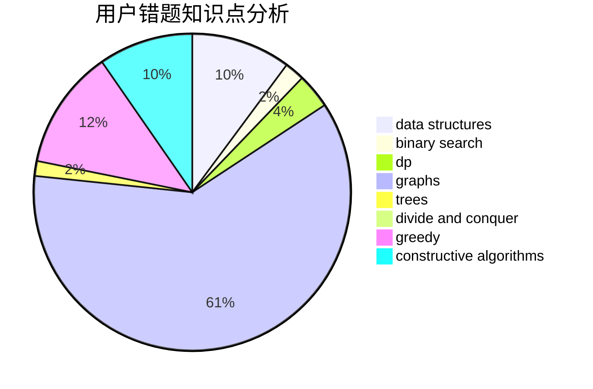

# KKpoker
<!-- tabs:start -->
#### **用户提交结果分析**

#### **用户做题类型偏好分析**

#### **用户错题知识点分析**

<!-- tabs:end -->
# 推荐题目
[Border](https://codeforces.com/contest/1011/problem/E)		number theory		  
[Save Energy!](http://codeforces.com/problemset/problem/936/A)		binary search,
                        implementation,
                        math		  
[Learning Languages](https://codeforces.com/contest/278/problem/C)		dfs and similar,
                        dsu		  
[Moon Craters](http://codeforces.com/problemset/problem/39/C)		dp,
                        sortings		  
[Lamps on a Circle](http://codeforces.com/problemset/problem/1368/F)		games,
                        implementation,
                        interactive,
                        math		  
[BRT Contract](http://codeforces.com/problemset/problem/187/D)		data structures		  
[Bank Robbery](http://codeforces.com/problemset/problem/794/A)		brute force,
                        implementation		  
[Shovels and Swords](http://codeforces.com/problemset/problem/1366/A)		binary search,
                        greedy,
                        math		  
[Card Constructions](http://codeforces.com/problemset/problem/1345/B)		binary search,
                        brute force,
                        dp,
                        math		  
[Magic Tricks](http://codeforces.com/problemset/problem/1346/E)		*special problem,
                        dp,
                        graphs		  
<!-- tabs:start -->
#### **data structures**
[Border](http://codeforces.com/problemset/problem/187/D)		data structures		  
[Save Energy!](http://codeforces.com/problemset/problem/862/E)		binary search,
                        data structures,
                        sortings		  
[Learning Languages](https://codeforces.com/contest/1417/problem/E)		bitmasks,
                        data structures,
                        divide and conquer,
                        dp,
                        greedy,
                        math,
                        sortings,
                        strings,
                        trees		  
[Moon Craters](http://codeforces.com/problemset/problem/731/D)		brute force,
                        data structures,
                        greedy,
                        sortings		  
[Lamps on a Circle](http://codeforces.com/problemset/problem/1498/C)		brute force,
                        data structures,
                        dp		  
[BRT Contract](http://codeforces.com/problemset/problem/1492/C)		binary search,
                        data structures,
                        dp,
                        greedy,
                        two pointers		  
[Bank Robbery](http://codeforces.com/problemset/problem/1490/G)		binary search,
                        data structures,
                        math		  
[Shovels and Swords](http://codeforces.com/problemset/problem/1479/D)		binary search,
                        bitmasks,
                        brute force,
                        data structures,
                        probabilities,
                        trees		  
[Card Constructions](http://codeforces.com/problemset/problem/1497/A)		brute force,
                        data structures,
                        greedy,
                        sortings		  
[Magic Tricks](http://codeforces.com/problemset/problem/1491/C)		brute force,
                        data structures,
                        dp,
                        greedy,
                        implementation		  
#### **binary search**
[Border](http://codeforces.com/problemset/problem/936/A)		binary search,
                        implementation,
                        math		  
[Save Energy!](http://codeforces.com/problemset/problem/1366/A)		binary search,
                        greedy,
                        math		  
[Learning Languages](http://codeforces.com/problemset/problem/1345/B)		binary search,
                        brute force,
                        dp,
                        math		  
[Moon Craters](http://codeforces.com/problemset/problem/862/E)		binary search,
                        data structures,
                        sortings		  
[Lamps on a Circle](http://codeforces.com/problemset/problem/1423/K)		binary search,
                        math,
                        number theory,
                        two pointers		  
[BRT Contract](http://codeforces.com/problemset/problem/1492/C)		binary search,
                        data structures,
                        dp,
                        greedy,
                        two pointers		  
[Bank Robbery](http://codeforces.com/problemset/problem/1463/D)		binary search,
                        constructive algorithms,
                        greedy,
                        two pointers		  
[Shovels and Swords](http://codeforces.com/problemset/problem/1490/G)		binary search,
                        data structures,
                        math		  
[Card Constructions](http://codeforces.com/problemset/problem/1479/D)		binary search,
                        bitmasks,
                        brute force,
                        data structures,
                        probabilities,
                        trees		  
[Magic Tricks](http://codeforces.com/problemset/problem/1436/E)		binary search,
                        data structures,
                        two pointers		  
#### **dp**
[Border](http://codeforces.com/problemset/problem/39/C)		dp,
                        sortings		  
[Save Energy!](http://codeforces.com/problemset/problem/1345/B)		binary search,
                        brute force,
                        dp,
                        math		  
[Learning Languages](http://codeforces.com/problemset/problem/1346/E)		*special problem,
                        dp,
                        graphs		  
[Moon Craters](http://codeforces.com/problemset/problem/398/B)		dp,
                        probabilities		  
[Lamps on a Circle](http://codeforces.com/problemset/problem/1144/G)		dp,
                        greedy		  
[BRT Contract](http://codeforces.com/problemset/problem/936/B)		dfs and similar,
                        dp,
                        games,
                        graphs		  
[Bank Robbery](http://codeforces.com/problemset/problem/633/D)		brute force,
                        dp,
                        hashing,
                        implementation,
                        math		  
[Shovels and Swords](https://codeforces.com/contest/1417/problem/E)		bitmasks,
                        data structures,
                        divide and conquer,
                        dp,
                        greedy,
                        math,
                        sortings,
                        strings,
                        trees		  
[Card Constructions](http://codeforces.com/problemset/problem/1420/C1)		constructive algorithms,
                        dp,
                        greedy		  
[Magic Tricks](https://codeforces.com/contest/1287/problem/C)		dp,
                        greedy,
                        sortings		  
#### **graph**
[Border](http://codeforces.com/problemset/problem/1346/E)		*special problem,
                        dp,
                        graphs		  
[Save Energy!](http://codeforces.com/problemset/problem/936/B)		dfs and similar,
                        dp,
                        games,
                        graphs		  
[Learning Languages](http://codeforces.com/problemset/problem/1487/C)		brute force,
                        constructive algorithms,
                        dfs and similar,
                        graphs,
                        greedy,
                        implementation,
                        math		  
[Moon Craters](http://codeforces.com/problemset/problem/1437/C)		dp,
                        flows,
                        graph matchings,
                        greedy,
                        math,
                        sortings		  
[Lamps on a Circle](http://codeforces.com/problemset/problem/1470/D)		constructive algorithms,
                        dfs and similar,
                        graph matchings,
                        graphs,
                        greedy		  
[BRT Contract](http://codeforces.com/problemset/problem/1476/C)		dp,
                        graphs,
                        greedy		  
[Bank Robbery](http://codeforces.com/problemset/problem/1304/D)		constructive algorithms,
                        graphs,
                        greedy,
                        two pointers		  
[Shovels and Swords](http://codeforces.com/problemset/problem/1475/C)		combinatorics,
                        graphs,
                        math		  
[Card Constructions](http://codeforces.com/problemset/problem/553/E)		dp,
                        fft,
                        graphs,
                        math,
                        probabilities		  
[Magic Tricks](http://codeforces.com/problemset/problem/1495/C)		constructive algorithms,
                        graphs		  
#### **trees**
[Border](https://codeforces.com/contest/1417/problem/E)		bitmasks,
                        data structures,
                        divide and conquer,
                        dp,
                        greedy,
                        math,
                        sortings,
                        strings,
                        trees		  
[Save Energy!](http://codeforces.com/problemset/problem/1479/D)		binary search,
                        bitmasks,
                        brute force,
                        data structures,
                        probabilities,
                        trees		  
[Learning Languages](http://codeforces.com/problemset/problem/1511/C)		brute force,
                        data structures,
                        implementation,
                        trees		  
[Moon Craters](http://codeforces.com/problemset/problem/1499/F)		combinatorics,
                        dfs and similar,
                        dp,
                        trees		  
[Lamps on a Circle](http://codeforces.com/problemset/problem/1491/E)		brute force,
                        dfs and similar,
                        divide and conquer,
                        number theory,
                        trees		  
[BRT Contract](http://codeforces.com/problemset/problem/1466/D)		data structures,
                        greedy,
                        sortings,
                        trees		  
[Bank Robbery](http://codeforces.com/problemset/problem/1495/D)		combinatorics,
                        dfs and similar,
                        graphs,
                        math,
                        shortest paths,
                        trees		  
[Shovels and Swords](http://codeforces.com/problemset/problem/1303/G)		data structures,
                        divide and conquer,
                        geometry,
                        trees		  
[Card Constructions](http://codeforces.com/problemset/problem/1454/E)		combinatorics,
                        dfs and similar,
                        graphs,
                        trees		  
[Magic Tricks](http://codeforces.com/problemset/problem/1494/D)		constructive algorithms,
                        data structures,
                        dfs and similar,
                        divide and conquer,
                        dsu,
                        greedy,
                        sortings,
                        trees		  
#### **divide and conquer**
[Border](https://codeforces.com/contest/1417/problem/E)		bitmasks,
                        data structures,
                        divide and conquer,
                        dp,
                        greedy,
                        math,
                        sortings,
                        strings,
                        trees		  
[Save Energy!](http://codeforces.com/problemset/problem/1461/D)		binary search,
                        brute force,
                        data structures,
                        divide and conquer,
                        implementation,
                        sortings		  
[Learning Languages](http://codeforces.com/problemset/problem/1466/G)		combinatorics,
                        divide and conquer,
                        hashing,
                        math,
                        string suffix structures,
                        strings		  
[Moon Craters](http://codeforces.com/problemset/problem/1490/D)		dfs and similar,
                        divide and conquer,
                        implementation		  
[Lamps on a Circle](https://codeforces.com/contest/1483/problem/C)		data structures,
                        divide and conquer,
                        dp		  
[BRT Contract](http://codeforces.com/problemset/problem/1491/E)		brute force,
                        dfs and similar,
                        divide and conquer,
                        number theory,
                        trees		  
[Bank Robbery](http://codeforces.com/problemset/problem/1303/G)		data structures,
                        divide and conquer,
                        geometry,
                        trees		  
[Shovels and Swords](http://codeforces.com/problemset/problem/1494/D)		constructive algorithms,
                        data structures,
                        dfs and similar,
                        divide and conquer,
                        dsu,
                        greedy,
                        sortings,
                        trees		  
[Card Constructions](http://codeforces.com/problemset/problem/1482/E)		data structures,
                        divide and conquer,
                        dp		  
[Magic Tricks](http://codeforces.com/problemset/problem/566/C)		dfs and similar,
                        divide and conquer,
                        trees		  
#### **greedy**
[Border](http://codeforces.com/problemset/problem/1366/A)		binary search,
                        greedy,
                        math		  
[Save Energy!](http://codeforces.com/problemset/problem/33/C)		greedy		  
[Learning Languages](http://codeforces.com/problemset/problem/1037/B)		greedy		  
[Moon Craters](http://codeforces.com/problemset/problem/1144/G)		dp,
                        greedy		  
[Lamps on a Circle](https://codeforces.com/contest/1417/problem/E)		bitmasks,
                        data structures,
                        divide and conquer,
                        dp,
                        greedy,
                        math,
                        sortings,
                        strings,
                        trees		  
[BRT Contract](http://codeforces.com/problemset/problem/731/D)		brute force,
                        data structures,
                        greedy,
                        sortings		  
[Bank Robbery](http://codeforces.com/problemset/problem/351/E)		greedy		  
[Shovels and Swords](http://codeforces.com/problemset/problem/1420/C1)		constructive algorithms,
                        dp,
                        greedy		  
[Card Constructions](https://codeforces.com/contest/1287/problem/C)		dp,
                        greedy,
                        sortings		  
[Magic Tricks](http://codeforces.com/problemset/problem/1185/C1)		greedy,
                        sortings		  
#### **constructive algorithms**
[Border](http://codeforces.com/problemset/problem/644/A)		*special problem,
                        constructive algorithms		  
[Save Energy!](http://codeforces.com/problemset/problem/1420/C1)		constructive algorithms,
                        dp,
                        greedy		  
[Learning Languages](http://codeforces.com/problemset/problem/1395/B)		constructive algorithms		  
[Moon Craters](http://codeforces.com/problemset/problem/1493/A)		constructive algorithms,
                        greedy		  
[Lamps on a Circle](http://codeforces.com/problemset/problem/1463/D)		binary search,
                        constructive algorithms,
                        greedy,
                        two pointers		  
[BRT Contract](https://codeforces.com/contest/1456/problem/B)		bitmasks,
                        brute force,
                        constructive algorithms		  
[Bank Robbery](http://codeforces.com/problemset/problem/1492/D)		bitmasks,
                        constructive algorithms,
                        greedy,
                        math		  
[Shovels and Swords](https://codeforces.com/contest/1504/problem/D)		constructive algorithms,
                        games,
                        interactive		  
[Card Constructions](https://codeforces.com/contest/1483/problem/A)		brute force,
                        constructive algorithms,
                        greedy,
                        implementation		  
[Magic Tricks](https://codeforces.com/contest/1457/problem/D)		bitmasks,
                        brute force,
                        constructive algorithms		  
#### **sortings**
[Border](http://codeforces.com/problemset/problem/39/C)		dp,
                        sortings		  
[Save Energy!](http://codeforces.com/problemset/problem/862/E)		binary search,
                        data structures,
                        sortings		  
[Learning Languages](https://codeforces.com/contest/1417/problem/E)		bitmasks,
                        data structures,
                        divide and conquer,
                        dp,
                        greedy,
                        math,
                        sortings,
                        strings,
                        trees		  
[Moon Craters](http://codeforces.com/problemset/problem/731/D)		brute force,
                        data structures,
                        greedy,
                        sortings		  
[Lamps on a Circle](https://codeforces.com/contest/1287/problem/C)		dp,
                        greedy,
                        sortings		  
[BRT Contract](http://codeforces.com/problemset/problem/1185/C1)		greedy,
                        sortings		  
[Bank Robbery](http://codeforces.com/problemset/problem/1203/E)		greedy,
                        sortings		  
[Shovels and Swords](https://codeforces.com/contest/1496/problem/C)		geometry,
                        greedy,
                        math,
                        sortings		  
[Card Constructions](http://codeforces.com/problemset/problem/1495/A)		geometry,
                        greedy,
                        math,
                        sortings		  
[Magic Tricks](http://codeforces.com/problemset/problem/1497/A)		brute force,
                        data structures,
                        greedy,
                        sortings		  
<!-- tabs:end -->
