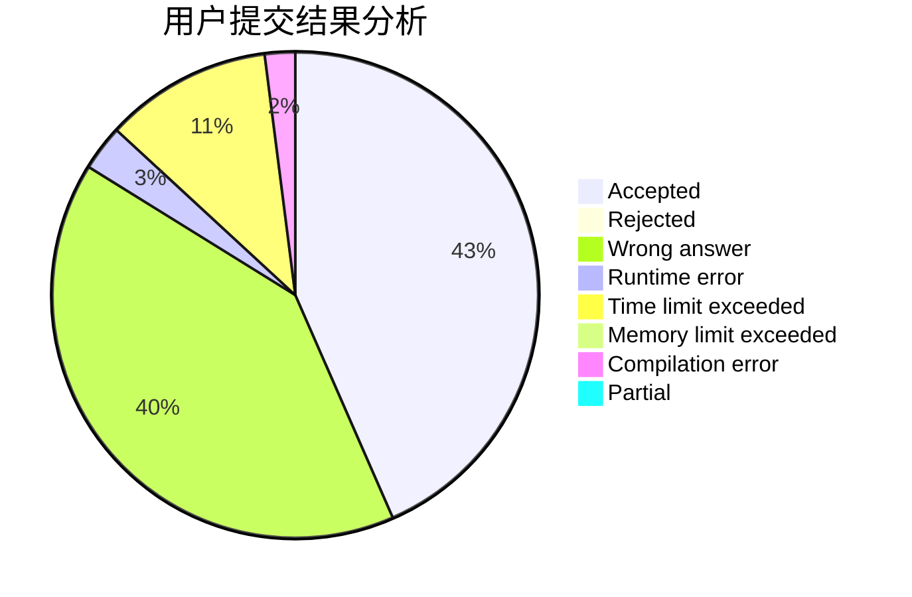
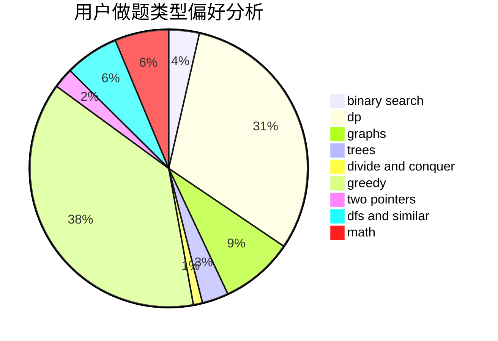

# KKpoker

<!-- tabs:start -->

#### **用户提交结果分析**

#### **用户做题类型偏好分析**

<!-- tabs:end -->
# 推荐题目
[1352D](https://codeforces.com/contest/1352/problem/D)
[1037E](https://codeforces.com/contest/1037/problem/E)
[9581](https://codeforces.com/contest/958/problem/1)
[1189A](https://codeforces.com/contest/1189/problem/A)
[1294F](https://codeforces.com/contest/1294/problem/F)
[1302F](https://codeforces.com/contest/1302/problem/F)
[1419F](https://codeforces.com/contest/1419/problem/F)
[425E](https://codeforces.com/contest/425/problem/E)
[1147A](https://codeforces.com/contest/1147/problem/A)
[1208C](https://codeforces.com/contest/1208/problem/C)
